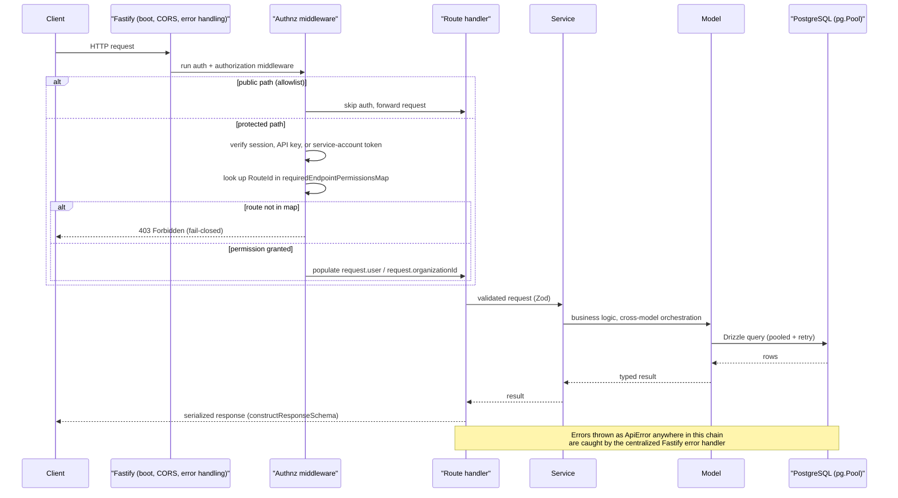
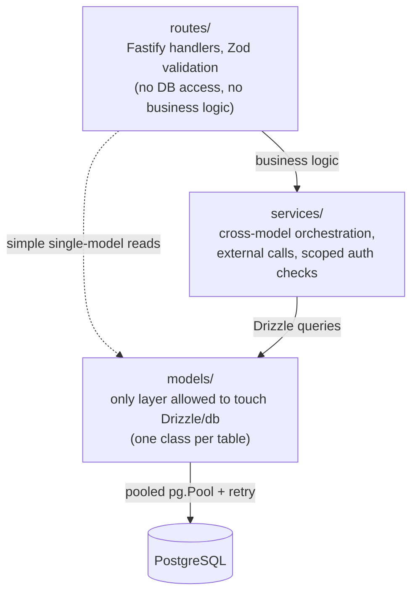
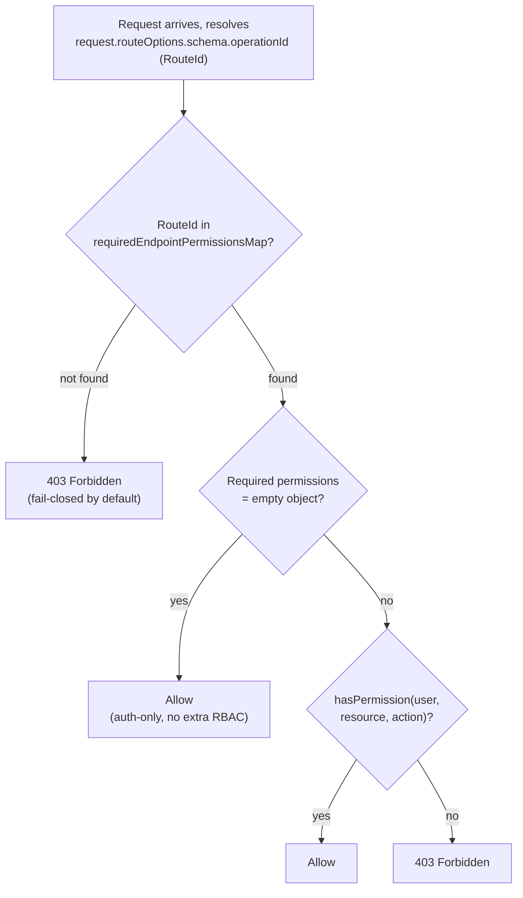

# Backend Architecture

The Archestra backend is a single Fastify (TypeScript) API server, living at `platform/backend/`, that fronts everything the platform does: authentication and RBAC, MCP tool gateway/proxying, LLM proxying, chat/agent orchestration, knowledge-base retrieval, skills execution, and admin/config APIs. It talks to PostgreSQL exclusively through a Drizzle ORM data-access layer (`backend/src/models/`), and it is deployed alongside a second, much smaller Fastify instance whose only job is to serve Prometheus metrics on a separate port.

The authoritative one-page summary of the layering rules lives in the repo itself at `platform/backend/architecture.md` — this document expands on it with the concrete code that implements those rules.

## Request Lifecycle

```
boot → global middleware (CORS, error handling, auth) → route handler → service → model → PostgreSQL
```

1. **Boot** (`platform/backend/src/server.ts`, entrypoints under `platform/backend/src/entrypoints/`): the server file conditionally imports Sentry and OpenTelemetry tracing *before* anything else, but only when the file is the actual process entrypoint (`isMainModule` check) — this ordering matters because some of Sentry's auto-instrumentation depends on the Sentry client already being initialized before OTel wires up. `createFastifyInstance()` builds the Fastify instance with the Zod type provider (`fastify-type-provider-zod`) wired in via `serializerCompiler`/`validatorCompiler`, registers `@fastify/cors`, `@fastify/formbody`, `@fastify/swagger`, and `fastify-metrics`, then calls `registerApiRoutes()` which iterates every exported route plugin from `./routes` (AGPL) **and** `./routes/index.ee` (Enterprise) and registers them all unconditionally — Enterprise routes are always loaded, with tier gating happening later at request time (see [Design Decisions](#design-decisions--tradeoffs)).
2. **Startup side-effects**: `server.ts` also calls `initializeDatabase()`, `seedRequiredStartingData()`, starts the K8s MCP-server runtime manager, the Dagger environment runtime manager, ChatOps manager, email provider, ngrok tunnel manager (dev), the task queue and its handlers, and several interval-based reapers (e.g. `ACTIVE_CHAT_RUN_REAPER_INTERVAL_MS`), then calls `fastify.listen({ port, host })` on port 9000 (`config.api.port`).
3. **Metrics server**: a second, independent `createFastifyInstance()` is built (`startMetricsServer`, `platform/backend/src/server.ts` ~L769-791), registers only a health route and `fastify-metrics`, and listens on its own port (9050, `ARCHESTRA_METRICS_PORT`-style config). It is closed separately during graceful shutdown (`metricsServerInstance.close()`).
4. **Authentication + authorization middleware**: every request to a protected path runs through `Authnz.handle` (`platform/backend/src/auth/fastify-plugin/middleware.ts`), registered via the Fastify plugin at `platform/backend/src/auth/fastify-plugin/plugin.ts` / `index.ts`. This is a single class (not per-route hooks) that:
   - Skips a hard-coded allowlist of public paths (`shouldSkipAuthCheck`) — CORS preflight/HEAD, `/api/auth/*`, LLM proxy routes (`/v1/<provider>`), model-router routes, `/openapi.json`, health/ready/metrics, MCP Gateway paths, the skill-marketplace public git endpoint, connection-setup one-time-token scripts, A2A gateway routes, OAuth well-known/consent endpoints, incoming-email webhooks, and a few more — each with an inline comment explaining *why* it's public.
   - Otherwise requires either a Better-Auth session (`betterAuth.api.getSession`, cookie-cache-first) **or** an `Authorization` header that verifies as a Better-Auth API key (`betterAuth.api.verifyApiKey`) **or** a service-account token (`ServiceAccountModel.verifyToken`). Note this header is *not* `Bearer <token>` — it's the raw key value, matching the CLAUDE.md convention `Authorization: ${apiKey}`.
   - On success, populates `request.user` and `request.organizationId` (`populateUserInfo`) so every downstream route can rely on them being present without a null check.
   - Then does authorization: it looks up `request.routeOptions.schema?.operationId` (a `RouteId` enum value) in `requiredEndpointPermissionsMap` (from `shared/access-control.ts`) and calls `hasPermission(...)`. **Routes not present in the map are denied by default** ("Forbidden, the route is not configured in auth middleware and is protected by default") — this is a fail-closed design, not an oversight.
5. **Route handler** (`backend/src/routes/**`): parses/validates the request via Zod schemas (through `fastify-type-provider-zod`), calls into one or more services (or a model directly, for simple single-model reads), and serializes the response using a schema built with `constructResponseSchema`.
6. **Service** (`backend/src/services/**`): business logic — cross-model orchestration, external API calls, scoped authorization checks, transactions.
7. **Model** (`backend/src/models/**`): the only code allowed to touch Drizzle/`db`. One file per table (roughly), static-method classes, Drizzle queries.
8. **Database**: PostgreSQL, reached through a single pooled `pg.Pool` wrapped with retry logic (`platform/backend/src/database/retry.ts`, `wrapPoolWithRetry`/`withTransactionRetry`) and OpenTelemetry instrumentation (`@kubiks/otel-drizzle`).

Errors thrown anywhere in this chain as `ApiError(statusCode, message)` (class defined in `platform/shared/types.ts`) are caught by a single centralized Fastify error handler (`fastify.setErrorHandler`, `platform/backend/src/server.ts` ~L473) that also special-cases Zod validation errors, response-serialization errors (schema mismatches — reported to Sentry as bugs, not client errors), and body-too-large errors, before falling through to a generic 500 handler. See [Error Handling](#error-handling--api-response-conventions).

Steps 4-8 of that chain, for a single request, look like this:



## Directory Tour: `backend/src/`

| Directory | Responsibility |
|---|---|
| `routes/` | Fastify route handlers, grouped per entity/domain (see below). No DB access, no business logic per `architecture.md`. |
| `services/` | Business logic that spans models, calls external systems, or enforces scoped authorization (e.g. `team-authorization.ts`, `agent-export.ts`, `mcp-tools-refresh.ts`, `cross-provider-pricing.ts`). |
| `models/` | One class per DB entity; the *only* place Drizzle queries are allowed to live (`architecture.md` rule 1 & 2: models don't call other models except via joins, and never call services). ~180 model files as of this writing. |
| `database/` | `index.ts` (pool init, `withDbTransaction`, health check), `schemas/` (Drizzle table defs, one file per table), `migrations/` (generated SQL + Drizzle's `meta/_journal.json`/snapshots), `retry.ts`, `seed.ts`, `soft-delete.ts`, `vault-database-url.ts`. |
| `auth/` | `better-auth.ts` (Better-Auth instance + plugins), `fastify-plugin/` (the Authnz middleware described above), `dev-auto-login.ts`, `idp.ee.ts` (SSO/SAML/OIDC, Enterprise), `agent-type-permissions.ts`, `mcp-catalog-permissions.ts`. |
| `middleware/` | Cross-cutting request hooks beyond auth: audit logging (`audit-log-hook.ts`, `audit-log-registry.ts`, `audit-decisions.ts`), enterprise license gating. |
| `types/` | Zod schemas + inferred TS types per entity, generated from `database/schemas/` via `drizzle-zod` (see below), plus request/response and business types that aren't DB-backed. |
| `openapi/` | `enrich-openapi-with-rbac.ts` — post-processes the raw Fastify-Swagger spec to inject `x-required-permissions` metadata and human-readable auth/authorization descriptions per route, derived from `requiredEndpointPermissionsMap`. |
| `standalone-scripts/` | CLI entrypoints invoked by `pnpm codegen*`/`pnpm check:*` — `codegen-openapi.ts` (writes `docs/openapi.json`), `codegen-access-control-docs.ts`, `check-drizzle-migration-journal.ts`, `lint-drizzle-migrations.ts`. |
| `archestra-mcp-server/` | Archestra's own built-in MCP server (tools prefixed `archestra__`), one file per tool group, RBAC-mapped per tool in `rbac.ts`. |
| `guardrails/`, `hooks/`, `skills/`, `skills-sandbox/` | Security policy enforcement (tool invocation policies, trusted data policies), lifecycle hooks, and the Dagger-backed Skill sandbox runtime — see [Security & Guardrails](./06-security-and-guardrails.md). |
| `k8s/`, `sandbox-runtime/` | Kubernetes-backed MCP server pod lifecycle and the Dagger environment runtime manager. |
| `observability/` | Sentry init, OTel tracing SDK, error-tracking policy (`classifyErrorForTracking`), Prometheus metric registration. See [Observability](./10-observability.md). |
| `task-queue/` | Background job queue + handlers, used for scheduled/async work (e.g. A2A execution, scheduled conversation runs). |
| `entrypoints/` | Process entrypoints beyond the main web server (worker mode, etc. — see `shouldRunWebServer`/`shouldRunWorker` in `config.ts`). |
| `clients/`, `integrations/`, `agents/` | Outbound clients (chat MCP client, etc.), third-party integrations (GitHub, ChatOps/Slack/MS Teams/Telegram, incoming email), and agent-specific orchestration logic (ChatOps manager, incoming-email agent). |

### Route domains (`backend/src/routes/`)

Routes are organized per-domain, and larger domains use a subdirectory with one `<entity>.routes.ts` aggregator plus one test file per endpoint (documented in `platform/backend/CLAUDE.md`: canonical shape is `routes/virtual-api-key/virtual-api-key.routes.ts`). Representative domains found under `backend/src/routes/`:

- **`agent.ts`, `agent-tool.ts`, `agent-type-permissions.test.ts`** — the unified "agent" entity (see [Database docs](./03-database-and-data-model.md) — this single table now covers what used to be separate "profiles", MCP gateways, LLM proxies, and internal chat agents).
- **`chat/`** — the large chat subsystem: conversation routes, streaming (`stream-route.ts`), context compaction/trimming, tool-call repair, hook integration, attachment handling, app-diagnostics injection, skill-activation injection.
- **`mcp-gateway.ts`, `mcp-proxy.ts`, `mcp-server.ts`, `mcp-server-proxy.ts`, `mcp-tool-call.ts`, `mcp-oauth-clients.ts`, `internal-mcp-catalog.ts`, `mcp-server-installation-requests.ts`** — the MCP Gateway (tool discovery/call-through for agents), the K8s MCP server proxy (`/mcp_proxy/:id`), the internal MCP catalog (marketplace of installable servers), and the install-request approval workflow. See [MCP Gateway & Orchestrator](./05-mcp-gateway-and-orchestrator.md).
- **`proxy/`** — the LLM Proxy: per-provider adapters (`proxy/adapters/`), auth (`llm-proxy-auth.ts`), the model-router resolver, virtual-API-key handling, and helpers shared across providers. See [LLM Proxy & Gateway](./04-llm-proxy-and-gateway.md).
- **`llm-provider-api-keys.ts`, `llm-provider-models.ts`, `llm-oauth-clients.ts`** — org-level LLM credential management (raw provider API keys, OAuth clients for providers like GitHub Copilot/OpenAI Codex, model catalogs).
- **`team.ts`, `team-labels.test.ts`, `team-members.test.ts`, `member.ts`, `organization.ts`, `organization-role.ts`, `invitation.ts`** — org/team/member management and Better-Auth-backed organization plugin surface.
- **`custom-role.ee.ts`, `identity-provider.ee.ts`** — Enterprise-tagged routes for custom RBAC roles and SSO identity providers (`.ee.ts` filename convention — see [Enterprise Licensing](#enterprise-licensing-marking)).
- **`skill/`, `skill-share/`, `skill-marketplace-public.ts`, `skill-sandbox-artifact.ts`** — Agent Skills CRUD, sharing, public marketplace browsing, and sandbox artifact download.
- **`knowledge-base.ts`** — RAG/knowledge-base ingestion and query routes (backed by pgvector — see [Database docs](./03-database-and-data-model.md)).
- **`app/`** — the "Apps" subsystem (rendered mini-apps: create/update/pin/screenshot/tools/versions/lifecycle/diagnostics).
- **`project/`** — Projects (a grouping/workspace concept for conversations, with instructions and file scaffolding).
- **`hook.ts`** — lifecycle hooks (Monaco-editable hook scripts, per `df0116e44` history).
- **`a2a.ts`, `a2a-v2.ts`** — Agent-to-Agent protocol routes (task delegation between agents, streaming).
- **`schedule-trigger/`, `schedule-trigger.ts`** — scheduled/cron-triggered conversation runs.
- **`chatops.ts`, `chatops-*`** — Slack/MS Teams/Telegram bot integration routes.
- **`connection-setup/`, `github-copilot-auth/`, `openai-codex-auth/`, `microsoft-365-copilot-auth/`** — OAuth/device-code style flows for connecting external coding-agent credentials.
- **`audit-log.ts`, `statistics.ts`, `limits.ts`, `optimization-rule.ts`** — audit trail, cost/usage statistics, spend limits, and cost-optimization policy routes.
- **`api-key.ts`, `user-token.ts`, `service-account.ts`, `token.ts`** — credential issuance surfaces distinct from session auth.
- **`environment.ts`, `k8s-capabilities.ts`** — deployment "Environments" (network policy / runtime scoping for agent sandboxes and MCP pods) and cluster capability probing.
- **`health.ts`, `config.ts`, `metrics.test.ts`** — `/health`, `/ready`, `/api/config` (public feature-flag surface consumed by the frontend's `useFeature()` hook), and the metrics endpoint.
- **`index.ts` / `index.ee.ts`** — the two route-registration barrels split by license tier, both always imported by `server.ts` (see boot step above).

### Models (`backend/src/models/`)

Every model is a class of static async methods that owns exactly the Drizzle queries for its table(s), following the pattern in `platform/backend/architecture.md`: *"Models do not call other models, except using joins. Models do not call services."* A representative example, `AgentModel` (`platform/backend/src/models/agent.ts`):

```ts
class AgentModel {
  // process-local LRU cache for a hot lookup path (id/slug -> id),
  // registered with the shared cache-manager registry, not a hand-rolled Map
  private static readonly resolveIdCache = registerProcessLocalCache(
    new LRUCacheManager<string>({ maxSize: 10_000, defaultTtl: TimeInMs.Minute }),
  );

  static async findBasicByOrganizationIdAndIds(params: {
    organizationId: string;
    agentIds: string[];
  }): Promise<Array<Pick<Agent, "id" | "name" | "agentType">>> {
    const { organizationId, agentIds } = params;
    if (agentIds.length === 0) return [];
    return await db
      .select({ id: schema.agentsTable.id, name: schema.agentsTable.name, agentType: schema.agentsTable.agentType })
      .from(schema.agentsTable)
      .where(and(
        eq(schema.agentsTable.organizationId, organizationId),
        inArray(schema.agentsTable.id, agentIds),
        notDeleted(schema.agentsTable), // soft-delete filter, see database docs
      ))
      .orderBy(desc(schema.agentsTable.createdAt), desc(schema.agentsTable.id));
  }
  // ... more static methods, private helpers at the bottom of the class
}
```

Note the **object-parameter style** for multi-argument methods, the **static-method class shape** (models are not instantiated — unlike the singleton-class pattern used for stateful services, see [Design Decisions](#design-decisions--tradeoffs)), and composition with sibling models via imports (`AgentTeamModel`, `AgentToolModel`, etc.) rather than raw cross-table joins scattered through routes.

### Services (`backend/src/services/`)

Services hold logic that: (a) spans more than one model, (b) calls external systems, or (c) performs scoped authorization decisions — per `architecture.md` rule 3. Examples actually present in the tree:

- `team-authorization.ts` — interface-agnostic team permission logic (`canManageTeamMembers`, `canReadTeam`) shared between the REST `/api/teams` routes and the Archestra MCP team tools, so both surfaces enforce identical rules without duplicating the logic.
- `agent-export.ts` / `agent-import.ts` — cross-model orchestration for exporting/importing an agent's full configuration.
- `mcp-tools-refresh.ts`, `mcp-reinstall.ts`, `mcp-install-policy.ts` — MCP server lifecycle logic that spans the catalog, install-request, and runtime models.
- `github-copilot-token.ts`, `openai-codex-token.ts`, `microsoft-365-copilot-token.ts` — external OAuth token refresh/exchange flows.
- `cross-provider-pricing.ts`, `instance-analytics.ts` — cost computation and analytics aggregation across LLM provider data.
- `system-key-manager.ts`, `active-chat-run.ts` — stateful, class+singleton services (see coding conventions below).

The layering rule that routes/services/models enforce (no reverse calls, no skipped layers except simple single-model reads) looks like this:



## Routing, Permissions & RBAC — Concrete Example

RBAC is *declarative and centralized*, not scattered across route handlers with ad hoc checks. The flow for a single endpoint:

1. **Resource/action taxonomy** is defined once in `platform/shared/access-control.ts`, in `allAvailableActions: Record<Resource, Action[]>` — e.g. `toolPolicy: ["read", "create", "update", "delete"]`, `mcpGateway: ["read", "create", "update", "delete", "team-admin", "admin"]`. This spreads Better-Auth's `defaultStatements` (its own built-in resources like `organization`, `member`, `invitation`) and then adds ~30 Archestra-specific resources across roughly four categories (Agents, LLM, MCP, Knowledge, plus Administration).
2. **Per-endpoint requirements** live in `requiredEndpointPermissionsMap`, keyed by `RouteId` (an enum generated from `shared/routes.ts`, one entry per Fastify `operationId`). For example (from the middleware test suite in `platform/backend/src/openapi/enrich-openapi-with-rbac.test.ts`): `RouteId.GetTools` requires `{ toolPolicy: ["read"] }`.
3. **Enforcement** happens once, centrally, in `Authnz.isAuthorized` (`auth/fastify-plugin/middleware.ts`): it reads `request.routeOptions.schema?.operationId`, looks it up in the map, and — critically — **denies any route that isn't in the map at all**, rather than defaulting to allow. Routes that are in the map with an *empty* permission object are allowed for any authenticated user (auth-only, no extra RBAC).
4. **Custom roles**: predefined roles (`admin`, `member`) are immutable; organizations can create unlimited custom roles (`organizationRolesTable`, `/api/roles/*`) that extend a predefined role. Permission validation ensures a role-creator can only grant permissions they themselves already hold — enforced in the custom-role route/service, not just at the UI layer.
5. **OpenAPI enrichment**: `platform/backend/src/openapi/enrich-openapi-with-rbac.ts` post-processes the generated OpenAPI spec so every operation's `description` documents its authentication requirement and its exact required permissions (`x-required-permissions: { kind: "static" | "dynamic" | "none", permissions: [...] }`) — this is how the public API docs stay in sync with the enforcement map instead of drifting from it, and it's regenerated by `pnpm codegen:access-control-docs`.
6. **Dynamic checks**: some routes (e.g. `GET /api/agents/{id}`) can't be fully expressed as a static resource:action pair because access also depends on runtime state (team membership, resource scope) — these are marked `kind: "dynamic"` with an explanatory note rather than silently omitted.

The fail-closed enforcement decision (steps 2-3 above) looks like this:



Team-based access control is a second, orthogonal axis layered on top of RBAC: agents and MCP catalog entries can additionally be scoped to specific teams via junction tables (`agent_team`, `mcp_catalog_team`, `virtual_api_key_team`), each a `pgTable` with a composite primary key over the two foreign keys — see [Database & Data Model](./03-database-and-data-model.md) for the schema-level detail, and [Security & Guardrails](./06-security-and-guardrails.md) for tool invocation/trusted-data policy enforcement that layers on top of both.

## Error Handling & API Response Conventions

- **Throwing**: the only sanctioned way to fail a request is `throw new ApiError(statusCode, message, internalCode?)`. `ApiError` is defined once in `platform/shared/types.ts` (not duplicated per-workspace) and derives its `type` field (`api_validation_error`, `api_authentication_error`, `api_authorization_error`, `api_not_found_error`, `api_conflict_error`, `api_internal_server_error`, …) from the status code in its constructor, so callers never have to remember to set both.
- **Centralized handling**: `fastify.setErrorHandler` in `server.ts` is the single place that turns any thrown error into an HTTP response. It special-cases, in order: response-serialization errors (a route's actual response didn't match its declared Zod schema — logged as a bug and reported to Sentry with the validation diff, since this indicates a backend defect, not a bad client request), Zod request-validation errors (→ 400), and body-too-large errors (→ 413 with a message naming the configured limit and observed size) — before falling through to a generic handler that reads `ApiError.statusCode`/`.type` when present or defaults to 500.
- **Response shape**: every error response is `{ error: { message, type, internal_code? } }` — defined once as `ErrorResponsesSchema` in `platform/backend/src/types/api.ts` and reused by `constructResponseSchema(schema)`, which every route uses to build its Fastify response schema map: `{ 200: schema, 400: ..., 401: ..., 403: ..., 404: ..., 409: ..., 500: ... }`. This is why every endpoint's OpenAPI doc uniformly documents the same error shapes without each route author re-declaring them.
- **Pagination**: `PaginationQuerySchema` / `createPaginatedResponseSchema` (`platform/backend/src/database/utils/pagination.ts`) standardize `?page=&pageSize=` query parsing and `{ data: [...], pagination: {...} }` response envelopes.
- **Sorting**: `SortingQuerySchema` (free-text `sortBy`) or `createSortingQuerySchema(allowedColumns)` (a constrained-enum variant) standardize `?sortBy=&sortDirection=`.
- **No manual `reply.status().send()`** for error paths — `platform/CLAUDE.md` explicitly calls this out as a rule, precisely because it would bypass the centralized formatting/logging/Sentry-capture behavior above.

## Config & Environment Variables

`platform/backend/src/config.ts` (≈1900 lines) is the single place environment variables are read, parsed, validated, and given typed defaults — nothing else in the backend calls `process.env` directly for anything the config module already owns. Conventions:

- **Naming**: every variable is `ARCHESTRA_<AREA>_<THING>` (e.g. `ARCHESTRA_AUTH_DEV_AUTO_AUTHENTICATE_EMAIL`, `ARCHESTRA_ORCHESTRATOR_K8S_NAMESPACE`, `ARCHESTRA_SENTRY_BACKEND_DSN`). This is enforced by convention/review, not a runtime check, but is consistent throughout `config.ts`.
- **`.env` loading**: `config.ts` loads `.env` from the *platform root* (`path.resolve(__dirname, "../../.env")`), explicitly to avoid a duplicate `.env` inside `backend/` — a one-file-to-rule-them-all approach across the monorepo's workspaces.
- **Safety-conscious parsing**: security-relevant flags are computed with explicit guards rather than trusted directly — e.g. `devAutoAuthenticateEmail` is hard-set to `undefined` whenever `NODE_ENV` is `production`/`prod`, regardless of what the env var says, and a `logger.warn` fires whenever the dev-auto-login bypass is active, so it can never silently linger in a real deployment.
- **Structured export**: config is grouped into nested namespaces (`config.api.port`, `config.observability`, `config.test.enableE2eTestEndpoints`, etc.) rather than one flat object, which is what `server.ts` destructures from at the top of the file.
- **Frontend visibility**: env-derived values the frontend needs are *not* exposed directly — they're threaded through `backend/src/routes/config.ts` (`publicConfigRoutes`, one of the explicitly-public unauthenticated paths in the auth middleware) and consumed on the frontend via a `useFeature()` hook, keeping the boundary between "backend config" and "public feature flags" explicit rather than letting arbitrary env vars leak to the client.
- **Custom validators get tests**: per `platform/CLAUDE.md`, any nontrivial parse/validation function in `config.ts` is exported and covered in `config.test.ts` rather than only exercised indirectly.

## OpenAPI & Generated API Client

The OpenAPI spec is not hand-maintained — it's generated from the live Fastify route registrations:

1. `platform/backend/src/standalone-scripts/codegen-openapi.ts` boots a headless Fastify instance, registers the Swagger plugin and **all** routes (including EE — the same `registerApiRoutes()` used at real boot), calls `fastify.ready()` so every route's Zod schema is compiled into JSON Schema (via `jsonSchemaTransform`/`createJsonSchemaTransformObject` targeting `openapi-3.0`), pulls `fastify.swagger()`, pipes it through `enrichOpenApiWithRbac()` (see RBAC section above), and writes the result to `docs/openapi.json` at the repo root.
2. `pnpm codegen:openapi` runs that script; `pnpm codegen` (backend) chains it with the access-control-docs and Archestra-MCP-server-docs generators.
3. The frontend does **not** talk to hand-written fetch wrappers for most of the API surface — `platform/shared/hey-api/openapi-ts.ts` (via the `@hey-api/openapi-ts` package, `pnpm codegen:api-client` in `platform/shared`) reads `docs/openapi.json` and generates a typed TypeScript client into `platform/shared/hey-api/clients/`, which both frontend code and (per the `archestra-dev-migrations` skill's conflict-resolution notes) other consumers import directly. This closes the loop: change a route's Zod schema → regenerate → the frontend gets compile-time errors if its usage no longer matches, without anyone maintaining a parallel API-client definition by hand.

## Enterprise Licensing Marking

The repo is dual-licensed (`../LICENSE.md` at repo root): AGPL-3.0 by default, Enterprise License (`LICENSE_ENTERPRISE`) for marked code, resolved by **first matching rule**: (1) an explicit SPDX header at the top of a file, (2) an in-file `SPDX-SnippetBegin`/`SPDX-SnippetEnd` region, (3) filename/path convention — any `*.ee.ts` file or anything under an `ee/` directory, (4) default AGPL. In the backend this shows up two ways in practice:

- **Path convention** (the common case): `backend/src/routes/custom-role.ee.ts`, `backend/src/routes/identity-provider.ee.ts`, `backend/src/models/identity-provider.ee.ts`, `backend/src/auth/idp.ee.ts`, `backend/src/routes/index.ee.ts` (the whole EE route barrel) — no header needed, the `.ee.ts` suffix alone is authoritative.
- **Explicit SPDX header**, used for a file that isn't itself named `*.ee.ts` but still contains Enterprise-only logic, e.g. `backend/src/enterprise-tier.ts`:
  ```ts
  // SPDX-License-Identifier: LicenseRef-Archestra-Enterprise
  // SPDX-FileCopyrightText: 2026 Archestra Inc.
  ```
- **Runtime gating vs. code gating are separate concerns**: `server.ts` always registers EE routes (there is no code branch that conditionally skips `index.ee.ts`); a lint rule is explicitly suppressed for that import (`biome-ignore lint/style/noRestrictedImports: dual-licensed at request time`). Access is instead gated *per-request* by `EnterpriseTierService` (`enterprise-tier.ts`), which checks a static `config.enterpriseFeatures.*` env flag **or** auto-enables Enterprise features for organizations under a small-team user-count threshold (`SMALL_TEAM_THRESHOLD = 30`, refreshed every 60s). This means the Enterprise/AGPL split is a licensing and code-organization boundary, not a feature-flag/build-flag boundary — the code always ships, and the *right to use it* is what's gated.

## Design Decisions & Tradeoffs

- **Model-only database access (`architecture.md` layering, enforced by convention + code review, not tooling)**
  *Rationale*: centralizing every Drizzle query in `models/` means there is exactly one place to look for "what does this table's access pattern look like," one place to add caching/batching (e.g. `AgentModel.resolveIdCache`), and one place N+1 query prevention lives (CLAUDE.md explicitly calls out batch methods like `getTeamsForAgents()`).
  *Tradeoff*: with ~180 model files and ~130+ schema files, this is a lot of small files to navigate, and the rule is enforced by human review/skill-guided workflow rather than a lint rule or import-graph check — a route or service *can* technically import `db` directly and nothing stops a compile.

- **Class + static-methods for models, class + singleton for stateful services**
  *Rationale*: two related but distinct patterns solve two different problems. Models are stateless data-access, so static methods on a class (`AgentModel.findBasicByOrganizationIdAndIds(...)`) give namespacing and testability without an instantiation ceremony. Stateful modules (caches, intervals, connections — e.g. `ChatOpsManager`, `EnterpriseTierService`, `activeChatRunService`) use `class + export const singleton = new Class()` specifically to make lifecycle (`.start()`/`.stop()`/`.cleanup()`) and encapsulated state explicit and testable, versus loose module-level `let` variables with exported functions (`platform/CLAUDE.md` shows this contrast directly).
  *Tradeoff*: singletons carry hidden global state across tests unless test infrastructure explicitly resets them (see `AgentModel.clearResolveIdCache()`, invoked by the shared test setup) — a service author has to remember to wire that reset in, or tests can leak state across cases.

- **Fastify (not Express/Koa/Nest) as the HTTP framework**
  *Rationale*: Fastify's schema-first design integrates cleanly with `fastify-type-provider-zod`, giving request/response validation, TypeScript inference, and OpenAPI generation from a single Zod schema declared once per route — this is the backbone of both the RBAC-enriched OpenAPI spec and the generated frontend client described above. Its plugin/encapsulation model also makes it straightforward to boot a second, isolated instance for the metrics server reusing the exact same `createFastifyInstance()` factory.
  *Tradeoff*: the ecosystem is smaller than Express's, and the ergonomics (plugin registration, decorators, `fastify.ready()` gating) have a steeper initial learning curve than a bare Express app — visible in how much boilerplate `server.ts` needs just to stand up the OpenAPI-codegen script's headless instance.

- **API-key header is `Authorization: <key>`, not `Authorization: Bearer <key>`**
  *Rationale*: per `platform/CLAUDE.md`, this is the established convention for Better-Auth API-key verification (`betterAuth.api.verifyApiKey({ body: { key: authHeader } })` passes the raw header value straight through — there's no `Bearer ` prefix to strip). Other auth surfaces in the same codebase (MCP Gateway, service-account-authenticated agent connections) *do* use `Bearer` — see `Authnz.shouldSkipAuthCheck`'s explicit `/^Bearer\s+/i.test(...)` check for MCP App connector Bearer tokens, and the CLAUDE.md note that chat-agent-to-MCP-gateway calls use `Authorization: Bearer ${archestraToken}`.
  *Tradeoff*: this inconsistency across auth surfaces (bare-key for org API keys, Bearer-prefixed for connector/gateway tokens) means `Authnz.isAuthenticated`/`populateUserInfo` has to attempt multiple auth methods in sequence (session → API key → service-account token) per request, and a developer adding a new auth-consuming surface has to know which convention applies where rather than there being one universal rule.

- **Metrics server on a separate port (9050) from the API server (9000)**
  *Rationale*: keeping `/metrics` off the main listener means the Prometheus scrape endpoint isn't subject to the same auth middleware, rate limits, or request-body-size limits as the public API, and an operator can firewall the metrics port independently (e.g. only reachable from the cluster's Prometheus, never from the internet) without touching the API's own network policy. It also means metrics collection survives independently if the main API's plugin chain has an issue, since it's a structurally separate Fastify instance built from the same factory but with a minimal plugin set.
  *Tradeoff*: two listening sockets to manage in every deployment topology (ingress rules, health checks, graceful shutdown ordering — `server.ts` explicitly closes `metricsServerInstance` as a distinct step within `SHUTDOWN_CLEANUP_TIMEOUT_MS`), and any shared setup (like `registerOpenApiSchemas()` side effects at module load) has to be safe to run twice if both instances are created in the same process.

- **Enterprise routes always registered; licensing enforced at request time, not build/import time**
  *Rationale*: shipping one binary/image that contains both AGPL and Enterprise code (rather than compiling two separate artifacts) simplifies the release pipeline enormously — there's no "enterprise build" vs. "community build" to keep in sync, test separately, or accidentally diverge. `EnterpriseTierService`'s auto-enable-below-threshold behavior also means small teams get Enterprise features for free without needing a license key at all, which is a deliberate product/pricing decision baked into the architecture (see `docs/pages/platform-pricing-model.md`).
  *Tradeoff*: the AGPL/Enterprise boundary is enforced purely by license-router convention (filename suffix, path, or SPDX header) rather than by the module system — nothing prevents an AGPL file from importing an `.ee.ts` file's exports at the TypeScript level, so keeping the boundary honest depends on reviewers (and the license-router tooling that scans these markers) rather than a compiler-enforced module boundary.

- **Route-permission enforcement is fail-closed via a single static map, not per-route decorators**
  *Rationale*: `requiredEndpointPermissionsMap` lives in one file (`shared/access-control.ts`) shared between backend enforcement and OpenAPI documentation generation, and any `RouteId` missing from the map is denied outright rather than silently allowed — this means a developer who forgets to register a new route's permissions gets a 403 in testing immediately, rather than accidentally shipping an unauthenticated-by-omission endpoint.
  *Tradeoff*: the map is a single, growing, hand-maintained file that every new endpoint must remember to update (`platform/CLAUDE.md` calls this out explicitly as an "IMPORTANT" step), and there is no compiler-level check tying a route's existence to a map entry — the only backstop is the runtime fail-closed behavior itself, which means the failure mode is caught at request time (or in an e2e/integration test), not at build time.
