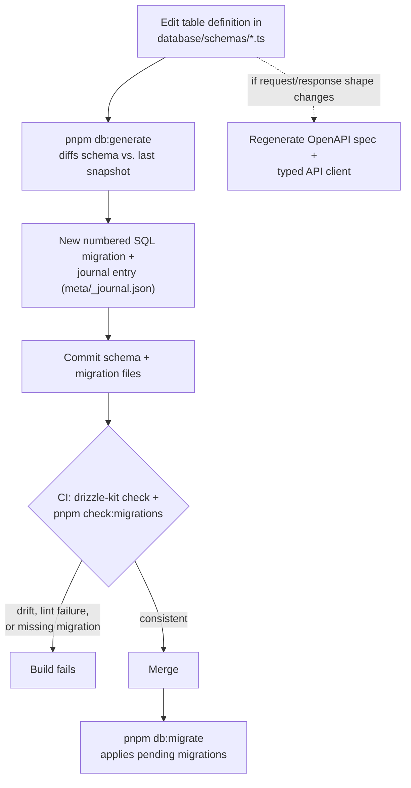
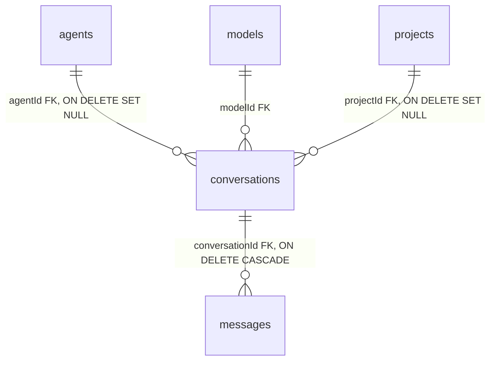
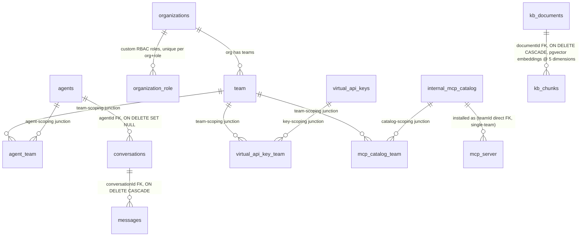

# Database & Data Model

Archestra's persistence layer is PostgreSQL, accessed exclusively through Drizzle ORM from `backend/src/models/`. This document covers how the schema is organized, how types are generated and kept in sync with the database, how migrations are produced and checked, and the shape of a few core entities and their relationships. For request-time layering (routes → services → models → DB) see [Backend Architecture](./02-backend.md).

## PostgreSQL + Drizzle Overview

- **Connection**: a single pooled `pg.Pool`, initialized once via `initializeDatabase()` (`platform/backend/src/database/index.ts`) and wrapped with retry logic (`wrapPoolWithRetry`, `withTransactionRetry` in `database/retry.ts`) plus OpenTelemetry instrumentation (`instrumentDrizzleClient` from `@kubiks/otel-drizzle`). Concurrent callers to `initializeDatabase()` share one in-flight init promise so only one pool is ever created.
- **Transactions**: `withDbTransaction<T>(callback)` wraps `getDb().transaction(callback)` with whole-transaction retry — pool-level retry alone isn't sufficient for transactions because they hold a checked-out client, so a transient connection failure has to retry the *entire* callback, not just one query.
- **The `db` handle and `schema` object** are re-exported from `database/index.ts`; models import `db, { schema }` and reference tables as `schema.agentsTable`, `schema.conversationsTable`, etc. — never a bare table import from `database/schemas/*` directly in a model (schemas are consumed through the aggregated `schema` namespace).
- **Extensions in use**: `pgvector` (for knowledge-base embeddings, multiple dimensionalities) and `pg_trgm` (trigram indexes for fuzzy/substring search — e.g. `conversations_title_trgm_idx`, `messages_content_trgm_idx`, both added as targeted migrations rather than baseline schema).
- **Vault-backed DB URL** (optional): `database/vault-database-url.ts` can resolve the database connection string from a Vault secret reference (`ARCHESTRA_DATABASE_URL_VAULT_REF` + `isReadonlyVaultEnabled`) instead of a static env var, for deployments that rotate credentials through Vault.

## Schema Organization

Every table lives in its own file under `platform/backend/src/database/schemas/` (~130 files), aggregated by `platform/backend/src/database/schemas/index.ts`. Conventions, all enforced by repo convention/review rather than tooling:

- **Naming**: table constants are exported as `<plural><EntitySingular>Table` in most files (`agentsTable`, `mcpServerTable`, `conversationsTable`, `messagesTable`), and the underlying SQL table name is plural snake_case (`"agents"`, `"mcp_server"`, `"conversations"`). A few older junction tables use the `pgTable("agent_team", ...)` singular-underscore SQL name directly with a `Table` suffix on the export (`agentTeamTable`).
- **`casing: "snake_case"`** is set once in `platform/backend/drizzle.config.ts`, so Drizzle auto-converts camelCase TS field names to snake_case columns — schema authors don't hand-write `text("organization_id")` names purely for casing (though many do include the explicit string anyway for clarity/searchability).
- **Soft deletion is a shared mixin, not copy-pasted per table**: `database/schemas/soft-deletable-table.ts` exports `softDeletablePgTable(name, columns, extraConfig)`, a wrapper around `pgTable` that injects a `deletedAt: timestamp` column, plus a `notDeleted(table)` helper (`isNull(table.deletedAt)`) that models use in `where` clauses. `agentsTable` is a concrete example (`softDeletablePgTable("agents", {...})` in `database/schemas/agent.ts`), paired with `database/soft-delete.ts` exporting `hardDelete`/`restore`/`softDelete` operations models call instead of raw `db.delete(...)`.
- **`$type<>()` casting must come from a shared enum, never an inline literal union** — this is a repo-wide rule (`platform/CLAUDE.md`): the enum is defined once as a `z.enum([...])` in the corresponding `types/*.ts` file, the TS type is inferred (`z.infer<...>`), and the schema references it via `import type` and `.$type<TheType>()`. Example: `database/schemas/kb-document.ts` imports `EmbeddingStatus` from `@/types/kb-document` (where `EmbeddingStatusSchema = z.enum([...])` is the single source of truth) rather than writing `$type<"pending" | "processing" | "completed">()` inline. This keeps the DB-level type and the Zod-validated API-level type from drifting apart.
- **Custom column types via `customType<>()`**: pgvector columns are hand-defined once per dimensionality in `database/schemas/kb-chunk.ts` (`createVectorType(dimensions)` factory, producing `vector1536`, `vector1024`, `vector768`, `vector384`, `vector3072` — the platform stores parallel embedding columns per model's native dimension rather than a single fixed-width column), and a `tsvector` custom type for full-text search columns.
- **Generated columns**: Postgres `GENERATED ALWAYS AS` is used directly in Drizzle via `.generatedAlwaysAs((): SQL => sql\`...\`)` — e.g. `agentsTable.builtIn` is computed as `${agentsTable.builtInAgentConfig} IS NOT NULL`, so "is this a built-in agent" is derived by the database itself rather than kept in sync by application code.

## Type Generation via `drizzle-zod`

The repo rule (`platform/CLAUDE.md`, "Database Types via drizzle-zod") is: **never hand-write a TypeScript interface for a database entity.** Instead, `platform/backend/src/types/<entity>.ts` derives Zod schemas from the Drizzle table definition with `drizzle-zod`'s `createSelectSchema`/`createInsertSchema`/`createUpdateSchema`, then infers the TS type with `z.infer<>`. A real example, `types/agent.ts`:

```ts
import { createInsertSchema, createSelectSchema, createUpdateSchema } from "drizzle-zod";
import { z } from "zod";
import { schema } from "@/database";

export const AgentTypeSchema = z.enum(["profile", "mcp_gateway", "llm_proxy", "agent"]);
export type AgentType = z.infer<typeof AgentTypeSchema>;
// ... more entity-specific enums, e.g. ToolExposureModeSchema, AgentScopeFilterSchema
```

The pattern continues (per `platform/CLAUDE.md`'s canonical shape) with:

```ts
export const SelectEntitySchema = createSelectSchema(schema.entityTable);
export const InsertEntitySchema = createInsertSchema(schema.entityTable).omit({ id: true, createdAt: true, updatedAt: true });
export const UpdateEntitySchema = createUpdateSchema(schema.entityTable).pick({ fieldToUpdate: true });

export type Entity = z.infer<typeof SelectEntitySchema>;
export type InsertEntity = z.infer<typeof InsertEntitySchema>;
export type UpdateEntity = z.infer<typeof UpdateEntitySchema>;
```

This means a schema change (adding a column, changing a type) automatically ripples into the select/insert/update Zod schemas and their inferred TS types on the next compile — there's exactly one place (`database/schemas/<entity>.ts`) that defines "what this entity looks like," and `types/<entity>.ts` is a derived, not independently authored, view of it. These same generated schemas are what routes pass to `constructResponseSchema` (see [Backend Architecture](./02-backend.md#error-handling--api-response-conventions)) to build OpenAPI-documented, runtime-validated response shapes.

## Migration Workflow

- **Tooling**: `drizzle-kit`, configured in `platform/backend/drizzle.config.ts` — `schema: "./src/database/schemas"`, `out: "./src/database/migrations"`, `dialect: "postgresql"`, `casing: "snake_case"`, credentials from `ARCHESTRA_DATABASE_URL`/`DATABASE_URL`.
- **Generating**: `pnpm db:generate` diffs the current schema files against the last recorded snapshot (`database/migrations/meta/*_snapshot.json`) and writes a new numbered SQL file (e.g. `0219_...sql`) plus a journal entry (`database/migrations/meta/_journal.json`). As of this writing there are 348 migration `.sql` files. Migration filenames use Drizzle's own generated slug (adjective+noun, often comic-book-themed, e.g. `0070_vault secrets manager.sql`, `0098_great_mister_fear.sql`) — files are never hand-renamed, because the journal references them by exact name.
- **Applying**: `pnpm db:migrate` runs pending migrations against the configured database.
- **Consistency checking**: `drizzle-kit check` verifies the migration history is internally consistent (no drift between snapshots and SQL). CI additionally runs `pnpm check:migrations` (`backend/package.json`), which chains two standalone scripts: `check-drizzle-migration-journal.ts` (journal ordering) and `lint-drizzle-migrations.ts` (a linter over migration files changed relative to `origin/main`). Both `pnpm db:generate` and the consistency check are required to be run and the result committed — CI checks for uncommitted/missing migrations, so a schema change without its generated migration fails the build.
- **Data-only migrations**: for pure data changes with no schema diff, `drizzle-kit generate --custom --name=<name>` produces an empty tracked migration file that the author fills in by hand with `INSERT`/`UPDATE`/`DO $$...$$` statements.
- **Data migrations mixed with schema migrations**: when a migration needs both DDL and a data backfill, the convention (`.claude/skills/archestra-dev-migrations/SKILL.md`) is schema DDL first, then `--> statement-breakpoint`, then the data statements — `pnpm db:generate` only ever emits the DDL half; the data-migration tail is hand-appended and preserved manually across any regeneration (this matters specifically when resolving merge conflicts on colliding migration numbers, per `resolve-conflicts.md` in the same skill).
- **Generated API client dependency**: because the frontend's typed API client (`platform/shared/hey-api/clients/`, generated via `@hey-api/openapi-ts` from `docs/openapi.json` — see [Backend Architecture](./02-backend.md#openapi--generated-api-client)) is derived from the same Zod schemas that `drizzle-zod` derives from the DB schema, a schema change that alters a route's request/response shape typically requires regenerating both the OpenAPI spec and the API client, not just running a migration.

The generate-then-check workflow, end to end:



## Core Entities & Relationships

### The unified `agents` table

The most structurally significant modeling decision in the schema: **there is no separate "profile" table.** `agentsTable` (`database/schemas/agent.ts`, SQL table `agents`) is a single table discriminated by an `agentType` enum (`AgentTypeSchema` in `types/agent.ts`) with four values:

- `profile` — external API-gateway profiles used for tool assignment and policy enforcement (what the product docs and some `platform/CLAUDE.md` prose still call "profiles" — e.g. `profileLabelsTable` naming, the `/v1/mcp/:profileId` URL, `profile_team`-style language in older docs). Prompt fields are null for this type.
- `mcp_gateway` — MCP Gateway configuration.
- `llm_proxy` — LLM Proxy configuration.
- `agent` — internal chat agents with `systemPrompt`, delegation to other agents, ChatOps triggering, incoming-email invocation.

**Note on terminology drift**: `platform/CLAUDE.md` describes team-scoping junction tables as `profile_team` and `mcp_server_team`. The schema actually on disk names the agent-side junction `agent_team` (`database/schemas/agent-team.ts`, SQL table `agent_team`) — consistent with the `agents` table unification — and there is no `mcp_server_team` junction table at all; `mcp_server` instead carries team scoping as a **direct nullable FK** (`teamId` on `mcpServerTable` itself, single-team ownership) while the separate MCP *catalog* (marketplace) entity has its own many-to-many junction, `mcp_catalog_team`. Treat `platform/CLAUDE.md`'s `profile_team`/`mcp_server_team` names as historical/product-language references, not literal current table names.

Selected columns on `agentsTable` reveal a lot of the platform's actual behavior model: `scope` (`personal`/`team`/`org`/`built_in` visibility), `isPersonalGateway`/`isPersonalProxy` (unique-indexed one-per-member), `considerContextUntrusted` (dual-LLM security flag), `toolExposureMode` (`full` vs `search_and_run_only`), `accessAllTools`/`accessAllSubagents` ("Auto" vs "Custom" dynamic tool/subagent discovery), `environmentId` (FK to `environments`, scoping the agent's sandbox network policy), `identityProviderId` (FK for JWKS-based JWT validation on MCP Gateway requests), and a **generated column** `builtIn` computed from `builtInAgentConfig IS NOT NULL`.

### `agents` → `conversations` → `messages`



- `conversationsTable` (`database/schemas/conversation.ts`) has a nullable `agentId` FK with `onDelete: "set null"` — deleting an agent does not cascade-delete its chat history; conversations become orphaned-but-preserved. It also carries `modelId` (FK to `models`, superseding deprecated `selectedModel`/`selectedProvider` text columns kept only for backward read compatibility), an optional `projectId` (`onDelete: "set null"` — a chat "lives" in a project only loosely), an `origin` enum (`user`, `schedule_trigger`, `app_open`), and `todoList` as a typed `jsonb` array.
- `messagesTable` (`database/schemas/message.ts`) FKs to `conversationId` with `onDelete: "cascade"` (deleting a conversation deletes its messages), stores the full message as `jsonb` `content` typed `any` (explicitly annotated as intentional — it stores the AI SDK's dynamic `UIMessage` structure, with a `biome-ignore` comment acknowledging the type escape hatch), and has a `feedback` column constrained by a Postgres `CHECK` constraint (`in ('up','down')`) in addition to the Zod-level enum — belt-and-suspenders validation at both the API and DB layers.
- Both tables carry targeted `pg_trgm` GIN indexes added in dedicated later migrations (`conversations_title_trgm_idx`, `messages_content_trgm_idx`) rather than being part of the original table definition — visible directly as comments in the schema files pointing at the specific migration number, since Drizzle's schema files don't themselves declare trigram indexes as a first-class column feature.

### Knowledge base: `kb_documents` → `kb_chunks` (pgvector)

`kbChunksTable` (`database/schemas/kb-chunk.ts`) is the clearest example of the pgvector extension in use. Each chunk carries **five parallel embedding columns** at different fixed dimensionalities (`embedding` @1536, `embedding_1024`, `embedding_768`, `embedding_384`, `embedding_3072`), each defined via a `customType<>()` factory (`createVectorType(dimensions)`) that maps to Postgres `vector(n)` and handles array↔string (de)serialization at the driver boundary (`toDriver`/`fromDriver`). A parallel `search_vector` column (custom `tsvector` type) supports keyword search alongside the embeddings, and `metadataSuffixSemantic`/`metadataSuffixKeyword` fields suggest chunk text is suffixed differently depending on which search mode is being served. Row-level `acl: jsonb text[]` stores an access-control list directly on the chunk, meaning ACL enforcement for retrieval is (at least partly) evaluated per-chunk rather than purely at the parent-document/knowledge-base level — see `kb-container-acl.ts`, `kb-external-user-group.ts`, `kb-member-override.ts` for the broader ACL model this composes with. `kbChunksTable.documentId` FKs to `kb_documents` with `onDelete: "cascade"`. `types/kb-document.ts` defines `EmbeddingStatusSchema` as the enum consumed via `.$type<EmbeddingStatus>()` in the schema, following the shared-enum rule above — this tracks per-document embedding progress (pending/processing/completed/etc.) as the ingestion pipeline runs.

## Team-Based Access Control (Junction Tables)

Team scoping is implemented as plain many-to-many junction tables with **composite primary keys** over the two foreign keys — no surrogate `id` column, since the pair itself is the natural key. Representative shape (`database/schemas/agent-team.ts`):

```ts
const agentTeamTable = pgTable("agent_team", {
  agentId: uuid("agent_id").notNull().references(() => agentsTable.id, { onDelete: "cascade" }),
  teamId: text("team_id").notNull().references(() => team.id, { onDelete: "cascade" }),
  createdAt: timestamp("created_at", { mode: "date" }).notNull().defaultNow(),
}, (table) => ({
  pk: primaryKey({ columns: [table.agentId, table.teamId] }),
}));
```

Both sides cascade-delete: removing an agent or a team cleans up the association automatically without an application-level cleanup step. The same shape repeats for `virtual_api_key_team` (LLM virtual-key team scoping). `mcp_catalog_team` extends the pattern with an extra `level` column (`CatalogTeamAccessLevel`, `use`/`write`) **enforced by a Postgres `CHECK` constraint in addition to the Zod enum** — the schema comment explicitly notes this is deliberate defense-in-depth: "The API serializes `level` through a strict enum, so a value outside `use`/`write` would fail response validation and break catalog reads. Enforce the domain in the database too." `team` itself is managed by the Better-Auth **organization plugin** (not a bespoke Archestra table), which is why FKs reference `team.id` as `text` rather than `uuid` — Better-Auth mints base62-style string IDs, not UUIDs (the same reasoning is called out explicitly in `organization-role.ts`'s `id: text("id").primaryKey() // Better-auth uses base62 IDs, not UUIDs`).

## RBAC Tables

`organizationRolesTable` (SQL: `organization_role`, `database/schemas/organization-role.ts`) is the storage for custom roles:

```ts
export const organizationRole = pgTable("organization_role", {
  id: text("id").primaryKey(),                 // base62, Better-Auth-compatible
  organizationId: text("organization_id").notNull().references(() => organizationsTable.id, { onDelete: "cascade" }),
  role: text("role").notNull(),                 // immutable identifier used by better-auth
  name: text("name").notNull(),                 // editable display name
  description: text("description"),
  permission: text("permission").notNull(),     // serialized permission set
  createdAt, updatedAt,
}, (table) => [ unique().on(table.organizationId, table.role) ]);
```

The `unique(organizationId, role)` constraint is what guarantees "one role identifier per org" at the database level, backstopping the application-level validation described in [Backend Architecture](./02-backend.md#routing-permissions--rbac--concrete-example) that a role's grantable permission set is validated against the creator's own permissions before this row is written. The resource/action taxonomy this `permission` blob is drawn from is *not* stored in the database at all — it's a static TypeScript structure (`allAvailableActions` in `platform/shared/access-control.ts`), so adding a new resource/action to the RBAC system is a code change plus a migration only if it also needs new persisted per-role grants, not a schema change by itself.

## Relationship Diagram (Selected Entities)



## Design Decisions & Tradeoffs

- **Drizzle ORM instead of a heavier ORM (e.g. Prisma/TypeORM)**
  *Rationale*: Drizzle's schema is plain TypeScript (`pgTable(...)` calls), so the same file both defines the table *and* is directly importable/composable by `drizzle-zod` for runtime validation — there's no separate schema-definition-language (like Prisma's `.prisma` files) that needs its own codegen step to become usable TS types. Query building stays close to SQL (explicit `and`/`eq`/`inArray` builders visible in every model), which keeps query cost/behavior legible without an ORM's abstraction hiding N+1s or unexpected joins.
  *Tradeoff*: there's less "magic" (no automatic relation loading/nested-write ergonomics that Prisma offers), so cross-entity queries like batch-loading teams for a list of agents have to be hand-written as explicit batch methods (`getTeamsForAgents()`, called out in `platform/CLAUDE.md` as the required pattern to avoid N+1s) rather than solved once by the ORM.

- **`drizzle-zod` for schema-derived types instead of hand-written interfaces**
  *Rationale*: one schema definition (the Drizzle table) is the source of truth for three things at once — the DB table shape, the Zod validation schema, and the inferred TypeScript type — via `createSelectSchema`/`createInsertSchema`/`createUpdateSchema`. This directly prevents the classic drift failure mode where a column is added to the DB but the hand-written TS interface (or API validation schema) is forgotten.
  *Tradeoff*: the generated Zod schemas are broad by default (every DB column, DB-shaped nullability) and routes have to explicitly `.omit()`/`.pick()` down to the actual request/response shape (as shown in `types/agent.ts`'s pattern) — it's easy to accidentally leave a DB-internal field (e.g. an internal-only flag) in a `Select` schema that then leaks into an API response schema built from it, unless the omission is done deliberately per-route.

- **Migrations generated and checked in CI, never hand-authored SQL from scratch**
  *Rationale*: `drizzle-kit generate` diffing schema-vs-snapshot means the SQL migration is *always* a mechanical consequence of the TypeScript schema change, and `drizzle-kit check` + `check:migrations` in CI (`pnpm check:ci`) catch drift (an uncommitted migration, a hand-edited migration that no longer matches the journal/snapshot) before merge — a much stronger guarantee than "please remember to write a migration."
  *Tradeoff*: this generate-then-hand-edit workflow gets genuinely awkward for data-only migrations (an empty `--custom` migration has to be created and then filled in by hand, with no schema diff to anchor it) and for merge conflicts on colliding migration *numbers* between branches — the dedicated `archestra-dev-migrations` skill's `resolve-conflicts.md` subpage exists specifically because resolving those conflicts safely (regenerate DDL against main's snapshot, manually re-append any hand-written data-migration tail) is non-obvious and easy to get wrong by naively taking "ours" or "theirs" wholesale.

- **Team access control as explicit many-to-many junction tables, not an array/jsonb column on the resource**
  *Rationale*: `agent_team`, `virtual_api_key_team`, `mcp_catalog_team` as first-class tables (composite PK, cascading FKs) get real referential integrity for free — a deleted team or agent cleans up its associations automatically at the database level, and the relationship is queryable/indexable in both directions (`teamIdIdx` on `virtual_api_key_team`, for instance) the way a `jsonb` array of team IDs on the resource table would not be.
  *Tradeoff*: every team-scoped resource needs its own junction table (or, for `mcp_server`, a simpler direct single-team FK instead — an intentional divergence, since MCP servers are apparently modeled as single-team-owned rather than shareable across teams) — there's no generic "taggable/scopeable" abstraction, so adding team-scoping to a new resource type means writing a new junction schema, model, and query pattern each time rather than reusing one mechanism.

- **Soft deletion via a shared mixin (`softDeletablePgTable`) rather than per-table hand-rolled `deletedAt` columns**
  *Rationale*: `softDeletablePgTable` + `notDeleted(table)` centralizes both the column definition and the "is this row alive" predicate, so every soft-deletable table (currently `agents`, and others) gets identical semantics, and a query that forgets to filter `notDeleted(...)` is a visible, greppable omission rather than an inconsistently-named-column bug.
  *Tradeoff*: soft-deleted rows still occupy space and still participate in unique constraints/indexes unless those indexes are explicitly scoped with a `WHERE deletedAt IS NULL` partial-index predicate — visible directly in `agentsTable`'s `agents_slug_idx`, which is a partial unique index (`.where(sql\`${table.slug} IS NOT NULL AND ${table.deletedAt} IS NULL\`)`) specifically so a soft-deleted agent's slug can be reused by a new agent. Every unique constraint on a soft-deletable table has to remember to add that predicate, or a "deleted" resource silently blocks recreation of one with the same natural key.

- **Multiple fixed-dimension pgvector columns per chunk instead of one variable-width column**
  *Rationale*: Postgres's `vector(n)` type requires a fixed dimensionality per column (and per index), so supporting multiple embedding models/providers with different native output dimensions (1536, 1024, 768, 384, 3072) means either one column per dimension (what `kb_chunks` does) or re-embedding/truncating everything to a single dimension. The chosen approach lets each embedding model use its own native, non-truncated vector.
  *Tradeoff*: five parallel nullable vector columns per chunk row is schema-level waste for any given chunk (only one is populated, based on whatever embedding model produced it) — a normalized "one embeddings table per dimension" or a variable-length representation would avoid the unused-column sprawl, at the cost of an extra join to fetch a chunk's embedding.
