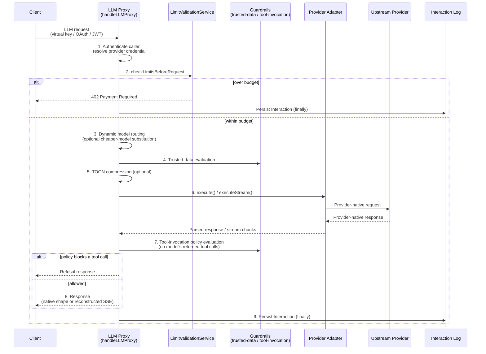
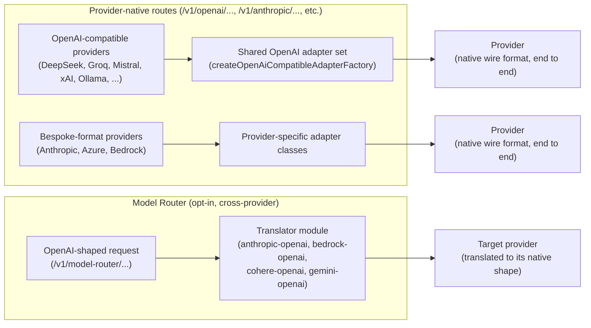
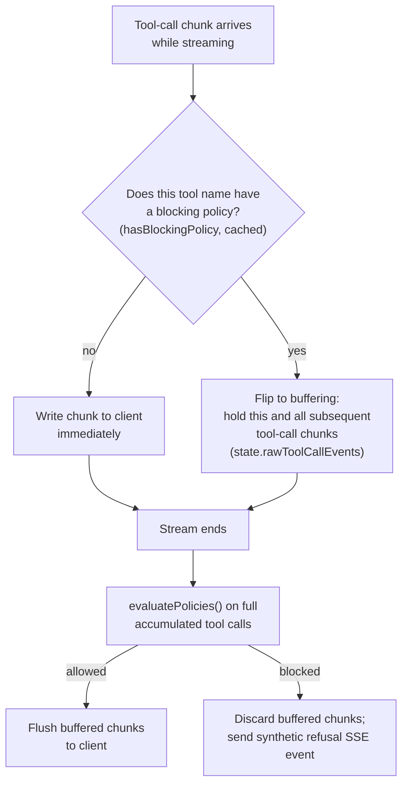

# LLM Proxy & Gateway

Every LLM call Archestra makes — from the in-app chat, from a client calling the platform's OpenAI-compatible endpoint directly, from an external agent using a virtual API key — passes through one component: the LLM Proxy, implemented under `platform/backend/src/routes/proxy/`. It is not a thin passthrough. It is the single point where Archestra authenticates the caller, resolves which real provider credential to use, enforces spend limits, optionally reroutes to a cheaper model, evaluates security guardrails on the model's tool calls, records cost and usage, and — for streaming responses — reconstructs a provider-shaped SSE stream chunk by chunk. All of that has to happen without the proxy becoming a bottleneck on token-by-token latency, which shapes several of the decisions below.

## Why a proxy exists at all

Three reasons come out of the code, not just the marketing copy:

1. **Single integration point.** A client that wants to talk to OpenAI, Anthropic, Azure OpenAI, Bedrock, DeepSeek, Groq, Gemini, Mistral, xAI, Cohere, Ollama, or a dozen other providers can point at one Archestra endpoint using each provider's own wire format (`/v1/openai/...`, `/v1/anthropic/...`, etc.) and never see Archestra as a "translation layer" — the request/response shape at each provider-native route matches that provider's real API almost exactly (`platform/backend/src/routes/proxy/routes/<provider>.ts`, one file per provider).
2. **Policy enforcement point.** Because every token-generating call is forced through this one code path, it is the natural place to enforce spend limits, tool invocation policies, and trusted-data policies — see [Security & Guardrails](./06-security-and-guardrails.md) for the guardrail internals; this document covers where in the proxy pipeline they run.
3. **Observability point.** Every call — streaming or not, successful or aborted — writes an `Interaction` record with token usage, cost, model actually used vs. requested, and TOON/cache savings, from a single `finally` block in the proxy handler.

## Request flow, end to end

The central function is `handleLLMProxy(body, request, reply, providerAdapterFactory)` in `platform/backend/src/routes/proxy/llm-proxy-handler.ts`. Route files under `routes/proxy/routes/` register Fastify handlers per provider (e.g. `openai.ts`, `anthropic.ts`, `azure.ts`, `bedrock.ts`, `deepseek.ts`, plus a provider-agnostic `model-router.ts`) and each calls into the same `handleLLMProxy`, differing only in which `LLMProvider` factory they pass in. Two URL shapes exist per provider: `{prefix}/chat/completions` (uses the org's default agent) and `{prefix}/:agentId/chat/completions` (targets a specific LLM proxy/agent), where `{prefix}` is `PROXY_API_PREFIX` (`/v1/<provider>`, `routes/proxy/common.ts`). Anything not explicitly intercepted (e.g. arbitrary provider endpoints Archestra doesn't specifically model) falls through a catch-all `fastifyHttpProxy` registration gated by `createProxyPreHandler` (`routes/proxy/routes/proxy-prehandler.ts`), so the proxy doesn't need to re-implement every corner of every provider's API to be usable as a drop-in base-URL replacement.

Inside `handleLLMProxy`, the pipeline runs in this order:

1. **Authentication** (`routes/proxy/llm-proxy-auth.ts`) — resolves who is calling and which real provider credential to use. See [Authentication](#authenticating-the-caller-not-just-the-key) below; this is its own multi-method chain, independent of the platform's Better-Auth session middleware that protects `/api/*` routes (see [Backend Architecture](./02-backend.md)).
2. **Cost-limit pre-flight check** (`LimitValidationService.checkLimitsBeforeRequest`, `models/limit.ts`) — runs *before* any upstream call, so a request that would blow a budget never reaches the provider and never incurs cost.
3. **Dynamic model routing / cost optimization** (`routes/proxy/utils/cost-optimization.ts`) — may silently substitute a cheaper model for the requested one, based on org-configured rules.
4. **Trusted-data evaluation** (`guardrails/trusted-data.ts`) — classifies whether the conversation's context is still trustworthy, based on prior tool results in the message history.
5. **TOON compression** (`routes/proxy/utils/toon-conversion.ts`) — optionally re-encodes JSON tool results in the outbound message array as TOON if that's smaller in tokens.
6. **Dispatch to the provider adapter** — `provider.execute(...)` or `provider.executeStream(...)`, which builds a real HTTP client for the target provider and sends the (possibly modified) request.
7. **Tool-invocation policy evaluation** (`guardrails/tool-invocation.ts`) — runs on the model's *returned* tool calls, after the provider responds (or as the stream completes), deciding whether to let them reach the client.
8. **Response formatting** — either the provider's native response shape (non-streaming) or a reconstructed SSE stream (streaming), sent back to the caller.
9. **Interaction persistence** (`finally` block) — usage, cost, baseline-vs-actual model, TOON savings, dual-LLM analysis outcome, regardless of whether the request completed, errored, or was aborted mid-stream.

The ordering matters: limits are checked before spend happens, not after; policy evaluation happens on the model's output, not the client's input, because tool invocation policy is about what the *model chose to call*, not what the client asked for. The pre-flight check (step 2) is a genuine gate — a request over budget gets a `402 Payment Required` and never reaches step 6.

The sequence below shows the same nine steps as a request/response flow, including where the pre-flight budget check short-circuits everything downstream of it:

## Authenticating the caller, not just the key

The LLM proxy's auth chain is separate from the session middleware described in [Backend Architecture](./02-backend.md); it's implemented inline in `handleLLMProxy`/`llm-proxy-auth.ts` and tries, in order:

1. **Internal override** (`llmProxyAuthOverride`) — set by trusted in-process callers (in-app chat, the Model Router) before invoking `handleLLMProxy`, skipping the chain entirely.
2. **JWKS** — if the target agent has an `identityProviderId` configured, the raw `Authorization: Bearer <jwt>` is validated against that IdP's JWKS (`validateExternalIdpToken(agentId, token, "llmProxy")`), and the matched user's own provider key is resolved.
3. **LLM OAuth access token** — for tokens that aren't `arch_*`-prefixed: either `oauth_client_credentials` (service-to-service, gated by an `allowedLlmProxyIds` allowlist on the OAuth client) or `oauth_user` (a user-bound access token with `llm:proxy` scope, resolving the user's *own* provider keys/limits/policies, access controlled by team RBAC or an additive per-client proxy grant).
4. **Virtual API key** (`arch_*`-prefixed) — see below.
5. **Passthrough virtual key** — a distinct header, `X-Archestra-Virtual-Key`, checked independently; authenticates the *user* while the real provider secret is still forwarded as-is via `Authorization`.

A `VirtualKeyRateLimiter` (Keyv/Postgres-backed) throttles brute-force key guessing — 10 failures per 60 seconds per IP triggers a 429 — because a virtual key is a bearer secret that, if guessed, grants spend against the org's real provider credentials. After a caller is resolved, `assertConsistentUserCredentials` cross-checks that if multiple identity sources fired (JWKS, OAuth, personal virtual key), they agree on who the user is — a defense against a key issued to one user being combined with a session/JWT belonging to another. Providers requiring a per-user credential (`PROVIDERS_REQUIRING_PER_USER_CREDENTIAL`, currently `github-copilot` and `microsoft-365-copilot`) fail fast with a `provider_auth_required` 401 and a connect link, rather than silently forwarding a request that's guaranteed to fail upstream or — worse — borrowing another user's linked token.

## Virtual API keys

Modeled in `platform/backend/src/models/virtual-api-key.ts`, schema `database/schemas/virtual-api-key.ts` (plus a `virtual_api_key_provider_api_key` mapping table and `virtual_api_key_team.ts`). There are two kinds:

- **`standard`** — a platform-issued bearer token (`arch_*` prefix) that maps, per real provider, to a `chat_api_keys` row Archestra holds. The client passes the virtual token as if it were the real provider key; Archestra decrypts and substitutes the real secret server-side (`getSecretValueForLlmProviderApiKey`) before calling upstream. The real secret never leaves Archestra's database.
- **`passthrough`** — carries no provider credential at all. Used when the client already has the real upstream secret (e.g. a user's own Claude subscription token) but Archestra still needs an authenticated identity for cost attribution and access control, so it's sent via the separate `X-Archestra-Virtual-Key` header rather than `Authorization`.

Virtual keys are the unit both cost limits (`entityType: "virtual_key"` in the `limits` table) and access scoping (`org`/`team`/`personal` scope, `authorId` for personal keys) attach to. This is what lets an org hand an external integration a single revocable token that carries its own budget, without exposing which real provider key backs it or letting that integration see (or change) the real secret.

## Provider adapter architecture

The proxy does **not** normalize every request into one canonical wire format and translate on the way out. Instead, each provider-native route (`/v1/openai/...`, `/v1/anthropic/...`, etc.) keeps the request in that provider's own shape end to end — the "normalization" only happens at the level of a common *view* used internally for guardrails and cost accounting, not a common *storage* format on the wire.

The interfaces are defined once in `platform/backend/src/types/llm-provider.ts`:

- `LLMRequestAdapter<TRequest, TMessages>` — wraps a provider request; exposes read accessors (`getModel`, `isStreaming`, `getMessages() → CommonMessage[]`, `getTools() → CommonMcpToolDefinition[]`) and mutators (`setModel`, `applyToolResultUpdates`, `applyToonCompression`) plus `toProviderRequest()` to rebuild the (possibly modified) native request before sending.
- `LLMResponseAdapter<TResponse>` — `getText`, `getToolCalls() → CommonToolCall[]`, `getUsage() → UsageView`, `toRefusalResponse(...)` (used when a guardrail blocks the response).
- `LLMStreamAdapter<TChunk, TResponse>` — holds `state: StreamAccumulatorState` (accumulated text/tool-calls/usage across chunks as they arrive), `processChunk`, SSE-formatting methods, and `toProviderResponse()` to synthesize a complete response shape from accumulated stream state (used for logging a streamed call the same way a non-streamed one is logged).
- `LLMProvider<TRequest, TResponse, TMessages, TChunk, THeaders>` — the top-level factory each provider registers: `extractApiKey`, `getBaseUrl`, `createClient`, `execute`/`executeStream`, `extractErrorMessage`.

`CommonMessage`/`CommonToolCall`/`CommonToolResult`/`CommonMcpToolDefinition` (`types/common-llm-format.ts`) are that internal common *view* — guardrail policy evaluation (tool invocation, trusted data) is written once against these types regardless of whether the underlying request came in OpenAI or Anthropic shape.

**Two families of adapters exist**, and the split is deliberate:

1. **OpenAI-compatible providers** — the large majority (DeepSeek, Groq, Mistral, xAI, Ollama, vLLM, OpenRouter, Perplexity, Cerebras, Zhipu AI, MiniMax) share one implementation via `createOpenAiCompatibleAdapterFactory` (`routes/proxy/adapters/openai-compatible-adapter.ts`), which wires the single `OpenAIRequestAdapter`/`OpenAIResponseAdapter`/`OpenAIStreamAdapter` set (`adapters/openai.ts`) with just a base-URL getter and client constructor per provider. Adding one of these providers is close to a config entry, not a new adapter implementation — `adapters/deepseek.ts` is a few lines.
2. **Providers with a genuinely different wire format** get bespoke adapter classes (Anthropic, Azure, Bedrock) *and*, separately, a **translator module** used only by the Model Router: `anthropic-openai-translator.ts`, `bedrock-openai-translator.ts`, `cohere-openai-translator.ts`, `gemini-openai-translator.ts`. Native routes (`/v1/anthropic/...`) never invoke the translators — they pass Anthropic's own shape straight through end to end. The translators exist specifically for the Model Router, which accepts one OpenAI-shaped request and must be able to route it to a non-OpenAI-shaped provider.

### Tool-call format translation (Model Router only)

`anthropic-openai-translator.ts` is the clearest example of the tool-call mapping problem: OpenAI's `tool_calls[].function.{name, arguments}` (a JSON string) becomes Anthropic's `content[].{type:"tool_use", id, name, input}` (a JSON object) on the way in, and Anthropic `tool_use` content blocks become OpenAI `tool_calls` with `arguments: JSON.stringify(block.input)` on the way back out. OpenAI's `tool` role message (keyed by `tool_call_id`) becomes an Anthropic `user` message containing a `tool_result` content block keyed by `tool_use_id`. `tool_choice: "required"` maps to Anthropic's `{type: "any"}`; a named-function choice maps to `{type: "tool", name}`. This translation exists in exactly one direction of use — OpenAI-shaped Model Router request → target provider's native shape, and native response → OpenAI-shaped response — because the Model Router's contract to callers is "you always speak OpenAI wire format, we speak whatever the destination needs."

### Streaming translation

Streaming lives in `handleStreaming` (`llm-proxy-handler.ts`). SSE headers are computed up front but the actual `reply.raw.writeHead(200, sseHeaders)` is deferred until the first byte is written (`ensureStreamHeaders()`), so that if the upstream call fails before any output, the proxy can still return a real HTTP error status instead of being stuck having already committed to `200 OK` (client SDKs detect provider errors via status code, not stream content). `provider.executeStream(...)` returns an `AsyncIterable<TChunk>`; the handler loops `for await (const chunk of stream)`, calls `streamAdapter.processChunk(chunk)`, and writes the resulting `sseData` immediately for text deltas.

For `OpenAIStreamAdapter` (`adapters/openai.ts`), this means reconstructing OpenAI-shaped SSE JSON chunks (`data: ${JSON.stringify(chunk)}\n\n`) while tracking tool-call deltas by index; `stream_options.include_usage: true` is always set so the final usage chunk marks the stream complete. For the native Anthropic route, Anthropic's own SSE event types pass through directly — there is no reshaping into OpenAI-style chunks on that route, because native routes don't translate.

Tool-call chunks get special handling for policy reasons — see the next section.

## How tool calls pass through untouched, while policy still applies

Per the [tool-execution model described in the platform's own contributor guide](./02-backend.md), the LLM proxy never executes tools itself — it returns `tool_use`/`tool_calls` to the client, and the client runs the agentic loop, calling the MCP Gateway to actually execute them (see [MCP Gateway & Orchestrator](./05-mcp-gateway-and-orchestrator.md)). That does not mean tool calls are unexamined; policy enforcement happens on the model's *output* before it leaves the proxy:

- **Non-streaming**: after `provider.execute(...)` returns, `utils.toolInvocation.evaluatePolicies(normalizeToolCallsForPolicy(toolCalls), agent.id, { teamIds, externalAgentId }, contextIsTrusted, enabledToolNames, { surface: "llm-proxy", sessionId })` runs against the response adapter's tool calls. If a policy blocks any call in the batch, the entire batch is blocked and the response is replaced by `responseAdapter.toRefusalResponse(refusalMessage, contentMessage)` — the client never sees the blocked tool call data at all, only a refusal.
- **Streaming**: the same `evaluatePolicies` call runs once the full stream has been accumulated (`streamAdapter.state.toolCalls`). But because blocking a tool call *after* it has already been streamed to the client would be too late, the handler pre-checks each tool name's *blocking* policy (`ToolInvocationPolicyModel.hasBlockingPolicy`, cached in an `LRUCacheManager` keyed `${agentId}:${toolName}:${contextIsTrusted}`, 500 entries / 60s TTL) as each tool-call chunk arrives. A tool with no blocking policy streams its call immediately (important for low-latency MCP Apps UI that render as tool calls arrive); the moment one tool call in the response is found to have a blocking policy, the handler flips to buffering *all* subsequent tool-call chunks in `streamAdapter.state.rawToolCallEvents` instead of writing them, so a later block decision can still discard them before they reach the client. Once the stream ends and the full policy evaluation completes, buffered events are either flushed (allowed) or discarded and replaced with a synthetic refusal SSE event (`streamAdapter.formatCompleteTextSSE`).

This is the concrete mechanism behind the platform-wide rule that "tool invocation policies and trusted data policies are still enforced by the proxy" even though the proxy itself never calls the tool.

The streaming case's buffering decision is per-tool-name, made as each chunk arrives, not a blanket policy:

## Virtual keys, cost limits, and dynamic model routing

### Cost model

`database/schemas/model.ts` (`ModelModel`) holds one row per `(provider, modelId)` with pricing synced from models.dev (`promptPricePerToken`, `completionPricePerToken`, `cacheReadPricePerToken`, `cacheWritePricePerToken`), plus admin-overridable `customPricePerMillion*` fields; `ModelModel.getEffectivePricing()` resolves custom-override > synced > estimated-fallback. `routes/proxy/utils/cost-optimization.ts#calculateCost(...)` uses this to compute the actual dollar cost of every call (including split cache-read/cache-write rates, `CACHE_PRICE_MULTIPLIERS`), used both for OTel span attributes and the persisted `Interaction` record.

### Limits — enforced before spend, not after

`models/limit.ts` (`LimitModel`/`LimitValidationService`) scopes a `token_cost` limit by `entityType` (`organization | team | user | agent | virtual_key | environment`) and an optional model allowlist, with a configurable rolling or calendar cleanup interval. `checkLimitsBeforeRequest` runs immediately after auth resolution and before the upstream call: it batches a single prefetch of all relevant limits/usage across every applicable entity (`prefetchEntityLimits`, avoiding N+1 queries per request) and evaluates in a fixed priority order — passthrough virtual key → standard virtual key → user (with org/environment default-user-limit fallback) → agent → environment → each team → organization — short-circuiting on the first violation. A blocked request returns **402 Payment Required**, deliberately not 429: a 429 signals "retry me," which is correct for provider rate limiting but wrong for a budget stop that will never clear on its own; LLM client SDKs commonly auto-retry 429s, which would just re-trigger the same block in a loop.

### Dynamic model routing — two distinct mechanisms, not one

1. **Cost-optimization substitution** (same provider, cheaper model). `OptimizationRuleModel` (`database/schemas/optimization-rule.ts`) stores priority-ordered rules per org+provider with conditions (`maxLength` token-count threshold, `hasTools`) and a `targetModel`; `matchByRules` returns the first fully-matching rule — first-match-wins, so rule ordering encodes "specific exception before general fallback." When a rule matches, `requestAdapter.setModel(optimizedModel)` silently substitutes the model before the request is sent, *after* the limit check (limits are evaluated against the model actually about to be billed... note the requested model, not yet the optimized one, which is why both `baselineModel` and `actualModel` are persisted as separate columns on the interaction record — an auditable trail of what was requested vs. what actually ran).
2. **The Model Router** (`routes/proxy/routes/model-router.ts`, `/v1/model-router/{proxyId}/{responses|chat/completions|embeddings|models}`) — an explicit, developer-chosen cross-provider endpoint, not automatic failover. Clients pass a provider-qualified model id like `openai:gpt-5.4` or `anthropic:claude-haiku-4-5-20251001`; `resolveModelRoute()` (`routes/proxy/model-router-resolver.ts`) parses the prefix, constrains the choice to `allowedProviders`/`allowedApiKeyIds` derived from the caller's virtual key or OAuth client mappings, and either forwards straight through (for the OpenAI-wire provider set) or runs the request through the relevant translator module before handing it to `handleLLMProxy`. There is no evidence in the code of automatic cross-provider failover on error — each request targets exactly one resolved provider.

### TOON compression

`routes/proxy/utils/toon-conversion.ts#shouldApplyToonCompression(agentId)` checks an org- or team-level toggle (`organization.convertToolResultsToToon` / `team.convertToolResultsToToon` booleans in `database/schemas/organization.ts` / `team.ts`, gated by `organization.compressionScope`) — note this lives on the org/team row, not on the agent itself, despite shorthand descriptions elsewhere referring to it as an agent-level setting. If enabled, each provider adapter's `convertToolResultsToToon(messages, model)` JSON-parses every `tool_result` content block, encodes it with the `@toon-format/toon` package, counts tokens before/after with a provider-specific tokenizer, and keeps the TOON-encoded version only if it's actually smaller — otherwise it silently falls back to the original JSON. This runs after trusted-data evaluation and before provider dispatch; savings (`tokensBefore`, `tokensAfter`, `costSavings`) are persisted per interaction and rolled up in cost statistics.

## Design Decisions & Tradeoffs

**Clients keep the agentic loop; the proxy never executes tools.** The LLM proxy returns `tool_use`/`tool_calls` to the caller exactly as the provider produced them (modulo policy blocking) — it does not call the MCP Gateway on the model's behalf, run the loop, and only return a final answer. This mirrors standard OpenAI/Anthropic client behavior, which means any existing OpenAI- or Anthropic-SDK-based application can point at Archestra with zero code changes to its control flow. The alternative — the proxy owning the loop — would centralize more logic server-side but would break the "drop-in base URL" promise that makes the proxy adoptable in the first place, and would require the proxy to hold live state across what might be a long-running, possibly-abandoned multi-turn tool exchange. The cost of the chosen design is that policy enforcement has to happen twice, once per surface (`PolicyEnforcementContext.surface: "llm-proxy" | "mcp-gateway"`) — the proxy checks tool calls the model *proposes*, the gateway checks tool calls the client actually *executes* — rather than once in a single control point.

**Provider-native routes over one normalized wire format.** Archestra could have picked a single canonical request/response format (OpenAI's, most likely, since it's the de facto lingua franca) and required every client to speak it, translating internally to every provider. Instead each provider gets its own route that mirrors that provider's real API almost exactly, and translation only happens for the opt-in Model Router. This means an Anthropic SDK client calling `/v1/anthropic/.../v1/messages` gets genuinely native Anthropic behavior (correct stream event types, correct error shapes) rather than an approximation — important because provider SDKs are picky about exact response shape and subtle mismatches break silently. The cost is real: it means N adapter implementations to maintain (one per genuinely different wire format) instead of one, and the translator modules used by the Model Router are themselves nontrivial, lossy-prone code (tool-call shape, stop-reason mapping, message-role folding) that has to be kept in sync as providers evolve their APIs. The `provider-matrix.test.ts` exhaustiveness check (`providerConfigsByProvider satisfies Record<SupportedProvider, ProviderTestConfig>`) exists specifically to keep that N-way surface from silently drifting when a provider is added.

**Streaming tool-call buffering trades latency for correctness only when it must.** The default behavior streams tool-call chunks to the client immediately, because MCP Apps UI wants to render tool-call progress in real time. Buffering (and the possibility of retroactively discarding already-buffered-but-not-yet-sent chunks) only kicks in once a *specific tool name* in the current response is found to have a blocking policy — a per-request, per-tool decision, not a blanket "always buffer to be safe" policy. This is a deliberate bet that most tool calls in practice have no blocking policy and should stream at full speed, accepting that the small subset with policies attached pay an extra buffering cost (and a slightly worse streaming UX — that tool call arrives all-at-once rather than incrementally) in exchange for never leaking a blocked tool call to the client, even for the last millisecond of a stream.

**402, not 429, for budget stops.** Limit violations are surfaked as `402 Payment Required` specifically to avoid the auto-retry behavior most LLM client SDKs apply to 429 responses. A budget block that gets auto-retried isn't just wasted work — for a per-request rate-based retry-with-backoff client it can look like a hang, since the block will never clear until a human intervenes (raises the limit or waits for the cleanup window). Choosing a status code most SDKs don't have special retry semantics for makes the failure visible immediately instead of silently retried into a longer outage.

**Virtual keys as an indirection layer, not just an API-key wrapper.** A virtual key isn't simply "a key that maps to another key" — it's the unit that cost limits, access scope, and (for passthrough keys) identity attribution all attach to, independent of which real provider credential eventually gets used. This lets an org issue a single revocable token to an external integration with its own enforced budget, without that integration ever seeing — or being able to rotate/leak — the real provider secret. The `passthrough` variant exists because not every use case can tolerate Archestra owning the real secret (e.g. a user's personal subscription-based Claude token that the user wants to use directly) — splitting virtual keys into two kinds rather than forcing every caller through the `standard` model was necessary to support that case without losing cost attribution and access control for it.

**Pre-flight cost-optimization model substitution is transparent, not silent.** Rerouting a request to a cheaper model without the caller's explicit per-request consent is the kind of behavior that erodes trust if it's invisible. Persisting `baselineModel` and `actualModel` as two distinct columns on every interaction (rather than overwriting the requested model in the log) means the substitution is always auditable after the fact, even though the substitution itself happens silently in the hot path — the tradeoff is between "safe to enable by default because behavior is fully logged" versus a design that required per-request opt-in and lost the "reduce spend without any client-side change" value proposition the feature exists for.

---

Related documents: [Backend Architecture](./02-backend.md) for the request lifecycle this proxy sits inside; [MCP Gateway & Orchestrator](./05-mcp-gateway-and-orchestrator.md) for where the tool calls this proxy returns actually get executed; [Security & Guardrails](./06-security-and-guardrails.md) for the tool invocation and trusted data policy internals referenced above.
