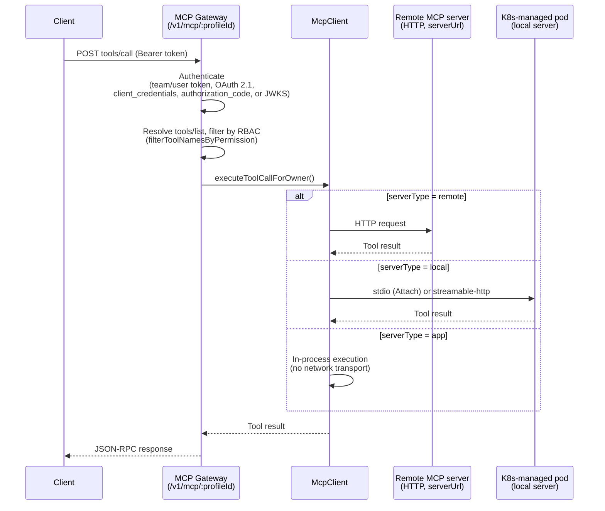
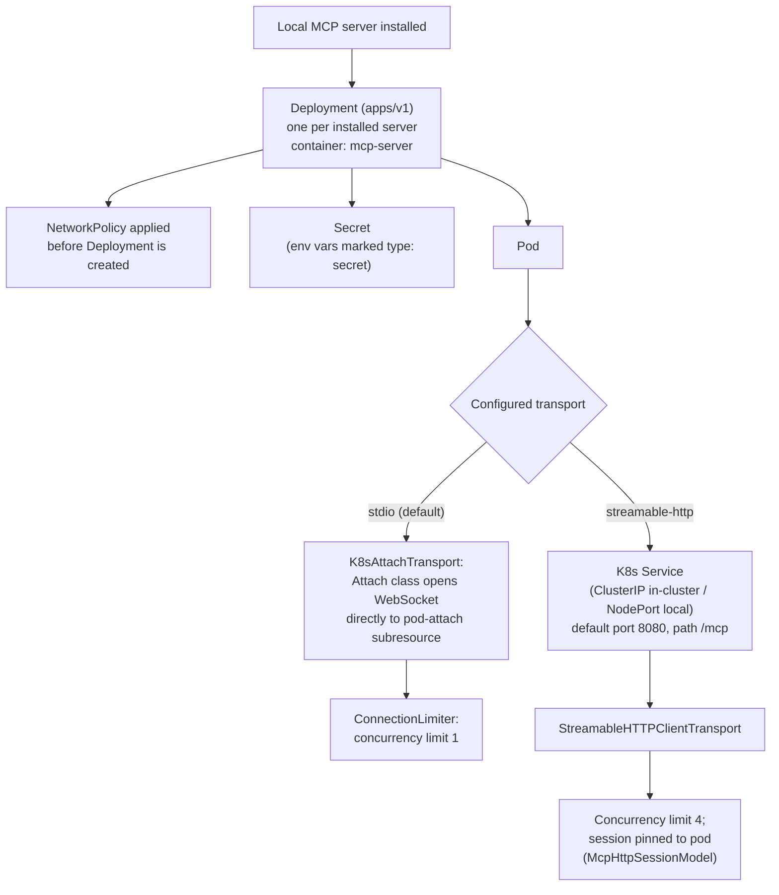

# MCP Gateway & Orchestrator

The [LLM Proxy](./04-llm-proxy-and-gateway.md) returns tool calls to the client — it never executes them. Execution happens against the MCP Gateway, which resolves a caller's `tools/list`/`tools/call` JSON-RPC requests against whatever MCP servers an agent has access to. Those servers can be remote HTTP endpoints Archestra doesn't manage, or "local" servers Archestra runs itself as Kubernetes workloads. This document covers the gateway's request path, the Kubernetes-backed runtime that manages those local servers, the two transports it supports, the OAuth/On-Behalf-Of machinery for calling out to third-party APIs as a specific user, the private registry and installation-approval workflow, and the built-in Archestra MCP server's RBAC model.

## MCP protocol primer (brief)

MCP (Model Context Protocol) defines a JSON-RPC 2.0 protocol for exposing tools, resources, and prompts to an LLM client. A server declares its capabilities and tool schemas via `initialize`/`tools/list`; a client calls a tool via `tools/call` and gets back a structured result (which may itself be marked with metadata like MCP Apps UI resources). Archestra depends on `@modelcontextprotocol/sdk` directly — `McpServer` for hosting the gateway's own protocol surface, `Client` and `StreamableHTTPClientTransport` for talking to backend MCP servers, and the `Transport` interface (`shared/transport.js`) implemented by Archestra's own K8s-attach transport (below).

## Gateway responsibilities

The token-authenticated gateway is implemented in `platform/backend/src/routes/mcp-gateway.ts` at `${config.mcpGateway.endpoint}/:profileId` (`/v1/mcp/:profileId`), where `endpoint` comes from `config.mcpGateway.endpoint` (`backend/src/config.ts`):

- **GET `/v1/mcp/:profileId`** — discovery. Validates the Bearer token, returns `{ name, version, agentId, transport: "http", capabilities: { tools: true }, tokenAuth? }`. A `401` response sets `WWW-Authenticate: Bearer resource_metadata="…/.well-known/oauth-protected-resource…"` per RFC 9728, so an OAuth-aware client can discover how to authenticate.
- **POST `/v1/mcp/:profileId`** — stateless JSON-RPC. Every request gets a fresh `McpServer` instance and a fresh `StatelessTransport` (`mcp-gateway.utils.ts`), and the Fastify response is hijacked (`reply.hijack()`) so the MCP SDK writes the raw HTTP response directly rather than going back through Fastify's serialization. `initialize` calls are logged to `McpToolCallModel`.
- `profileId` in the URL is an **agent ID** — "profile," "agent," and "gateway" all resolve to the same underlying `agent` table row; the terminology varies by context but not the schema.

`tools/list` resolution (`createAgentServer`, `mcp-gateway.utils.ts`) merges several sources before returning a tool list to the caller: (a) MCP tools explicitly assigned via `agent_tools`, (b) dynamically-widened access when the agent has `accessAllTools` ("Auto" mode) enabled, via `ToolModel.getMcpToolsAccessibleToUser`, (c) implicit `search_tools`/`run_tool` meta-tools when the agent's `toolExposureMode` is `search_and_run_only` (used to keep large tool catalogs out of the model's context until needed), and (d) delegation tools for sub-agents and skills. The merged list is then filtered by RBAC (`filterToolNamesByPermission`) and any per-agent exclusions — a caller never sees a tool they aren't permitted to call, rather than seeing it and being denied at call time.

Actual `tools/call` dispatch reaches `McpClient.executeToolCallForOwner()` (`backend/src/clients/mcp-client.ts`), which resolves the target MCP server for the requested tool and picks a transport based on `catalogItem.serverType`: `"remote"` always dispatches over HTTP to the catalog's `serverUrl`; `"local"` dispatches to a Kubernetes-managed pod over stdio or streamable-http depending on the runtime's configured transport (below); `"app"` short-circuits entirely in-process with no network transport, since an "app" tool backing is handled locally.

Auth on this surface is not a single mechanism — `mcp-gateway.utils.ts` implements six paths: team/user bearer tokens, full OAuth 2.1 (Archestra acting as both authorization server and resource server), MCP OAuth client `client_credentials`, MCP OAuth client `authorization_code` (On-Behalf-Of an Archestra user — see below), and external-IdP JWKS validation. This matches the two-layer model `docs/pages/mcp-authentication.md` documents: gateway auth (who is allowed to call the gateway at all) is a separate concern from upstream MCP-server auth (what credential the *server itself* uses to call a third-party API on the caller's behalf).

Separately, session-cookie-authenticated (not Bearer-token) routes exist for the frontend's in-app "Apps" UI: `POST /api/mcp/:agentId` (`routes/mcp-proxy.ts`) and `POST /api/mcp/server/:mcpServerId` (`routes/mcp-server-proxy.ts`). Both dispatch through the same `McpClient` transport-selection code eventually, but they authenticate the browser session rather than a bearer token, and they are a distinct surface from the token-authed `/v1/mcp/:profileId` gateway — there is no literal `/mcp_proxy/:id` Bearer-token route in the codebase as of this writing; the closest analogues are these two session-authed routes.

The sequence below traces a `tools/call` request through the token-authed gateway, from auth through dispatch to whichever backing the resolved tool has:

## K8s orchestrator design: pod-per-server

The runtime manager lives at `platform/backend/src/k8s/mcp-server-runtime/` (not `backend/src/mcp-server-runtime/`), split across:

- `manager.ts` — `McpServerRuntimeManager`, a singleton exported as `default new McpServerRuntimeManager()`, the orchestration entry point (`startServer`, `stopServer`, `removeMcpServer`, `getExecCommand`, log streaming, etc.).
- `k8s-deployment.ts` — `K8sDeployment`, one instance per MCP server, owning every Kubernetes API call for that server's Deployment/Service/Secret/NetworkPolicy.
- `k8s-yaml-generator.ts`, `network-policy.ts`, `egress-baseline.ts`, `image-pull-policy.ts`, `schemas.ts` — supporting concerns (manifest generation, network policy shape, default-deny egress baseline, image pull policy resolution).
- `platform/backend/src/k8s/shared.ts` — `loadKubeConfig()`/`createK8sClients()`, the actual `@kubernetes/client-node` client construction (`CoreV1Api`, `AppsV1Api`, `BatchV1Api`, `NetworkingV1Api`, `CustomObjectsApi`, plus `Attach`/`Exec`/`Log` helper classes).
- `platform/backend/src/k8s/capabilities.ts`, `cluster-dns.ts` — cluster capability probing (used to pick which NetworkPolicy CRD flavor is available — see below) and DNS resolution helpers.

A separate `k8s/dagger-environment-runtime/` runs the Dagger-backed Skill sandbox, not MCP servers — the two are easy to conflate by directory proximity but are functionally unrelated; see [Agents, Skills & the Sandbox](./07-agents-skills-sandbox.md) for that runtime.

### Imperative API calls, not a CRD/controller-loop operator

This is worth being precise about, since "orchestrator" and "operator" suggest a Kubernetes controller pattern (watch a custom resource, reconcile continuously). That is **not** what this is. There is no Archestra-owned CRD and no watch-based reconcile loop. `McpServerRuntimeManager` and `K8sDeployment` make direct, on-demand `@kubernetes/client-node` calls — `createNamespacedDeployment`, `readNamespacedDeployment`, `deleteNamespacedDeployment`, etc. — triggered by actual events: a user installs a server, a chat turn needs a cold-started server, or the process boots and re-verifies every already-installed local server. Readiness is polled (`waitForDeploymentReady`, up to 60 attempts × 2s), not watched. There is a boot-time `reconcileEgressPolicies` sweep and a `cleanupOrphanedDeployments` sweep, which are reconcile-*shaped* in spirit, but both are one-shot passes at startup, not a continuously running controller process.

### Resources created per MCP server

- **Deployment** (`apps/v1`, `replicas: 1` by default, container named `mcp-server`) — not a bare Pod. The runtime migrated off bare Pods to Deployments and retains self-heal logic for stale immutable `spec.selector` values left over from that migration (delete + `waitForDeploymentAbsent()` + recreate).
- **Secret** (`Opaque`) for any catalog `localConfig.environment` entry marked `type: "secret"`, named per-install (`mcp-server-<id>-secrets`) or, for multitenant catalogs, shared by catalog ID.
- **Service** — only created for the streamable-http transport (stdio doesn't need one, since traffic goes through the K8s API server's attach subresource, not a Service). `NodePort` when running against a local/dev kubeconfig, `ClusterIP` when configured to load the kubeconfig from the current cluster (in-cluster/production). Default port `8080`, default path `/mcp` (both overridable via `localConfig.httpPort`/`httpPath`).
- **Image-pull Secret(s)** (`kubernetes.io/dockerconfigjson`) — generated from configured registry credentials, or referenced by name if an existing cluster secret was chosen instead.
- **NetworkPolicy** (or the cluster's native equivalent — `CiliumNetworkPolicy`, GKE `FQDNNetworkPolicy`, AWS `ApplicationNetworkPolicy` — selected via `getK8sCapabilitiesFromApi`) applied to the pod before the Deployment is created (so a pod is never briefly unconfined), plus a namespace-wide default-deny egress baseline ensured once per namespace. This is the one place Archestra manages a third-party CRD, and it's still a one-shot upsert (`createNamespacedCustomObject`/`replaceNamespacedCustomObject`), not a watched object.

**Multitenant catalogs** (`multitenant: true`) share a single Deployment/Service/Secret across every installer, named by catalog ID rather than per-install ID; `stopServer`/`removeMcpServer` track sibling install counts so the shared resources only get torn down when the last installer removes it.

**Lifecycle**: `startOrCreateDeployment()` migrates any legacy bare Pod, self-heals a stale selector, applies the NetworkPolicy, then creates the Deployment; `waitForDeploymentReady()` classifies container `waiting` reasons into terminal failures (`CrashLoopBackOff`, `InvalidImageName` → fail fast) versus transient ones the kubelet will retry (`ImagePullBackOff`, `ErrImagePull` → keep polling); `stopDeployment()` deletes only the Deployment, while `removeDeployment()` tears down Deployment + Service + Secret + regcred Secrets + NetworkPolicy. There is no idle-timeout auto-scale-to-zero — an installed local server's pod runs continuously; the only cleanup sweep runs once at process boot and removes Deployments whose stored name no longer matches current naming conventions. Pods run with `terminationGracePeriodSeconds: 5` and `enableServiceLinks: false`.

Custom Docker images per server override `ARCHESTRA_ORCHESTRATOR_MCP_SERVER_BASE_IMAGE`; personal-scope catalog entries with a custom image go through a separate `catalogItemApprovalStatus` gate before their pod is allowed to run, distinct from the installation-request workflow described below.

## Transports: stdio vs streamable-http

### stdio (default)

Implemented in `platform/backend/src/clients/k8s-attach-transport.ts` (`K8sAttachTransport`), consumed from `clients/mcp-client.ts`. It is **not** a `kubectl` subprocess. It uses `@kubernetes/client-node`'s `Attach` class — `.attach(namespace, podName, "mcp-server", stdoutStream, null, stdinStream, false /* tty */)` — which opens a WebSocket directly to the Kubernetes API server's pod-attach subresource: the same underlying protocol `kubectl attach` uses, but through the native Node.js client library, with no subprocess spawned. `K8sAttachTransport` implements the MCP SDK's `Transport` interface, feeding a persistent stdin stream and buffering stdout through the SDK's own `ReadBuffer`/`serializeMessage` JSON-RPC framing.

Because a single stdio pipe can't multiplex concurrent JSON-RPC calls, `mcp-client.ts` runs a `ConnectionLimiter` that serializes requests per connection key when `shouldLimitConcurrency()` is true — effectively a concurrency limit of 1 for stdio connections, versus `HTTP_CONCURRENCY_LIMIT = 4` for HTTP-transported servers.

A related but distinct mechanism, interactive exec (used for debug shells, not tool calls), uses `@kubernetes/client-node`'s `Exec` class the same way — `K8sDeployment.execIntoContainer()` → `this.k8sExec.exec(namespace, podName, "mcp-server", command, stdout, stderr, stdin, true /* tty */, onStatus)` — exposed through `McpServerRuntimeManager.execIntoMcpServer()`. A sibling helper, `getExecCommand()`, returns a literal `kubectl exec -it ...` string purely for the UI's "copy this command" convenience; the actual live exec session still goes over the client-node WebSocket, not a spawned CLI. Pod logs (`getMcpServerLogs`/`streamMcpServerLogs`, backing `GET /api/mcp_server/:id/logs?lines=N&follow=true`) similarly call `CoreV1Api.readNamespacedPodLog()` directly rather than shelling out to `kubectl logs`.

### streamable-http

`mcp-client.ts` resolves the pod's K8s Service endpoint (`McpServerRuntimeManager.getHttpEndpointUrl()`) and constructs an MCP SDK `StreamableHTTPClientTransport(new URL(endpointUrl), { sessionId, requestInit: { headers } })` — a direct outbound HTTP client connection to the Service, not a literal reverse-proxy route on the gateway. Because a Deployment can in principle run multiple replicas and a K8s Service load-balances across them, MCP session affinity is handled explicitly: the MCP `Mcp-Session-Id` and the specific `sessionEndpointPodName` are persisted in Postgres (`McpHttpSessionModel`), and when running in-cluster, requests are pinned to a specific pod IP (`getRunningPodHttpEndpoint()`) rather than relying on the Service's random load-balancing to keep hitting the same backend mid-session.

### Why both exist

stdio is the default because it matches how the overwhelming majority of existing MCP servers are actually distributed and run today (a CLI process reading/writing JSON-RPC over stdin/stdout) — no server-side code change is required to run an off-the-shelf stdio MCP server inside Archestra's runtime. streamable-http is required for servers that are natively HTTP services (or need to support genuinely concurrent tool calls) since a serialized single-pipe transport would otherwise become a bottleneck. The tradeoff is transport-dependent request concurrency (1 for stdio vs. 4 for HTTP) and different infrastructure per server (no Service resource needed for stdio at all).

## OAuth / On-Behalf-Of (OBO) authentication

This is Enterprise-tier code (`SPDX-License-Identifier: LicenseRef-Archestra-Enterprise`) under `platform/backend/src/services/identity-providers/enterprise-managed/`, and it solves a distinct problem from gateway auth: once a caller is authenticated *to the gateway*, an MCP server sometimes needs to call a third-party API (e.g. Microsoft Graph) *as that specific user*, without ever holding that user's actual password or a long-lived personal token.

- **`exchange.ts`** — `exchangeEnterpriseManagedCredential()` selects a strategy: `entra_obo`, `okta_managed`, or `rfc8693`, from explicit catalog configuration or auto-detected from the IdP issuer hostname.
- **`exchange-strategies/entra-obo-strategy.ts`** — the literal Entra ID OBO flow: POST to the IdP token endpoint with `grant_type=urn:ietf:params:oauth:grant-type:jwt-bearer`, `requested_token_use=on_behalf_of`, `assertion=<caller's Entra JWT>`, `scope=<resource>/.default`. Client authentication to the token endpoint supports `client_secret_post`, `client_secret_basic`, or `private_key_jwt` (a signed JWT client assertion via `jose`). A special-cased error path recognizes `AADSTS50013` (signature validation failure), which usually means the inbound token was minted for a different audience (e.g. Microsoft Graph) than the target app registration expects.
- **`broker.ts`** — `resolveEnterpriseTransportCredential()` orchestrates the full exchange: resolve an identity assertion for the tool's owning user (`assertion-resolver.ts`), then either pass it through raw or exchange it (optionally via an intermediate ID-JAG hop at a protected-resource endpoint, RFC 8414/9728-style discovery), normalizing the result into `{ headerName, headerValue }` for injection into the upstream request — `Authorization: Bearer`, a raw `Authorization` value, or a custom header, depending on `tokenInjectionMode`.
- **`assertion-resolver.ts`** — decides *where* the caller's identity assertion comes from: if the agent's bound IdP matches the IdP that authenticated the caller at the gateway (JWKS-based gateway auth), the raw JWT is passed through directly; otherwise a stored per-user session token for the target IdP is resolved (`resolveSessionExternalIdpToken`).
- Consumed in `clients/mcp-client.ts::executeToolCallForOwner()`, and explicitly restricted to HTTP-based transports — stdio throws ("Enterprise-managed credentials require an HTTP-based MCP transport"), since injecting a per-request Authorization header only makes sense on a request/response transport, not a persistent stdio pipe.

This backs `docs/pages/mcp-authentication.md`'s "Identity Provider Token Exchange" section and is configured per catalog entry via `internal_mcp_catalog.enterpriseManagedConfig` (jsonb).

```mermaid
flowchart LR
    Call["Tool call needs to reach a<br/>third-party API as a specific user<br/>(executeToolCallForOwner, HTTP transport only)"] --> Broker["broker.ts:<br/>resolveEnterpriseTransportCredential()"]
    Broker --> Resolver["assertion-resolver.ts:<br/>where does the identity assertion come from?"]
    Resolver -- "agent's IdP = gateway-auth IdP" --> RawJwt["Pass through caller's<br/>raw JWT"]
    Resolver -- "different IdP" --> StoredToken["resolveSessionExternalIdpToken:<br/>stored per-user session token"]
    RawJwt --> Exchange["exchange.ts:<br/>exchangeEnterpriseManagedCredential()<br/>selects a strategy"]
    StoredToken --> Exchange
    Exchange -- "entra_obo" --> Entra["entra-obo-strategy.ts:<br/>JWT-bearer OBO exchange<br/>with IdP token endpoint"]
    Exchange -- "okta_managed" --> Okta["okta_managed strategy"]
    Exchange -- "rfc8693" --> Rfc["rfc8693 strategy"]
    Entra --> Normalize["Normalize to<br/>{ headerName, headerValue }"]
    Okta --> Normalize
    Rfc --> Normalize
    Normalize --> Inject["Inject header into<br/>upstream MCP-server request"]
```

## Private registry & installation-request workflow

**Registry**: `internal_mcp_catalog` table (`database/schemas/internal-mcp-catalog.ts`), model `InternalMcpCatalogModel`, routes `routes/internal-mcp-catalog.ts`. Each catalog entry has a `serverType` (`local | remote | app`), a `scope` (`personal | team | org`), a `multitenant` flag, an optional `environmentId`, and jsonb configuration blocks (`localConfig`, `oauthConfig`, `enterpriseManagedConfig`) plus `catalogItemApprovalStatus` for gating untrusted custom images on personal entries.

**Installation requests**: `mcp_server_installation_request` table, model `McpServerInstallationRequestModel`, routes `routes/mcp-server-installation-requests.ts`. Flow: a member submits `POST /api/mcp_server_installation_requests` referencing either an `externalCatalogId` (an entry from a public/external registry index) or a `customServerConfig`; a duplicate-pending-request guard prevents resubmission spam. An admin (holding `mcpServerInstallation:admin`) sees every pending request via `GET`, while a regular member sees only their own. `POST .../:id/approve` or `.../:id/decline` (both accepting an optional `adminResponse`) resolve the request, with `reviewedBy`/`reviewedAt` recorded for audit, and `POST .../:id/notes` supports a collaborative comment thread on the request before a decision is made. This is the gate between "an org member found a useful MCP server" and "that server actually gets a running pod" for anything beyond the member's own personal scope.

## The built-in Archestra MCP server and its RBAC model

Archestra ships its own MCP server, implemented at `platform/backend/src/archestra-mcp-server/` (one file per tool group — team tools, agent tools, sandbox/file tools, skill tools, etc.), with every tool name prefixed `archestra__`. A catalog entry for it is auto-created at startup with a fixed ID, `ARCHESTRA_MCP_CATALOG_ID`, so it always exists without requiring installation. Unlike upstream MCP tools, these tools must be **explicitly assigned** to an agent — they are never auto-injected just because they exist.

These built-in tools bypass tool-invocation and trusted-data policy evaluation entirely (`archestraMcpBranding.isPolicyBypassedToolName` — see [Security & Guardrails](./06-security-and-guardrails.md) for the full guardrail model) on the reasoning that they are platform-authored code, not upstream content an attacker could inject through. That bypass is narrow and specific to content-based guardrails — it does **not** extend to RBAC. Every `archestra__*` tool is mapped to a `{ resource, action }` permission pair in `TOOL_PERMISSIONS`, typed `Record<ArchestraToolShortName, Permission | null>` in `archestra-mcp-server/rbac.ts` — a type that fails to compile if a newly added tool doesn't get an explicit permission entry (or an explicit `null` for "no additional check"). `checkToolPermission` is the single choke point every built-in tool dispatch runs through before its handler executes, and `tools/list` calls `filterToolNamesByPermission` to filter the tool set a caller even sees, rather than showing a tool a caller would then get denied for calling. This keeps "trusted content" (bypassing policy) and "authorized caller" (RBAC) as two independent gates that are never accidentally coupled — a built-in tool being exempt from prompt-injection-focused guardrails says nothing about whether the calling user is permitted to use it.

## A2A gateway — how it differs from the MCP gateway

Two versions coexist: legacy `routes/a2a.ts` (`config.a2aGateway.endpoint = "/v1/a2a"`) and the current `routes/a2a-v2.ts` (`config.a2aV2Gateway.endpoint = "/v2/a2a"`, `A2AV2Router`, backed by `agents/a2a/a2a-manager.ts::A2AManager`). It implements a JSON-RPC 2.0 protocol modeled on Google's Agent-to-Agent (A2A) spec: `GET /v2/a2a/:agentId/.well-known/agent-card.json` for capability discovery (name, skills, `supportedInterfaces`, streaming support), and `POST /v2/a2a/:agentId` for `SendMessage`/`GetTask`/`SendStreamingMessage` (SSE, 15s heartbeat, aborts on client disconnect). It reuses the exact same `validateMCPGatewayToken`/`extractBearerToken` logic as the MCP Gateway — same Bearer-token surface — but is restricted to internal agents (`agent.agentType === "agent"`, not MCP-server-backed gateways).

The direction of the relationship is the opposite of the MCP Gateway's: the MCP Gateway exposes **tools** for a client to drive its own agentic loop against; the A2A Gateway exposes Archestra's own **agents** as callable conversational peers for *other* agent systems to orchestrate. Instead of Archestra calling out to a tool, an external A2A-speaking system calls in and runs a turn of an Archestra agent.

## TOON conversion in the tool-result path

`convert_tool_results_to_toon`-style compression is applied in the LLM proxy, not in the MCP gateway itself — see [LLM Proxy & Gateway](./04-llm-proxy-and-gateway.md#toon-compression) for the mechanism. The gateway returns tool results in their native JSON shape; TOON re-encoding happens later, when those results are assembled into the next LLM proxy request.

## Design Decisions & Tradeoffs

**Pod-per-MCP-server instead of multiplexing servers inside shared processes.** Each installed local MCP server gets its own Kubernetes Deployment rather than Archestra running several servers' processes inside one shared container or pod. This buys hard isolation — one server's crash, resource exhaustion, or (if compromised) malicious egress attempt cannot affect another server's process or network namespace — and lets per-server NetworkPolicy/egress-baseline rules be genuinely per-server rather than a coarse shared boundary. The cost is real infrastructure overhead: every installed server is a full Deployment (plus optional Service/Secret/NetworkPolicy), so an org with many lightly-used MCP servers pays a fixed per-server K8s resource cost rather than amortizing overhead across a shared runtime — there is no idle-scale-to-zero to offset this, so an installed server's pod runs continuously whether or not it's actively used.

**Imperative API-client calls over a real CRD/controller-loop operator.** Despite "orchestrator" naming, the runtime does not define a custom resource and reconcile it continuously; it makes direct, on-demand Kubernetes API calls triggered by product events (install, cold-start on first tool call, process boot). This is a simpler implementation with far less Kubernetes-specific operational complexity (no controller binary, no CRD versioning/migration story, no leader election) — appropriate given Archestra's backend is already a long-running process that can hold this state in its own database rather than in `etcd`-backed custom resources. The tradeoff is that "self-healing" (e.g. pod deleted out-of-band, recreate it) only happens on the events Archestra explicitly checks for (boot-time sweep, next tool call needing that server) rather than continuously — a genuine controller watching Pod/Deployment events would notice and react faster to out-of-band cluster changes.

**stdio over a real `kubectl attach` subprocess.** Using `@kubernetes/client-node`'s `Attach` class to open the same underlying WebSocket protocol `kubectl attach` uses, rather than shelling out to the actual `kubectl` binary, avoids a process-management and binary-availability dependency (no need to ship/locate a `kubectl` binary, manage its lifecycle, or parse its stdout/stderr framing) and gives the backend a typed, promise-based API surface with the SDK's own error types. The literal `kubectl exec`/`kubectl logs` strings that *are* surfaced (via `getExecCommand()`, `getMcpServerLogsCommand()`) exist purely as a copy-pasteable convenience for a human operator debugging manually — the platform itself never runs them.

**stdio's serialized concurrency (limit 1) is accepted, not engineered around, because it matches most MCP servers' actual constraints.** Nearly all off-the-shelf stdio MCP servers are single-threaded processes reading one JSON-RPC message at a time from stdin — genuinely concurrent request handling over one stdio pipe isn't safe for most of them regardless of what the transport allows. Rather than build request pipelining/multiplexing logic that most servers couldn't safely use anyway, the `ConnectionLimiter` simply serializes stdio calls (concurrency 1) and treats streamable-http (concurrency 4) as the escape hatch for servers that actually need concurrent tool calls — pushing the choice of "do I need real concurrency" onto whichever transport the server author picks, rather than trying to paper over it uniformly.

**OBO/enterprise-managed credentials are HTTP-transport-only, by design, not by omission.** `resolveEnterpriseTransportCredential` explicitly throws for stdio servers rather than silently degrading or attempting some stdio-compatible workaround. Token exchange produces a per-request `Authorization`-style header value, which is a concept that only maps cleanly onto a request/response transport; stdio's persistent bidirectional pipe has no natural per-call header injection point. Failing loudly here (rather than, say, injecting the token as an environment variable at pod start, which would make it stale the moment the OBO token needs refreshing) keeps the guarantee that every OBO-authenticated call uses a freshly exchanged, correctly-scoped token.

**RBAC on built-in tools is never bypassed, even though content-policy checks are.** `archestra__*` tools skip tool-invocation/trusted-data policy evaluation because they're platform code, not upstream content an attacker could inject instructions through — but they still run through `checkToolPermission` unconditionally. Collapsing these into one "trusted tool, skip all checks" flag would have been the simpler implementation, but would have meant a built-in tool with real side effects (e.g. sandbox command execution, file deletion) could run for any authenticated caller regardless of their actual role. Keeping the two bypass decisions independent — and enforcing the compile-time-checked `TOOL_PERMISSIONS` map so no new built-in tool can ship without an explicit permission decision — means "this content is safe to process" and "this caller is allowed to do this" are never conflated into a single, coarser judgment call.

---

Related documents: [LLM Proxy & Gateway](./04-llm-proxy-and-gateway.md) for how tool calls reach the client in the first place and how tool-invocation policy is enforced on the LLM-response side; [Security & Guardrails](./06-security-and-guardrails.md) for the full guardrail and RBAC model referenced throughout; [Backend Architecture](./02-backend.md) for the broader Fastify request lifecycle these routes run inside.
