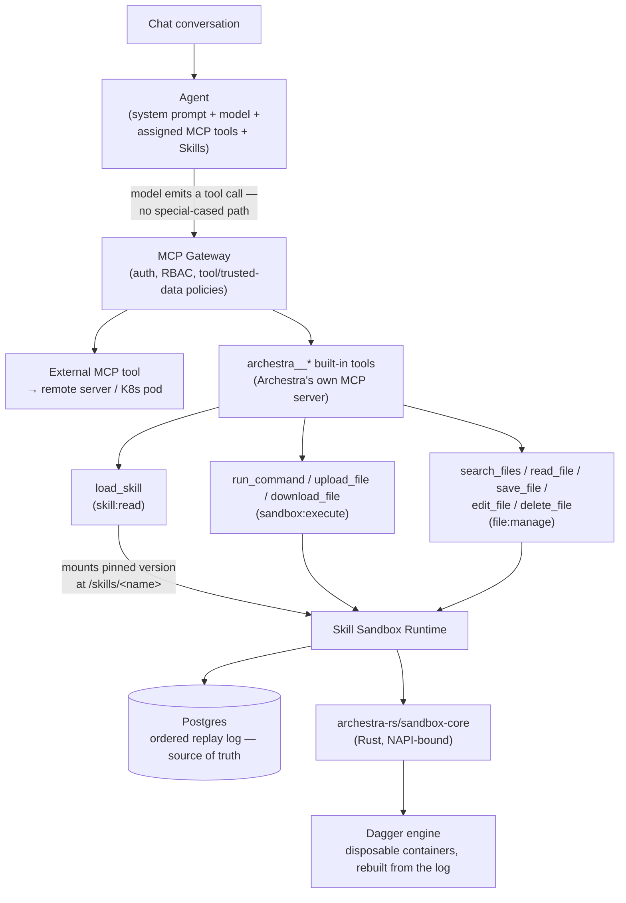
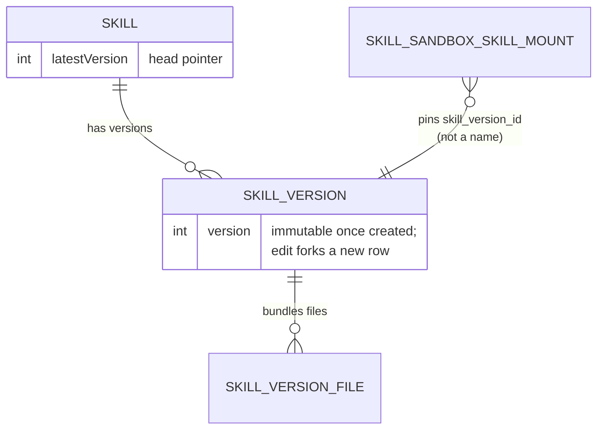
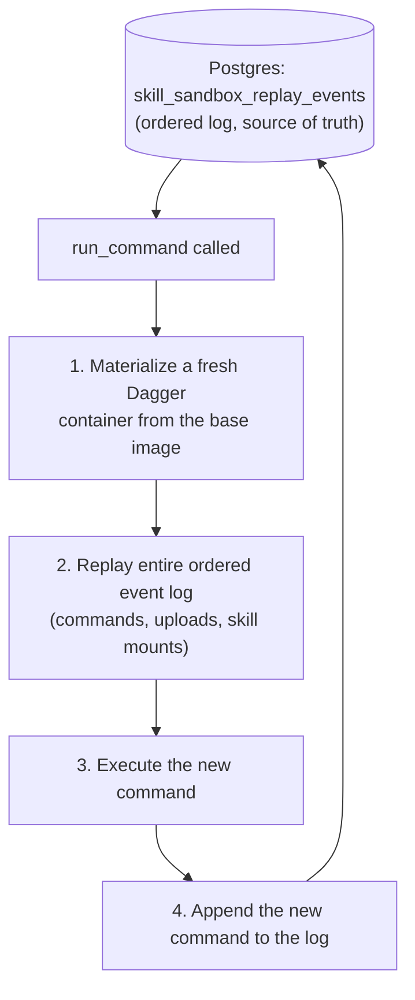
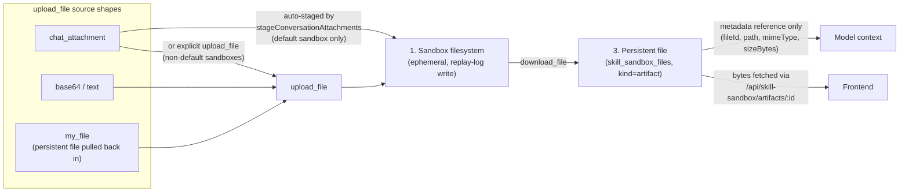

# Agents, Skills & the Sandbox

This document covers three related but distinct concepts in the codebase: **Agents** (the unified runtime entity chat, MCP gateways, and LLM proxies all resolve to), **Skills** (versioned, reusable SKILL.md instruction sets a model can load into context), and the **Skill Sandbox Runtime** (a DB-backed, Dagger-materialized execution environment skills and agents can run code in). Paths are relative to `platform/backend/src/` and `platform/archestra-rs/` unless noted. For the guardrails that gate what an agent's tools are allowed to do once running, see [Security & Guardrails](./06-security-and-guardrails.md).

## How this fits into the system

The rest of this document goes deep on schema and Dagger internals before it says what the sandbox is actually *for* — worth fixing with the picture up front. The single most important fact: **the sandbox is not a separate subsystem a model talks to directly. It's a code-execution backend exposed through ordinary MCP tools**, sitting behind Archestra's own built-in MCP server exactly the way a remote MCP server sits behind the MCP Gateway.

A few things this makes concrete:

- **No new interface, same enforcement points.** A model calling `run_command` looks, to the MCP Gateway, exactly like a model calling a remote server's tool — same auth, same RBAC (`sandbox:execute`/`file:manage`, see [Fail-closed re-checks](#fail-closed-re-checks) below), same logging. The sandbox adds no bypass and no shortcut; it's a *destination* behind the gateway, not an alternate path around it.
- **Why it has to exist at all.** A Skill on its own is inert — SKILL.md text plus bundled files, loaded into context by `load_skill` the same way a system prompt is assembled (see [What a Skill is](#what-a-skill-is) below). Nothing about that act *runs* anything. The sandbox is what turns "here are some bundled scripts" into "here is a filesystem where those scripts execute," scoped to one conversation.
- **Skills plug in at exactly one point.** `load_skill` mounts a skill's pinned, immutable version into the sandbox at `/skills/<name>` — itself just another entry in the same replay log `run_command` and `upload_file` write to (see [The sandbox execution model](#the-sandbox-execution-model)). This is why *authoring* a skill (`create_skill`/`update_skill`, pure Postgres writes) and *running* a skill's code (`load_skill` + `run_command`, sandbox execution) are cleanly separable concerns that happen to compose through one mount step.
- **Postgres is truth, Dagger is a rebuildable cache** — the same "derived, disposable execution layer over a durable database record" shape used for the MCP orchestrator's Kubernetes pods (see [MCP Gateway & Orchestrator](./05-mcp-gateway-and-orchestrator.md#k8s-orchestrator-design-pod-per-server)). Nothing about a sandbox's correctness depends on any particular container surviving; see [Why replay, not persistent containers](#why-replay-not-persistent-containers).
- **Rust exists here for robustness, not speed.** The actual Dagger SDK calls, container-graph construction, and session-pool management live in `archestra-rs/sandbox-core`, exposed to the TypeScript backend via NAPI. That boundary buys panic containment and direct control over a spawned `dagger session` process's lifecycle — awkward properties to get from pure TypeScript glue code. See [The Rust layer vs the TypeScript layer](#the-rust-layer-vs-the-typescript-layer) below and [Native Rust Components](./09-native-rust-components.md) for the general NAPI pattern.

## What an Agent is

There is exactly one `agents` table (`database/schemas/agent.ts`) behind four different-looking surfaces, distinguished by `agentType`:

- `agent_type = 'agent'` — an internal chat agent with a `systemPrompt`, tools, and (optionally) skills.
- `agent_type = 'profile'` — an external API-gateway profile for routing LLM traffic (no prompt fields).
- `agent_type = 'mcp_gateway'` — an MCP Gateway configuration.
- `agent_type = 'llm_proxy'` — an LLM Proxy configuration.

The comment at the top of `database/schemas/agent.ts` documents this deliberately: it's one table because tool assignment, tool/trusted-data policy scoping, and team-based access control all key off the same `agentId`, regardless of whether the "agent" in question is a chat persona or a routing profile. Relevant columns for the chat-agent case:

- `systemPrompt` — rendered through Handlebars at request time (`templating.ts`, `renderSystemPrompt`) with user context (`{{user.name}}`, `{{currentDate}}`, team names) only when the prompt actually contains `{{` (`promptNeedsRendering`), so plain prompts skip the DB round-trip for user/team lookups.
- `toolExposureMode` — `"full"` (every assigned tool listed in `tools/list`) vs `"search_and_run_only"` (only `search_tools`/`run_tool` are listed; the rest are discovered dynamically). See `agents/agent-system-prompt.ts:buildLoadToolsWhenNeededSystemPrompt`.
- `accessAllTools` / `accessAllSubagents` — "Auto" mode flags. When set, `search_tools`/`run_tool` and delegation resolve dynamically against everything the *calling user* can access, rather than an explicit `agent_tools`/delegation-target assignment list.
- `considerContextUntrusted` — see [Security & Guardrails](./06-security-and-guardrails.md#trusted-data-policies-result-time-classification): forces every turn to start untrusted, useful for agents that inherently ingest external content.
- `environmentId` — binds the agent's code sandbox to a specific Environment's Dagger engine and egress `NetworkPolicy`, rather than the shared default runtime (see [Design Decisions](#design-decisions--tradeoffs) below and `archestra-mcp-server/sandbox.ts:resolveEnvironmentTarget`).
- `builtInAgentConfig` / `builtIn` (generated column) — non-null for system-seeded agents (Dual LLM main/quarantine, Policy Configuration, Context Compaction, Chat Title Generation, App Runtime LLM — see `docs/pages/platform-built-in-subagents.md`).

**Runtime assembly.** `agents/agent-system-prompt.ts:buildAgentSystemPrompt` composes the final system prompt sent to the model from: tool-loading instructions (if `search_and_run_only`), the rendered base prompt, project instructions (if in a Projects chat), an "opened app" context block (if a chat was launched from an MCP App), the eagerly-listed skill catalog (if `load_skill` is in the tool set — gated on `TOOL_LOAD_SKILL_SHORT_NAME in mcpTools`, mirroring how Claude Code/OpenCode list skills upfront), file-handling guidance scoped to which file tools are actually present, a fixed tool-denial instruction, a UI-result instruction (if any MCP tools are assigned), and hook-injected `SessionStart` context. Every block is conditionally included based on what the agent can actually do — the file omits a block entirely rather than emit a paragraph describing a tool the agent doesn't have (see `buildFileHandlingInstruction`, which branches on `hasSandbox`/`hasPersistentFiles` independently).

**A2A execution.** `agents/a2a-executor.ts` is what actually runs an agent outside interactive chat (delegation from another agent, ChatOps, scheduled triggers, incoming email). It resolves the model, forwards `parentContextIsTrusted` into the child's trust state (see [Security & Guardrails](./06-security-and-guardrails.md#trusted-data-policies-result-time-classification)), and — when the delegated agent has attachments it can't read inline and a sandbox is available — stages them via `stageConversationAttachments`, same as the interactive chat path.

## What a Skill is

**Schema:** `database/schemas/skill.ts`, `skill-version.ts`, `skill-version-file.ts`, `skill-file.ts`, `skill-team.ts`.

A Skill is a named, versioned SKILL.md instruction set plus optional bundled resource files, modeled on the [Agent Skills specification](https://agentskills.io/specification). Key properties from the schema:

- **Visibility scope** mirrors agents: `personal` (author only), `team` (assigned teams via `skill_team`), `org` (everyone) — enforced with a partial unique index so name uniqueness is scoped correctly per visibility tier (`skills_org_personal_name_idx` vs `skills_org_shared_name_idx`, `database/schemas/skill.ts:121`).
- **`latestVersion`** is a head pointer into `skill_versions`; every skill has at least version 1. Editing a skill forks a new version row rather than mutating the current one in place — see [immutable versioning](#design-decisions--tradeoffs) below.
- **`templated`** — when true, the SKILL.md body is rendered through Handlebars with the activating user's context at load time, exactly like an agent system prompt (`skills/skill-activation.ts:formatSkillActivation`). Automatically set when converting a templated agent into a skill.
- **`agentName`** — an optional `agent` frontmatter field: when set, *activating* the skill delegates to that named agent (instructions + task) instead of loading the SKILL.md body directly into the caller's context.
- **`sourceType`/`sourceRef`/`sourceCommit`** — provenance for imported skills (e.g. GitHub import via `skills/github-import.ts`, marketplace materialization via `skills/marketplace/materialize.ts`), recorded as `owner/repo@ref:path` plus the commit SHA.

**Activation.** `skills/skill-activation.ts:formatSkillActivation` is the single function behind both entry points a model uses to bring a skill into context — the `load_skill` MCP tool and slash-command activation in chat — so both render identically. It wraps the (optionally Handlebars-rendered) body in an XML-ish `<skill_content>` frame, appends `<skill_compatibility>`/`<skill_allowed_tools>` blocks when present, and lists bundled resource files under `<skill_resources>`. Untrusted content inside a skill body (e.g. an imported skill from a third-party repo) cannot break out of these frames: `neutralizeFrameTags` defangs only the exact set of frame tag names the pipeline itself emits (`skill_content`, `skill_resources`, `skill_compatibility`, `skill_allowed_tools`, `skill_file`, `available_skills`, `skill`) by turning their opening `<` into `&lt;`, while leaving every other `<`/`>` in the body untouched — this is deliberately lossy (a skill that legitimately contains the literal text `&lt;/skill_content>` becomes indistinguishable from an injection attempt) but necessary, because escaping every angle bracket would corrupt code samples (heredocs, generics, comparisons) the model is expected to read and run verbatim.

**Version pinning at mount time.** `skills/skill-version-resolution.ts:resolveActivationVersion` is the function that decides which version a `load_skill` call actually exposes: if the skill is already mounted in the conversation's default sandbox, it returns *that* mounted version (not necessarily the latest — a mid-conversation edit to the skill does not retroactively change what a running sandbox sees); otherwise it mounts the skill's current `latestVersion` and pins it. A same-named-skill mount collision (two different skills both trying to claim `/skills/<name>`) is handled explicitly: the loser resolves with `mounted: false` and is shown to the model read-only, never advertised as runnable, so the model is never told to execute code that actually belongs to a different skill.

The versioning relationships that make "pin the mounted version, don't retroactively change it" possible:

## The sandbox execution model

**Code:** `skills-sandbox/` (see its own `README.md` — this section summarizes and extends it) and `archestra-mcp-server/sandbox.ts` (the MCP tool layer: `run_command`, `upload_file`, `download_file`, plus the persistent-file tools `search_files`/`read_file`/`save_file`/`edit_file`/`delete_file`).

The sandbox is gated by `config.skillsSandbox`, enabled only when `ARCHESTRA_CODE_RUNTIME_DAGGER_RUNNER_HOST` is configured. When off, `run_command` and friends return "The sandbox is not enabled on this deployment" (`archestra-mcp-server/sandbox.ts:ensureUsable`).

### Why replay, not persistent containers

The core design decision is that **Postgres, not Dagger, is the source of truth.** A sandbox's state is not "a running container somewhere" — it's a recipe: an ordered log of commands, uploads, and skill mounts in `skill_sandbox_replay_events`, sequenced by the atomic `skill_sandboxes.next_replay_sequence` counter. Every `run_command` call:

1. Materializes a **fresh** Dagger container from the base image.
2. Replays the entire ordered event log — each command re-executes, each upload re-writes its bytes at its absolute path, each skill mount re-writes the pinned version's files under `/skills/<name>`.
3. Executes the new command.
4. Appends the new command to the log.

`skills-sandbox/README.md` is explicit that interleaving is preserved exactly: a file uploaded between command A and command B is *not* present while A replays, because the on-disk order always matches acceptance order. Dagger's content-addressed layer cache is what keeps this fast in the common case (unchanged prefix ⇒ cache hit ⇒ near-zero wall-clock cost for replay); a cold cache or engine restart just means a slower — but still deterministic, for deterministic commands — rebuild from the DB recipe. Non-deterministic commands (network calls, `time`/RNG) are an accepted v1 limitation: the recorded stdout from the original run stays the canonical observation even if a literal replay would diverge.

### The Rust layer vs the TypeScript layer

The split between `backend/src/skills-sandbox/` (TypeScript) and `archestra-rs/sandbox-core` + `archestra-rs/sandbox-rs` (Rust, NAPI-bound) is roughly: **TypeScript owns the durable recipe and orchestration; Rust owns talking to the Dagger engine and building the actual container graph.**

- `skill-sandbox-runtime-service.ts` (TS) is the singleton that owns the Dagger client at the service layer, materializes a sandbox from its DB replay log, replays it, executes a new command, and exports files as artifacts — with a status FSM and a per-sandbox queue so concurrent calls against the same sandbox serialize deterministically (`upload_file`'s "no Dagger work, just persist the event" model relies on this queue to land its sequence number correctly relative to in-flight `run_command`s).
- `archestra-rs/sandbox-core/src/backends/dagger.rs` (Rust, 1800+ lines) is where the actual `dagger_sdk` calls live — building the container chain via `with_exec`/`with_new_file`/`with_workdir`/`with_user` for every replay step. Key facts from the source:
  - Base image: `ghcr.io/astral-sh/uv:0.9.17-python3.12-bookworm-slim` (overridable via `ARCHESTRA_DAGGER_RUNTIME_IMAGE`), warmed once per process with an apt toolbelt (`bash`, `git`, `jq`, `build-essential`, `nodejs`, `npm`, etc. — `DEFAULT_APT_PACKAGES`, `dagger.rs:46`).
  - The sandbox always runs as a **non-root user** (`SKILL_SANDBOX_USER`) — root is only used transiently, sandwiched between two `with_user` calls, for operations that need it (writing an uploaded file at a path that requires creating parent directories, chowning a freshly-mounted skill's tree).
  - A warm-baked `uv` project at `/home/sandbox` (a `pyproject.toml` plus a venv at `/home/sandbox/.venv`, seeded with numpy/pandas/httpx) means `python3` always resolves to the project interpreter; `pip`/`pip3`/`pip3.12` are replaced with a shim that fails with a hint to use `uv add --project /home/sandbox <pkg>` instead (`PIP_SHIM_SETUP`, `dagger.rs:100`).
  - `PYTHONPATH` is extended as its own container layer exactly at the sequence point where a skill mount happens (`materialize`, `dagger.rs:891`) — so commands *before* the mount are byte-identical to a world where the mount never happened (cache stays valid), and commands after it can `import` the skill's modules directly, with no `sys.path` editing needed in the skill's own scripts.
  - **Replay length is bounded.** Every replayed command/upload/mount appends overlay filesystem layers to the container's rootfs, and the kernel's overlay mount has a hard `lowerdir=a:b:c:...` string-length ceiling (~4KB, one page). `check_replay_layer_budget` (`dagger.rs:818`) estimates the layer count a replay would produce and fails fast with a clear, actionable `ARCHESTRA_SANDBOX_HISTORY_LIMIT` error — "start a fresh sandbox to continue" — well before hitting the kernel's opaque `ENOENT`. The threshold (`MAX_REPLAY_FS_LAYERS = 256`) is explicitly documented as a heuristic, not an exact bound: it can fire early (BuildKit dedup means a rare zero-dedup session could still exceed the real kernel limit below this count) or, less often, under-fire, in which case the raw overlay error surfaces as-is.
- `archestra-rs/sandbox-rs` is the NAPI binding layer exposing the Rust `sandbox-core` crate's types (e.g. `EnvironmentTarget`, imported in `archestra-mcp-server/sandbox.ts` as `@archestra/sandbox-rs`) to the TypeScript backend. For the general NAPI crate-pair pattern (`-core` Rust logic / `-rs` generated bindings) used across the platform, see [Native Rust Components](./09-native-rust-components.md) and the `archestra-dev-rust-napi` project skill.

### Environment-scoped sandboxes

An agent bound to an `environmentId` runs its sandbox on that environment's own Dagger engine, inheriting the environment's egress `NetworkPolicy`, instead of the shared default engine (`resolveEnvironmentTarget`, `archestra-mcp-server/sandbox.ts:1399`). This is fail-closed by construction: if the agent has an `environmentId` set but the environment row is missing, or the isolated engine can't be resolved (e.g. the Kubernetes orchestrator isn't configured), the call throws rather than silently falling back to the shared runtime — the comment in the source is explicit that this must never happen, because a silent fallback would run the agent's code with unrestricted egress and defeat the environment's isolation guarantee.

## File lifecycle

There are three distinct file surfaces in play, and the tool descriptions in `sandbox.ts` are written to keep a model from conflating them:

1. **Sandbox filesystem** — ephemeral, only exists inside a materialized container, reconstructed via replay every `run_command`. Files here are invisible to the user directly.
2. **Chat attachments** — files the user attached to the conversation. Auto-staged (not manually uploaded) into the conversation's *default* sandbox under `/home/sandbox/attachments/<sanitized-name>` by `stageConversationAttachments`, run inside the per-sandbox queue before `run_command`/`download_file` build their context. This exists because the model has no visibility into attachment ids and would otherwise have to guess them (`skills-sandbox/README.md`); staging is idempotent (`skill_sandbox_files.source_attachment_id` plus a partial unique index on `(sandbox_id, source_attachment_id)` makes re-staging a DB-level no-op) and multi-turn safe (attachments added in a later turn stage on the next tool call). Only the *default* sandbox is auto-staged — `{ fresh: true }` or explicit `{ id }` sandboxes are not, and `upload_file` remains the path for those, plus inline base64/text content and non-chat-UI gateway clients (which have no `conversation_attachments` at all). Oversized attachments (over `config.skillsSandbox.artifactBytesLimit`) are skipped with a model-visible notice returned in `stagingNotices`, rather than silently dropped.
3. **Persistent files** (`skill_sandbox_files`, kind `artifact`) — the conversation's Files panel, what the *user* actually sees. `download_file` copies bytes from the sandbox's ephemeral filesystem into this durable store; the model only ever receives a short metadata reference back (`fileId`, `path`, `mimeType`, `sizeBytes`) — the actual bytes are never returned into the model's context, and are fetched by the frontend directly via `/api/skill-sandbox/artifacts/:id`. This is a deliberate one-way valve: `save_file`/`download_file`'s tool descriptions explicitly instruct the model to *export by path* rather than "read a file's bytes back and paste them into your reply" — keeping large or binary content out of the token stream entirely.

`upload_file`'s four source shapes (`chat_attachment`, `base64`, `text`, `my_file` — a persistent file pulled back into the sandbox) all funnel through the same replay-log write path, so regardless of origin, an upload is durable and replayable the same way. A `chat_attachment` source is read server-side and never passes through model context (`skills-sandbox/README.md`), and is rejected if the attachment doesn't belong to both the caller's organization *and* the current conversation — closing a cross-conversation exfiltration path where a model could try to reference another conversation's attachment id.

## Fail-closed re-checks

Two places in `archestra-mcp-server/sandbox.ts` re-verify authorization at the moment a container is about to be built, rather than trusting an earlier check:

- **Sandbox scope.** `resolveTarget` scopes an explicit `target: { id }` to the caller's organization + user + conversation (`sandboxConversationInScope`) — an id from another conversation, or another headless execution, is rejected with a generic "no accessible sandbox" message rather than a permission-denied message that would leak the sandbox's existence.
- **Skill mount readability.** `load_skill` mounts a skill into the default sandbox at `skill:read`-check time, but a skill's readability can change afterward (revoked team access, deleted skill). `run_command` and `download_file` **re-check that every mounted skill is still readable by the caller before building any container** (`skills-sandbox/README.md`, "RBAC" section) — this is fail-closed: if the revocation check itself fails or the skill is no longer readable, the call is refused rather than defaulting to "allow, since it was mounted before."

This mirrors the RBAC posture described in [Security & Guardrails](./06-security-and-guardrails.md#rbac-as-a-security-layer): `sandbox:execute` and `file:manage` gate the tools themselves, but scope and revocation are re-derived at execution time, not cached from the mount/assignment step.

## TOON conversion

Not part of the sandbox, but adjacent to "how agents talk to tools efficiently": agents can opt into TOON (Token-Oriented Object Notation) conversion of tool results via the `convert_tool_results_to_toon` boolean field (`platform/CLAUDE.md`; conversion logic in `routes/proxy/utils/toon-conversion.ts` and the per-provider adapters under `routes/proxy/adapters/`). `shouldApplyToonCompression` resolves whether it's enabled from the agent's team/organization settings, and JSON tool results — particularly uniform arrays of objects, e.g. rows from a database or API listing tool — are converted to TOON before being sent to the LLM, cutting token usage roughly 30–60% for that shape of data. This lives in the LLM Proxy request path (see [LLM Proxy & Gateway](./04-llm-proxy-and-gateway.md)), not in the sandbox or skills code, but it's the same "keep large structured content out of the token stream cheaply" instinct that shows up in the sandbox's export-by-reference file model above.

## Design Decisions & Tradeoffs

**Replay log over keeping containers alive.** The alternative — one long-lived container per sandbox, kept warm across calls — was evidently rejected in favor of "container is a derived artifact, Postgres is the recipe." The tradeoff is per-call replay cost (mitigated by Dagger's layer cache on the hot path) in exchange for two properties a persistent container can't offer: **restart resilience** (an engine restart or evicted cache layer just means a slower rebuild, not lost state — `skills-sandbox/README.md`: "Dagger owns ephemeral filesystem state. There is no retention guarantee") and **auditability** (the full history of what ran, in what order, is a queryable Postgres log, not opaque container diffs). The cost surfaces concretely as the `ARCHESTRA_SANDBOX_HISTORY_LIMIT` ceiling — a long enough conversation eventually can't be replayed into a single container at all, and the fix is "start fresh," not "wait for the mount to catch up."

**Postgres as source of truth, Dagger as a pure cache.** This is really the same decision viewed from the DB side: `skill_sandboxes`, `skill_sandbox_replay_events`, and friends fully describe a sandbox's state; nothing about correctness depends on any particular container surviving. This buys operational simplicity (no need to reconcile drifted container state, no sandbox-specific backup/restore story beyond normal Postgres backups) at the cost of the non-determinism caveat already noted: a command that hit the network or read the clock during its *original* run has its stdout preserved as the canonical record, but a literal replay of that same command later could produce different bytes on-disk even though the logged stdout doesn't change. The system treats the logged observation as ground truth, not the live re-execution — a deliberate choice to prioritize reproducible *records* over byte-identical *reruns*.

**Skills are versioned immutably; mounts pin a version id, not a name.** `skill_sandbox_skill_mounts` references `skill_version_id`, and `skill_versions`/`skill_version_files` are never mutated in place — an edit forks a new version and bumps `skills.latestVersion`. The direct payoff: editing a skill mid-conversation cannot retroactively change what a running sandbox sees, and `resolveActivationVersion`'s "already mounted ⇒ use that version" logic (`skills/skill-version-resolution.ts:39`) depends on this — without immutability, "the version currently mounted" would be a moving target. The cost is storage growth (every edit is a new row, forever) and one piece of user-facing complexity: a skill can be "updated" in a way a currently-running conversation never sees until it starts a new sandbox or explicitly re-mounts.

**RBAC is enforced on sandbox/file tools even though they're Archestra-authored.** Unlike the guardrail-bypass logic in `tool-invocation.ts` (built-ins skip *policy* evaluation because they're not upstream content), the sandbox and file tools are still gated by `sandbox:execute`/`file:manage` in `rbac.ts` — because "this tool is platform code, not injected content" says nothing about whether *this particular user* should be allowed to execute arbitrary shell commands or read another team's files. Conflating "trusted content" with "authorized user" would have been a real vulnerability here specifically, since `run_command` is, by design, a general-purpose code execution primitive.

**Fail-closed re-checks at execution time instead of caching the authorization decision from mount time.** `run_command`/`download_file` re-verify every mounted skill is still readable before building a container, rather than trusting the `skill:read` check done when `load_skill` first mounted it. This costs an extra query per execution call but closes a revocation-lag window: without it, a user whose team access to a skill was just revoked could keep executing that skill's bundled scripts for the remaining lifetime of their sandbox session.

**Chat attachments are staged server-side, into the sandbox, rather than handed to the model as an id to fetch.** The `README.md` names the failure mode this avoids directly: "the model can't see attachment ids, so it otherwise guesses." Auto-staging trades a small amount of hidden-from-the-model complexity (files silently appearing under `/home/sandbox/attachments/`) for removing an entire class of tool-call failure (wrong/hallucinated attachment id) — at the cost of needing the idempotency machinery (`source_attachment_id` + partial unique index) to make staging safe to re-run on every `run_command`/`download_file` call.

**Downloaded artifacts return a reference, never the bytes, to the model.** `download_file`'s output schema deliberately excludes file content — `fileId`/`path`/`mimeType`/`sizeBytes` only — and the frontend fetches actual bytes via a separate authenticated route (`/api/skill-sandbox/artifacts/:id`). This is consistent with the tool-description-level instruction in `agent-system-prompt.ts` to "export by path... so the bytes never pass through your context": every design choice around file handling in this system optimizes for keeping large/binary payloads out of the token stream, even where it would be simpler to just base64-encode the file into the tool result.
