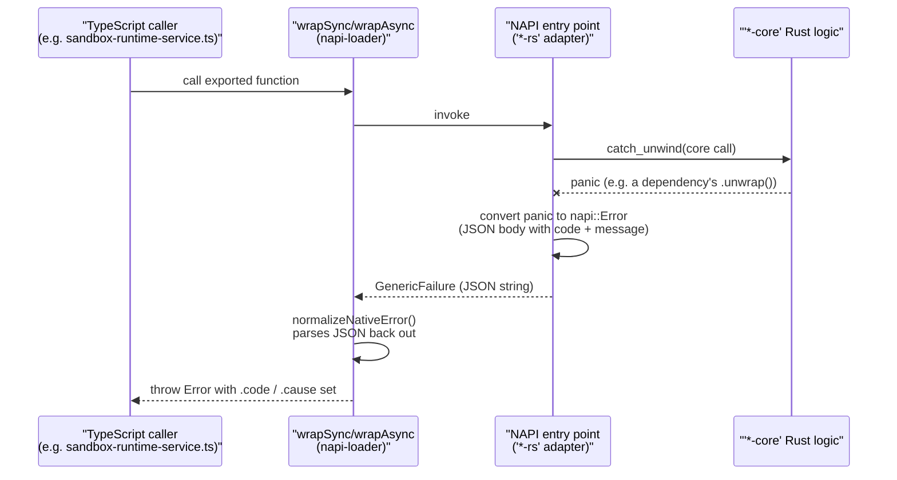
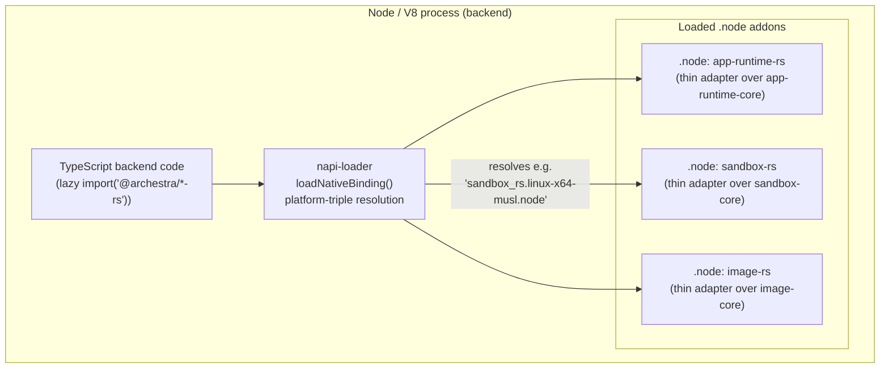
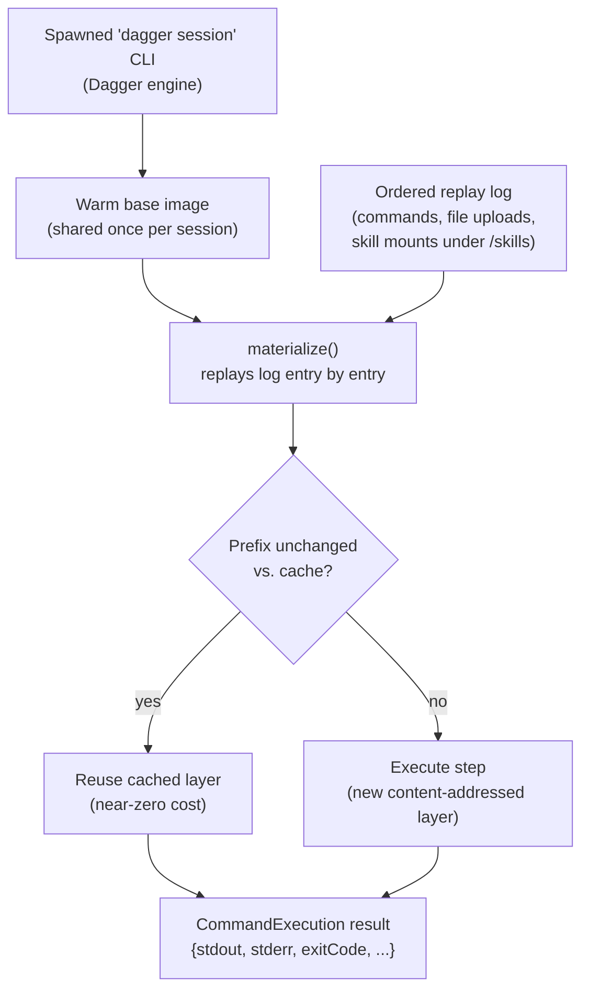
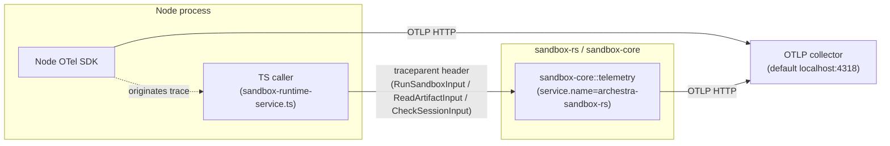

# Native Rust Components

Archestra's backend is a Fastify/TypeScript service, but a handful of subsystems are implemented in Rust and exposed to Node via [NAPI (Node-API)](https://nodejs.org/api/n-api.html) bindings generated with [`napi-rs`](https://napi.rs/). This document covers `platform/archestra-rs/`: what lives there, why it's Rust instead of TypeScript, how the JS↔Rust boundary works, and how it's built, tested, and shipped.

This is a distinct, unrelated codebase from `ai-labs/` (the `archestra-bench` benchmark harness), which is a standalone pure-Rust workspace with no NAPI layer — see `13-ai-labs-benchmark.md`.

## Why Rust exists in a TypeScript-heavy platform

Reading `platform/archestra-rs/` end to end, three concrete justifications show up in the code, not just "Rust is fast":

1. **Untrusted-input hardening.** `image-core` decodes attacker-controlled image bytes under hard allocation/dimension limits (`platform/archestra-rs/image-core/src/lib.rs`) specifically to defend against decompression bombs — `image::load_from_memory` has no such bound and "would OOM-abort the host" per the crate's own comment. `app-runtime-core` parses and scans untrusted, user-authored app HTML (`platform/archestra-rs/app-runtime-core/src/app_html.rs`, `app_html_lint.rs`) for save-time policy violations. Both are exactly the kind of "parsing/escaping logic over untrusted input" the project's Rust conventions (`archestra-dev-rust-napi` skill) call out as a legitimate reason to reach for Rust.
2. **Process-level isolation orchestration.** `sandbox-core` is the execution engine behind the Agent Skills sandbox: it drives a Dagger engine session, materializes ephemeral containers from a replay log, and runs untrusted model-issued shell commands inside them (`platform/archestra-rs/sandbox-core/src/backends/dagger.rs`). This is the same subsystem referenced in `07-agents-skills-sandbox.md`; Rust owns the actor/session-pool logic, retry/fault classification, and the Dagger GraphQL client, none of which is business logic that belongs in TypeScript.
3. **CPU-bound work off the event loop.** `image-rs` runs image decode/resize/encode on the libuv threadpool via napi's `AsyncTask`, explicitly "so the JS event loop is never blocked by a large image" (`platform/archestra-rs/image-rs/src/lib.rs`).

Every crate pair also follows one non-negotiable rule from the project's Rust style guide: the **core crate has zero Node/NAPI awareness**. `app-runtime-core`'s `lib.rs` states it is "free of Node/NAPI/browser assumptions so the same logic backs both the TypeScript backend ... and a future Rust companion that links this crate directly." `sandbox-core/README.md` says the same about a hypothetical future daemon. The NAPI crate is deliberately a thin, deletable adapter layer over a reusable library — see the target shape documented in the skill: `JS/Node -> thin NAPI adapter -> reusable Rust core`.

## Repository layout

```
platform/archestra-rs/
├── Cargo.toml            # workspace root (6 members, resolver = "2")
├── Cargo.lock
├── deny.toml              # cargo-deny: advisories, license allowlist, source pinning
├── rustfmt.toml           # (empty — defaults)
├── app-runtime-core/      # pure Rust: app-envelope HTML transform logic
├── app-runtime-rs/        # napi-rs adapter over app-runtime-core -> @archestra/app-runtime-rs
├── image-core/            # pure Rust: bounded image decode/resize/encode
├── image-rs/              # napi-rs adapter over image-core -> @archestra/image-rs
├── sandbox-core/          # pure Rust: Dagger-backed skill sandbox execution engine
├── sandbox-rs/            # napi-rs adapter over sandbox-core -> @archestra/sandbox-rs
└── napi-loader/           # shared CommonJS loader used by all three *-rs crates' index.cjs
```

`platform/rust-toolchain.toml` pins the toolchain: `channel = "1.93.0"`, `profile = "minimal"`, with only `rustfmt` as a component, and cross-compilation targets `aarch64-unknown-linux-musl` / `x86_64-unknown-linux-musl` (the production container's arch/libc).

The workspace `Cargo.toml` (`platform/archestra-rs/Cargo.toml`) is worth reading directly for its build-profile comments:

- `[profile.release]` disables LTO — for these NAPI shims LTO measured *slower to build and produced a larger binary* because there's little cross-crate hot code to inline. Pure cost, no benefit, so it's off.
- `[profile.dev]` sets `debug = "line-tables-only"` — full debuginfo isn't useful for a native addon loaded from Node.
- `[profile.release-fast]` inherits `release` (no LTO) but adds `codegen-units = 256` and `incremental = true`, trading binary size/runtime for parallel, incremental rebuilds. This is what `pnpm build:dev` uses locally; CI and production publishing use plain `release`.

## The NAPI bridge mechanism

Each of the three product crates (`app-runtime-rs`, `image-rs`, `sandbox-rs`) is a `crate-type = ["cdylib"]` compiled to a platform-specific `.node` addon via [`napi-rs`](https://napi.rs/) (`napi`/`napi-derive` v3, `napi-build` v2 in `build.rs`). The pattern is identical across all three:

- `#[napi(js_name = "...")]` on a function generates both the native export and a matching TypeScript declaration.
- `#[napi(object)]` on a struct generates a JS-shaped interface (camelCase field renames done explicitly via `#[napi(js_name = "...")]` per field, since the Rust structs use `snake_case`).
- Async work either returns `async fn -> napi::Result<T>` directly (sandbox-rs, riding napi's `tokio_rt` feature) or wraps CPU-bound work in a `napi::bindgen_prelude::AsyncTask` that runs on the libuv threadpool (image-rs's `ShrinkImageTask`), so a big image never blocks the Node event loop.

### Panic containment is the load-bearing safety property

Per the `archestra-dev-rust-napi` skill's NAPI rule — *"the host process must never abort on a Rust panic"* — every NAPI entry point in all three crates wraps its call into the core in `std::panic::catch_unwind` (sync) or `.catch_unwind()` via `futures_util::FutureExt` (async), and converts any caught panic into a structured `napi::Error` whose message is a JSON blob: `{"code": "ARCHESTRA_INTERNAL", "message": "rust panic: ..."}`. See `panic_to_napi_error` in `platform/archestra-rs/app-runtime-rs/src/lib.rs`, `image-rs/src/lib.rs`, and `sandbox-rs/src/lib.rs` — the same pattern, three times, because each crate's core is free to depend on libraries that themselves might panic (the comment in the skill explicitly calls out that dependencies can still panic despite the no-`unwrap`-in-core-code rule).

`sandbox-core` goes one step further because it must recover from panics buried inside a third-party SDK: `dagger-sdk` 0.21.5 calls `.unwrap()` deep in generated GraphQL resolver code, so a transient "stale attachables" engine timeout surfaces as a Rust panic rather than a typed error. `sandbox-core/src/backends/dagger.rs`'s `engine_fault_from_panic` inspects the panic message for a known substring and re-tags it as a retryable `EngineFault::StaleAttachables` rather than a fatal error — panic recovery here is not just "don't crash the host," it's woven into the retry state machine (`sandbox-core/src/session.rs`'s `catch_panic` / `panic_to_error`).

### Error propagation across the boundary

Rust errors don't cross the FFI boundary as native `napi::Error` variants with structure — they're serialized to a JSON string (`{code, message}`) inside the `Error.message`, because that's the only channel napi's `GenericFailure` status reliably carries. Both `app_runtime_core`/`image_core`'s panic converters and `sandbox_core::SandboxError::code()` (an enum → `&'static str` mapping: `ARCHESTRA_ENGINE_UNREACHABLE`, `ARCHESTRA_COMMAND_FAILED`, `ARCHESTRA_ARTIFACT_TOO_LARGE`, `ARCHESTRA_ARTIFACT_NOT_FOUND`, `ARCHESTRA_SANDBOX_HISTORY_LIMIT`, `ARCHESTRA_INVALID_INPUT`, `ARCHESTRA_INTERNAL`) follow this convention. On the JS side, `napi-loader/index.cjs`'s `normalizeNativeError` parses that JSON back out and re-throws a real `Error` with `.code` and `.cause` set, so TypeScript callers (e.g. `sandbox-runtime-service.ts`'s `NativeSandboxErrorCode` union) get typed, catchable error codes instead of opaque native-panic strings.

The panic-containment and error-propagation path, end to end:



## `napi-loader`: solving cross-platform native binary resolution

`platform/archestra-rs/napi-loader/` (`@archestra/napi-loader`) is shared, hand-maintained CommonJS scaffolding (not itself a Rust crate) consumed by all three `*-rs` crates' generated `index.cjs`. It solves two problems napi-rs's default per-platform-package pattern would otherwise duplicate three times:

1. **Platform-triple resolution.** `loadNativeBinding({ dir, crateName, packageName })` maps `process.platform`/`process.arch` (and, on Linux, a musl-vs-glibc probe via `process.report().header.glibcVersionRuntime`) to a compiled filename like `sandbox_rs.linux-x64-musl.node`, tries several filename candidates in order, and throws a clear "Unable to load `@archestra/sandbox-rs` for linux/x64" error with the underlying `require()` failures attached if none exist. This is the same "prebuilt native binary for the right OS/arch" problem every native Node addon has to solve; centralizing it means a fix to the triple-detection logic (e.g. a musl edge case) fixes all three crates at once.
2. **Uniform panic-to-Error normalization.** `wrapSync`/`wrapAsync` wrap every exported native function so a caught Rust panic (see above) becomes a clean `Error` with `.code`/`.cause` before the caller ever sees it — the crate-specific `index.cjs` files are two-line wrappers around this.

Each crate's own `index.d.ts` is the actual typed public API (napi-rs auto-generated); `napi-loader`'s own `.d.ts` is intentionally loosely typed (`Record<string, unknown>`), since it's infrastructure, not the product surface.

The overall in-process bridge, spanning the three core/adapter crate pairs and the shared loader:



## Per-crate walkthrough

### `sandbox-core` / `sandbox-rs` — the skill sandbox execution engine

This is the largest and most architecturally significant crate pair (`sandbox-core` alone is ~1,800 lines in `backends/dagger.rs`). Per its own `README.md`: *"Pure-Rust execution core for the skill sandbox and code runtime. It owns the serde DTOs, input validation, Dagger-backed execution, and typed error codes. The crate has no host bindings of its own."*

**Module structure** (`platform/archestra-rs/sandbox-core/src/`):
- `lib.rs` — public API surface: `check_session`, `run_sandbox`, `read_artifact` async functions, plus all the `#[napi(object)]`-tagged DTOs (`RunSandboxInput`, `ReplayEntry`, `CommandExecution`, `ArtifactBytes`, `Limits`, `EnvironmentTarget`, ...). Validates untrusted input immediately at these entry points (e.g. `runtime_target_from` rejects a non-UUID `environmentId` or a namespace that isn't a valid RFC1123 label before it ever reaches a backend).
- `backend.rs` — the `SandboxBackend` trait (the "contract a sandbox runtime must satisfy") and the closed `Backend` enum that dispatches to it via `match`, not `dyn Trait` — an explicit design choice documented in the module comment: *"selection is static (an enum match), never `dyn` — a second backend slots in by adding a variant, and the compiler then forces every match site to handle it."*
- `backends/dagger.rs` — the only module that touches `dagger-sdk`. Connects to a Dagger engine by spawning a `dagger session` CLI child process, warms a shared base image once per session (`DEFAULT_BASE_IMAGE = "ghcr.io/astral-sh/uv:0.9.17-python3.12-bookworm-slim"`), and materializes each request into a content-addressed container chain by replaying an ordered log of commands/file-uploads/skill-mounts. Skill mounts write files under `/skills/<skill_name>` and extend `PYTHONPATH` at that sequence point (referenced by `platform/CLAUDE.md`'s Skill Sandbox Runtime section and `07-agents-skills-sandbox.md`).
- `session.rs` — a backend-agnostic actor: one session per `RuntimeTarget` (default engine, or a per-environment Dagger engine pod), request queueing via `tokio::sync::mpsc`, a `Semaphore`-based concurrency cap (`MAX_CONCURRENT_HANDLERS = 32`, defense-in-depth behind the TS-side queue cap), and a retry policy that distinguishes *safe-to-retry* engine faults (`EngineFault::StaleAttachables` — the engine gave up before the query ran, so nothing executed) from generic failures that must not be retried blindly (a `run` or `read_artifact` might have partially executed).
- `validation.rs`, `supervisor.rs`, `telemetry.rs`, `tracing_ctx.rs` — path/cwd/encoding validation, the in-container command supervisor protocol (caps stdout/stderr, reports timeout/exit-code/truncation as one JSON document so only bounded JSON crosses the GraphQL boundary), and the crate's own OTLP telemetry pipeline (below).

The `dagger.rs` materialize/replay flow — a request is never run against a live standing container, it's rebuilt from an ordered log each time, with unchanged steps served from Dagger's content-addressed layer cache:



**Exposed NAPI surface** (`platform/archestra-rs/sandbox-rs/src/lib.rs`, all async, all call `core::telemetry::init()` first since it's idempotent):
- `checkSession(input?) -> Promise<void>` — verify the engine is reachable and the warm base image builds.
- `runSandbox(input) -> Promise<CommandExecution>` — replay history, run one command, return `{stdout, stderr, exitCode, durationMs, timedOut, truncated}`.
- `readArtifact(input) -> Promise<ArtifactBytes>` — replay history, then export a file as `{dataBase64, sizeBytes}`.
- `flushTelemetry() -> void` — force-flush pending OTLP batches on graceful shutdown; deliberately **synchronous**, because "the blocking flush runs on the JS thread while the batch-export tasks drain on the tokio runtime — calling it from inside the runtime (an async fn) would deadlock."
- `__testPanic()` — only compiled under the `test-helpers` Cargo feature, used by `panic-smoke.test.cjs` to assert a Rust panic really does surface as a clean JS error rather than crashing the process.

**Consumed from TypeScript** at `backend/src/sandbox-runtime/sandbox-runtime-service.ts` and `backend/src/skills-sandbox/skill-sandbox-runtime-service.ts`, which lazy-`import("@archestra/sandbox-rs")` (so codegen/OpenAPI generation and any request path that never touches the sandbox never needs the compiled `.node` present) and map the `{code, message}` error payload to a typed `SandboxRuntimeError`.

**Rust-owned OTLP telemetry.** Unlike a typical library, `sandbox-core` owns its *own* process-global tracing/telemetry pipeline (`sandbox-core/src/telemetry.rs`) rather than borrowing the Node SDK's — because there is no way for a Rust `tracing` subscriber to plug into a Node OpenTelemetry SDK in-process. It ships traces and logs to the same OTLP collector the Node side targets (default `http://localhost:4318`, configurable via `ARCHESTRA_OTEL_EXPORTER_OTLP_ENDPOINT` and bearer/basic auth env vars mirroring the Node exporter config), tagged `service.name=archestra-sandbox-rs`. The two sides are stitched into one trace via the W3C `traceparent` header, which the TS caller forwards explicitly on every `RunSandboxInput`/`ReadArtifactInput`/`CheckSessionInput` and which `tracing_ctx.rs` attaches as the remote parent of the Rust span (`attach_parent`) — see `07-agents-skills-sandbox.md` and [Observability](./10-observability.md) for the Node-side half of this. This is gated behind the `telemetry` Cargo feature (on for the `sandbox-rs` binding, off for plain `cargo test` "so `cargo test` of the pure logic stays light").



### `app-runtime-core` / `app-runtime-rs` — owned-app HTML envelope and validation

Per `app-runtime-core/src/lib.rs`'s module doc: *"Pure app-runtime envelope logic: turning an owned app's authored HTML plus per-viewer context into sandbox-ready HTML."* This is **not** a desktop/Electron runtime — verified directly from the code, it's the server-side logic behind Archestra's "owned Apps" feature (rendered inside a sandboxed iframe, referenced by `06-security-and-guardrails.md` / `07-agents-skills-sandbox.md`'s coverage of the Apps SDK). Modules: `app_html.rs` (save-time policy scan), `app_html_lint.rs` (authoring-time lint for the `validate_app` tool), `envelope.rs` (HTML injection), `diagnostics.rs`, `contract.rs`.

Exposed NAPI functions (`platform/archestra-rs/app-runtime-rs/src/lib.rs`):
- `prepareAppEnvelope(html, contextJson, baseOrigin, csp, inlineAssets?) -> string` — injects the platform CSP, baseline stylesheet, per-viewer bootstrap context, and the Apps SDK into an app's authored HTML. `inlineAssets` lets the caller embed the SDK/CSS bytes directly (needed when serving a strict foreign host like claude.ai whose sandbox CSP blocks cross-origin `<script src>`).
- `scanAppHtml(html) -> {rejection?, warnings}` — save-time policy scan; a `rejection` (`sdk_bootstrap` | `platform_script_src` | `platform_base_css` | `unparseable`) is the first disqualifying construct found, turned into a user-facing `ApiError` by the TS caller.
- `lintAppHtml(html, config) -> findings` — authoring-time lint against a caller-supplied policy (CDN host allowlist, injected SDK member/storage-partition names) so the TS side stays the single source of truth for that policy data.
- `escapeAngleBrackets`, `capDiagnosticEntries`, `mergeDiagnosticEntries`, `formatDiagnosticEntryLines` — small, pure diagnostic-text sanitization helpers exposed individually rather than one bundled call.

Consumed from `backend/src/services/apps/app-runtime-native.ts`, again via a memoized lazy `import()`.

Dependencies (`app-runtime-core/Cargo.toml`): `tl` (HTML parsing), `regex`, `url` — small, targeted, no framework.

### `image-core` / `image-rs` — bounded image shrinking for model input

Confirmed from code: this is specifically about shrinking chat-attached images to fit a model's inline-image limits, not general image processing. `shrink_image_to_fit(input, targets: {max_bytes, max_dimension})` in `platform/archestra-rs/image-core/src/lib.rs`:

- Decodes under an explicit `image::Limits` (`max_alloc = 128 MB`, `max_image_width/height = 20,000px`) — the decompression-bomb guard the module doc calls out as mandatory, since the unbounded `image::load_from_memory` would let a crafted file exhaust memory and abort the process.
- Prefers lossless PNG re-encoding (comment: "chat attachments are often text-heavy screenshots," where JPEG artifacts hurt legibility), falls back to JPEG at quality 80, then progressively downscales by 3/4 per step (floor: 320px longest edge) until the byte budget is met or the image becomes unusably small (`None`).
- Never upscales, never panics on malformed input — returns `Option`, tested explicitly against empty/garbage bytes and an artificially tiny decode-limit case.

`image-rs`'s NAPI layer wraps this in a napi `AsyncTask` (`ShrinkImageTask`) so decode/resize/encode runs on the libuv threadpool rather than blocking Node's event loop; the input buffer is copied out on the JS thread before the task's `compute()` runs, "so nothing here touches a JS handle" off-thread. Exposes one function: `shrinkImageToFit(input: Buffer, maxBytes, maxDimension) -> Promise<ShrunkImage | null>`. Consumed by `backend/src/utils/image-conversion.ts`'s `shrinkImageForModel`.

## The generated-bindings workflow

Every `*-rs` crate ships three hand-written files (`index.cjs`, `package.json`) plus generated `index.d.ts`, and the actual `.node` binary is a build artifact, never committed:

1. Rust source with `#[napi]`/`#[napi(object)]` annotations is the single source of truth.
2. `napi build --release --platform` (napi-rs CLI, invoked by each crate's `pnpm build` script) compiles the crate to a platform-tagged `.node` file (e.g. `sandbox_rs.linux-x64-musl.node`) **and** regenerates `index.d.ts` from the annotated Rust signatures/doc comments — the `/* auto-generated by NAPI-RS */` header at the top of every `index.d.ts` marks this.
3. The hand-written `index.cjs` (thin, ~20 lines per crate) loads the right `.node` via `napi-loader`'s `loadNativeBinding` and re-exports each function through `wrapSync`/`wrapAsync` for panic normalization.
4. Turbo (`platform/turbo.json`) wires each crate's `build` task with `"cache": false` (native artifacts aren't safely cacheable across machines/targets) and makes `@backend#check:ci` explicitly `dependsOn: ["@archestra/app-runtime-rs#build", "@archestra/sandbox-rs#build"]` — the backend's typecheck needs the generated `.d.ts` / compiled addon to exist first. Note `image-rs` is *not* in that backend dependency list, presumably because its consumer doesn't hit a codepath typechecked at that boundary the same way, or the load stays fully dynamic — worth confirming with the backend team if this looks like an oversight.
5. TypeScript consumers never hand-write types for these — they `import type { ... } from "@archestra/sandbox-rs"` directly against the generated `.d.ts`, and load the runtime binding lazily (`import("@archestra/sandbox-rs")`) so paths that never exercise the native code (codegen, OpenAPI generation, tests that don't touch the sandbox) don't require a compiled `.node` to be present.

The `archestra-dev-rust-napi` skill is explicit that these generated `.d.ts` files "are part of the public API and should stay clean, stable, and intentional" — i.e., they're not throwaway codegen, they're reviewed like any other API surface.

## Build and packaging: dev vs. Docker

**Local dev**: `pnpm build:dev` (per-crate script) runs `napi build --profile release-fast --platform` — the fast-iteration profile with parallel codegen units and incremental compilation described above.

**Production image** (`platform/Dockerfile`): the Rust toolchain is installed via Alpine's `apk add build-base cargo rust` in the `builder-base` stage — *not* the pinned `rust-toolchain.toml` version, since the musl-based Alpine build environment gets its Rust from the distro package manager instead of rustup (worth flagging: this means the exact Docker build toolchain version can drift from the CI-checked `1.93.0` pin, though musl target support is what's actually needed here). This `apk add` layer is deliberately placed *above* the source `COPY` layers "so this layer depends only on `base` and stays cache-stable across ordinary source changes."

The Dockerfile has a dedicated `rust-napi-musl-smoke` stage that runs `pnpm --filter @archestra/sandbox-rs --filter @archestra/app-runtime-rs --filter @archestra/image-rs check:musl` — building each `.node` under musl and then actually `require()`-ing and calling it, "so a musl-specific loader/linkage regression fails here rather than at runtime." This stage's cargo registry/git/target caches are explicitly shared with the main `builder` stage's `pnpm build` (mounted at the same cache-mount paths) so the smoke stage's compilation warms the cache for the real build rather than duplicating it.

Final assembly uses `pnpm deploy --filter=@backend --prod --legacy` (pnpm's monorepo packaging step) rather than a hand-rolled copy of each crate's `.node`/`index.cjs` — the Dockerfile's comment notes this *replaced* an earlier hand-rolled `COPY` approach that "dropped `@archestra/napi-loader` and crashed the image with `MODULE_NOT_FOUND`," i.e. this was a real production incident, not a preemptive choice. `--legacy` is used specifically to avoid pnpm's `inject-workspace-packages` mode, which would copy (rather than symlink) workspace packages and break the NAPI crates' watch-mode rebuilds in local Tilt development if applied there too.

The Dagger CLI binary itself is built from source in a separate `go-builder` stage (matching `ARG DAGGER_VERSION=v0.21.5`) and baked into the final image at `/usr/local/bin/dagger`, with `_EXPERIMENTAL_DAGGER_CLI_BIN` pointing at it — this is the binary `sandbox-core`'s Dagger backend shells out to at runtime to open an engine session.

**Version sync enforcement**: `platform/scripts/check-dagger-version-sync.sh` cross-checks the Dagger version across six independent places (Dockerfile `ARG DAGGER_VERSION`, `sandbox-core/Cargo.toml`'s `dagger-sdk = "=0.21.5"`, two Helm chart versions, a Helm chart `appVersion`, and `ai-labs`' own bench Docker Compose file) and fails CI if any of them disagree — a version-drift class of bug this script exists specifically to catch before it reaches production.

## Testing and CI

Rust checks run as a **separate CI job** from the TypeScript lint/test pipeline, on the rationale (per the workflow's own comment) that "cargo work runs in parallel with the pnpm work instead of serializing ~1.5–2 min ahead of it" (`.github/workflows/on-pull-requests.yml`, job `platform-rust-checks`):

- `rustup show` + `rustup target add x86_64-unknown-linux-musl aarch64-unknown-linux-musl`
- `./scripts/check-dagger-version-sync.sh`
- `cargo check --workspace --locked --target x86_64-unknown-linux-musl` (musl cross-compile check, matching production)
- `cargo install cargo-deny --version 0.20.2 --locked` then `cargo deny --config deny.toml check advisories bans licenses sources`

A separate, independently-gated `ai-labs-rust-checks` job runs the fuller `cargo fmt --check`, `cargo check`, `cargo clippy --all-targets -- -D warnings`, `cargo test` sequence for the unrelated `ai-labs` workspace — notably, `platform-rust-checks` does **not** run `cargo test` or `cargo clippy` directly in that job; those instead run per-crate inside each package's own `check:ci` npm script (e.g. `sandbox-rs/package.json`'s `check:ci`: `cargo fmt --check --all && cargo check --workspace --locked && cargo test --workspace --locked && pnpm build && pnpm smoke && pnpm build:test-helpers && pnpm smoke:panic && pnpm build`), which Turbo runs as part of the normal `pnpm check:ci` / `pnpm test` graph alongside the TypeScript packages.

Both `cargo test` (Rust unit tests, run under the default *and* `napi`+`telemetry` feature sets per the skill's guidance) and JS-level **smoke tests** exist per crate:
- `smoke.test.cjs` / `smoke.esm.test.mjs` — load the compiled `.node` via both CJS `require` and ESM `import` and call each exported function once, catching packaging/linkage regressions that a pure `cargo test` (which never touches the NAPI boundary) can't.
- `sandbox-rs/panic-smoke.test.cjs` — builds a special `test-helpers`-feature binary exposing `__testPanic`, calls it, and asserts the panic surfaces as a normal JS `Error` rather than crashing the Node process. This is the empirical proof of the "panic containment" design property described above, not just a unit test of the conversion function.

`sandbox-core`'s own `cargo test`s (in `backend.rs`, `session.rs`, `backends/dagger.rs`, `lib.rs`) are notably thorough for infrastructure code with no live engine available in unit-test scope: they cover UUID/RFC1123 validation edge cases, the session-pool generation/invalidation race (a late-arriving spawn must not resurrect a handle another caller already retired), retry-reason classification per operation type, and even spawn a fake `dagger session` CLI stand-in script (Linux-only, `#[cfg(target_os = "linux")]`) to test the connect-handshake and process-teardown logic without a real engine.

## Supply-chain and dependency policy

`platform/archestra-rs/deny.toml` runs [`cargo-deny`](https://embarkstudios.github.io/cargo-deny/) in CI (`platform-rust-checks` job) checking four categories:

- **advisories** — RUSTSEC database checks, with a small explicit `ignore` list (four RUSTSEC IDs, all transitive through `dagger-sdk 0.21.5`'s HTTP stack — `reqwest 0.11` / `rustls-webpki 0.101` — each annotated `"remove once dagger-sdk upgrades its HTTP stack"`). This mirrors the pattern used for pnpm CVE overrides elsewhere in the platform (see `platform:archestra-dev-override-sweep`): a documented, source-linked, time-bound exception rather than a silent suppression.
- **bans** — `multiple-versions = "warn"` (don't hard-fail on duplicate dep versions, just flag), `wildcards = "allow"`.
- **licenses** — an explicit allowlist (`MIT`, `Apache-2.0`, `BSD-2/3-Clause`, `MPL-2.0`, `Unicode-3.0`, `CDLA-Permissive-2.0` for `webpki-roots`' bundled Mozilla CA data, etc.); internal workspace crates are exempted via `[licenses.private] ignore = true` since they inherit the repo license and are never published.
- **sources** — `unknown-registry = "deny"`, `unknown-git = "deny"`, only `crates.io` allowed — no crate may be pulled from an unpinned git ref or a non-standard registry, closing off a supply-chain vector the npm-side `ignoreScripts`/`minimumReleaseAge` policy (documented in `platform/CLAUDE.md`, see also `06-security-and-guardrails.md`) addresses for JS dependencies.

This is a distinct, parallel supply-chain gate from the JS one but philosophically the same: pin sources, allowlist licenses, and require every advisory exception to carry a stated reason rather than a blanket suppression.

## Design Decisions & Tradeoffs

**1. NAPI in-process bindings vs. a separate sidecar/microservice for native code.**
*Decision*: Rust logic runs in-process as a loaded `.node` addon, not as a separate service the backend calls over the network.
*Rationale*: All three use cases (image shrinking, HTML transform, sandbox orchestration) are called synchronously in a request path and need to share the backend's process lifecycle, config, and observability context (the `traceparent` forwarding pattern in `sandbox-core` depends on being able to pass a string across a function call, not a network hop). A sidecar would add a network round-trip, a second deployable, and a second thing to keep alive per request.
*Cost*: A panic in Rust is one `catch_unwind` away from taking down the whole Node process — hence the very deliberate, repeated panic-containment machinery at every NAPI entry point. A sidecar would get process isolation for free at the cost of latency and operational surface area.

**2. Pure-core / thin-adapter split (`*-core` vs `*-rs`) even though only one adapter exists today.**
*Decision*: Every product crate is actually two crates — a Node-free core and a NAPI shim — even though NAPI is currently the only consumer.
*Rationale*: Stated explicitly in the doc comments: the split keeps the core "free of Node/NAPI/browser assumptions" so it can be tested with plain `cargo test` (no engine/runtime needed), and so "deleting this layer must not delete the core logic" — the NAPI crate is disposable infrastructure, the core is the product.
*Cost*: Two `Cargo.toml`s and a workspace-member entry per feature area, plus type-conversion boilerplate at the boundary (e.g. `into_core`/`from_core` in `app-runtime-rs`) that a single merged crate wouldn't need. The project accepts this as the price of keeping "core Rust logic independent from Node" (an explicit rule in the `archestra-dev-rust-napi` skill).

**3. Dagger for sandbox isolation vs. gVisor/Firecracker/plain Docker.**
*Decision*: The skill sandbox runs on Dagger's engine (a BuildKit-based container orchestrator), reached via the `dagger-sdk` Rust crate and a spawned `dagger session` CLI process.
*Rationale*: Not fully explained in code comments — the choice predates what's visible in `sandbox-core`'s history — but the code reveals *why Dagger specifically* pays for itself operationally: its content-addressed layer cache lets `materialize()` in `dagger.rs` replay an entire command/upload/skill-mount history on every call "near-zero" wall-clock cost when the prefix is unchanged, because unchanged steps hit cache instead of re-executing. That replay-based execution model (rebuild the container chain from an ordered log rather than keeping a live container around) is deeply Dagger-specific — a bare Docker/gVisor/Firecracker approach would need to design and own that caching layer itself.
*Cost*: The integration is fragile in ways the code works hard to paper over — `dagger-sdk` panics instead of returning typed errors on a known transient failure mode (stale attachables), and the container layer chain has a hard kernel ceiling (`MAX_REPLAY_FS_LAYERS = 256`, the overlay `lowerdir=` mount-options string length) that `check_replay_layer_budget` proactively guards, forcing "start a fresh sandbox" as a real user-facing failure mode after enough history accumulates. The crate also owns a hand-rolled reimplementation of the SDK's private session-handshake and teardown logic (`SessionProc`) because the upstream `DaggerSessionProc.shutdown()` blocks forever on a reconnect-looping child — i.e., the team has taken on maintenance of parts of the SDK's internals that don't work well enough as shipped.

**4. Prebuilt platform binaries vs. building Rust from source at install time.**
*Decision*: Every `*-rs` crate ships as a platform-tagged prebuilt `.node` (built once in CI/Docker via `napi build`), loaded at runtime by `napi-loader`'s triple-matching logic — never compiled on the end user's machine at `pnpm install` time.
*Rationale*: This is consistent with, and reinforces, the platform's broader npm supply-chain posture: `pnpm-workspace.yaml` sets `ignoreScripts: true` repo-wide specifically to stop arbitrary `postinstall` code execution (documented in `platform/CLAUDE.md`'s Dependency Security section), and a from-source Rust build at install time would itself be exactly that kind of install-time code execution — plus it would require every developer and CI runner to have a working Rust+musl toolchain just to `pnpm install`. Prebuilding centralizes that requirement into the Docker build and a handful of CI jobs.
*Cost*: `napi-loader` has to maintain the OS/arch/libc detection matrix by hand (`TRIPLES` in `napi-loader/index.cjs`) and gracefully degrade for platform combinations it doesn't ship — the load path already throws a clear error rather than silently failing, but any new supported platform is a manual addition. It also means the compiled binaries themselves become an artifact whose provenance matters (built in the Dockerfile/CI from the pinned toolchain, not fetched from an external registry), sidestepping — rather than needing — a `minimumReleaseAge`-style waiting-period gate, since there's no third-party binary being pulled in.

**5. Static enum dispatch (`Backend` enum) instead of `dyn SandboxBackend`.**
*Decision*: `sandbox-core/src/backend.rs` defines `SandboxBackend` as a trait but the actual runtime dispatch is a hand-written `match` over a closed `Backend` enum (currently one variant, `Backend::Dagger`), not a `Box<dyn SandboxBackend>`.
*Rationale*: Explicit in the module comment and matches the project's stated Rust conventions (`archestra-dev-rust-napi`: *"Avoid `dyn Trait`... an enum when the set of implementations is closed"*): a second backend is added by adding an enum variant, and the compiler then force-errors every match site that doesn't handle it — a correctness guarantee `dyn Trait` dispatch can't offer (a missed dynamic-dispatch call site just silently does the wrong thing or panics at runtime).
*Cost*: Every new backend requires touching every `match` site in `backend.rs` (four methods today) rather than just implementing a trait and registering an instance — more mechanical edits per addition, in exchange for compile-time exhaustiveness.

**6. Rust owns its own OTLP telemetry pipeline instead of forwarding to the Node SDK.**
*Decision*: `sandbox-core::telemetry` installs a full, independent OpenTelemetry SDK (tracer + logger providers, OTLP HTTP exporters) inside the Rust process, rather than somehow forwarding span data to the Node process's existing OTel SDK.
*Rationale*: There is no in-process channel between a Rust `tracing` subscriber and a Node OpenTelemetry SDK — they're different runtimes with no shared memory for span state. The only integration point available is the wire protocol both understand (OTLP over HTTP) and the W3C `traceparent` header, which is why the crate ships its own exporter pointed at the *same collector* rather than trying to pipe events back through Node.
*Cost*: Two independent OTLP pipelines (Node's and Rust's) hitting the same collector, each with its own env-var configuration surface that has to be kept in sync by convention (`ARCHESTRA_OTEL_EXPORTER_OTLP_ENDPOINT` parsing is duplicated — normalized in both the Node exporter helpers and `sandbox-core::telemetry::normalize_base`), and a synchronous `flushTelemetry()` NAPI export that exists purely to avoid a runtime-reentrancy deadlock this split architecture creates.

## Related documents

- [Agents, Skills & Sandbox](./07-agents-skills-sandbox.md) — the product-level skill sandbox lifecycle that `sandbox-core`/`sandbox-rs` execute underneath.
- [Security & Guardrails](./06-security-and-guardrails.md) — the broader untrusted-input and supply-chain security posture these crates fit into (decompression-bomb guards, HTML policy scanning, `ignoreScripts`/`minimumReleaseAge`).
- `13-ai-labs-benchmark.md` — the separate, unrelated `ai-labs/` Rust workspace (not covered here).
