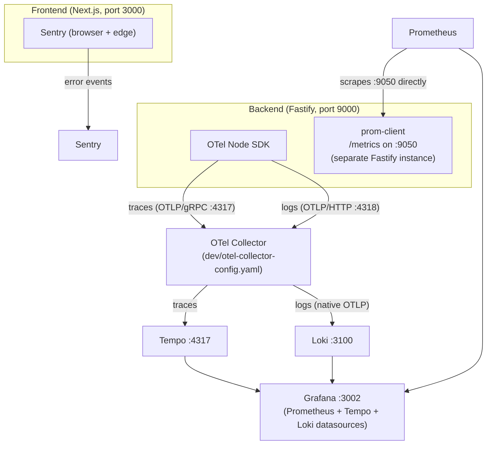
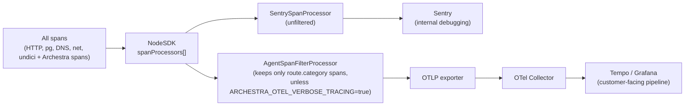

# Observability

Archestra is a platform that runs other people's agentic workloads: LLM calls it proxies, MCP tool calls it gateways, and (for Enterprise customers) skill execution it sandboxes in Kubernetes/Dagger. When something goes wrong in that chain — a hung tool call, a blocked call by policy, a slow model, a runaway cost — the failure surfaces several hops away from the code that caused it. Observability here is not a bolt-on dashboard; it is how the team debugs a distributed system it does not fully control (upstream LLM providers, third-party MCP servers, customer Kubernetes clusters) and how customers get cost/usage accountability per agent, team, and session. That is why traces, metrics, and logs are wired through nearly every request path in `platform/backend/src`, and why the project has a dedicated skill (`archestra-dev-observability`) governing how new spans/metrics must be named.

This document describes the pipeline end to end: what gets instrumented, where it flows, and the tradeoffs behind the design. See also [Backend Architecture](./02-backend.md) and [MCP Gateway & Orchestrator](./05-mcp-gateway-and-orchestrator.md) for the request paths that originate the spans and metrics described here.

## The pipeline, end to end

```
Backend (Fastify, port 9000)          Frontend (Next.js, port 3000)
  │  OTel Node SDK                       │  Sentry (browser + edge)
  │  ├─ traces ──► OTLP/gRPC :4317 ──┐   │
  │  └─ logs   ──► OTLP/HTTP :4318 ──┤   └─ error events ──► Sentry
  │                                   │
  │  Prometheus client (prom-client)  ▼
  │  └─ /metrics on :9050      OTel Collector (dev/otel-collector-config.yaml)
  │        ▲                     ├─► Tempo :4317 (traces)
  │        │                     └─► Loki :3100 (logs, native OTLP)
  │  Prometheus scrapes :9050 ◄──┘
  │        │
  └────────┴─► Grafana :3002 (dashboards: Prometheus + Tempo + Loki datasources)
```

- **Backend traces**: `platform/backend/src/observability/tracing/sdk.ts` configures a `NodeSDK` from `@opentelemetry/sdk-node`. Spans are batched (`BatchSpanProcessor`) and exported over OTLP to the collector (`platform/dev/otel-collector-config.yaml`), which fans traces out to Tempo and (for local debugging) a `debug` console exporter.
- **Backend logs**: pino logs are forwarded to the OTLP Logs API (`BatchLogRecordProcessor` in `sdk.ts`) and land in Loki via the collector's native-OTLP ingestion path (Loki 3.x). Log records are tagged with `trace_id`/`span_id`/`session_id` (see "Log correlation" below), so a trace can be pivoted straight into its logs in Grafana (`tracesToLogsV2` in `platform/dev/grafana/datasources/datasources.yml`).
- **Backend metrics**: `prom-client` metrics are registered under `platform/backend/src/observability/metrics/` and exposed on a **separate Fastify instance** listening on port 9050 (`registerStandaloneMetricsEndpoint` / `startMetricsServer` in `platform/backend/src/server.ts`), not on the main API port 9000. Prometheus (`platform/dev/prometheus.yml`) scrapes `host.docker.internal:9050/metrics` directly — metrics do not go through the OTel Collector.
- **Storage**: Tempo (`platform/dev/tempo.yaml`) stores traces, queryable via its HTTP API on port 3200. Prometheus stores metrics with `--enable-feature=exemplar-storage` turned on, so a metric can carry an exemplar trace ID. Loki stores logs.
- **Visualization**: Grafana (port 3002) is provisioned with all three datasources (`platform/dev/grafana/datasources/datasources.yml`) plus pre-built dashboards (`platform/dev/grafana/dashboards/*.json`: `genai-observability`, `agent-sessions`, `application-metrics`, `mcp-monitoring`, `rag-knowledge-base`).
- **Errors**: Sentry is a parallel, independent sink for exceptions (backend via `@sentry/node` + `@sentry/opentelemetry`, frontend via `@sentry/nextjs`). See "Sentry as a second, filtered sink" below.

The diagram below summarizes the pipeline described above, including the metrics path that bypasses the OTel Collector entirely:



Locally the whole stack is a single Tilt resource: `tilt trigger observability` (or the equivalent `docker compose -f platform/dev/docker-compose.observability.yml up -d`) starts Tempo, Loki, the OTel Collector, Prometheus, and Grafana together. Unlike the backend/frontend/database resources, `observability` is declared with `auto_init=False` in `platform/dev/Tiltfile.integrations` — it does not start automatically with `tilt up`, since most day-to-day development doesn't need the full trace/metrics UI.

## What gets traced: LLM and MCP spans

Spans follow the [OTel GenAI semantic conventions](https://opentelemetry.io/docs/specs/semconv/gen-ai/gen-ai-agent-spans/) rather than a bespoke schema, so traces are legible in any OTel-native tool, not just Archestra's own dashboards. The convention constants live in `platform/backend/src/observability/tracing/attributes.ts`.

- **`chat {agentName}`** — the parent span for a chat turn, opened by `startActiveChatSpan` (`platform/backend/src/observability/tracing/chat.ts`, `SpanKind.SERVER`). It groups every LLM call and every MCP tool call made during that turn into one trace.
- **`{operationName} {model}`** (e.g. `chat gpt-4o-mini`, `generate_content gemini-2.0`) — an LLM proxy call, opened by `startActiveLlmSpan` (`tracing/llm.ts`, `SpanKind.CLIENT`). Carries `gen_ai.provider.name`, `gen_ai.request.model`, `gen_ai.request.streaming`, token usage (`gen_ai.usage.input_tokens` / `.output_tokens` / `.total_tokens`, plus prompt-cache read/write breakdowns), `archestra.cost` (USD), and — when `ARCHESTRA_OTEL_CAPTURE_CONTENT` is enabled — a `gen_ai.content.prompt` event with the truncated prompt.
- **`execute_tool {toolName}`** — an MCP tool call, opened by `startActiveMcpSpan` (`tracing/mcp.ts`). Carries `mcp.server.name`, `gen_ai.tool.name`, `gen_ai.tool.call.id`, and (content-capture permitting) input/output events. Tool calls blocked by a tool-invocation policy still get a short-lived span via `recordBlockedToolSpans`, tagged `mcp.blocked=true` / `mcp.blocked_reason`, so a blocked call is visible in the trace next to the calls that did execute.
- **Cross-cutting attributes** set on every span type via shared helpers (`setAgentAttributes`, `setTeamAttributes`, `setUserAttributes`, `setSessionId` in `attributes.ts`): `gen_ai.agent.id`/`.name`, dynamic `archestra.agent.label.<key>` values (agent labels are fetched from the DB at startup and drive both span attributes and Prometheus label dimensions), `archestra.<scope>.team.*` for the executing agent's teams and the requesting user's teams (array-valued, since a principal can belong to multiple teams), `archestra.user.id`/`.email`/`.name`, and `gen_ai.conversation.id` (the session ID from `X-Archestra-Session-Id`).
- **Route filtering**: every Archestra-authored span carries `route.category` (`llm-proxy`, `mcp-gateway`, `chat`, `a2a`, `chatops`, `email`). This attribute is what lets the pipeline distinguish "our" spans from raw infrastructure spans — see the Sentry section below.

Attribute naming is deliberately conservative: the skill instructs contributors to search the OTel GenAI semconv registry before minting a new attribute, and to only fall back to an `archestra.*` name (with a comment explaining why) when nothing in the registry fits — e.g. `archestra.usage.cache_creation.1h_input_tokens` for the Anthropic/Bedrock 1-hour cache TTL surcharge, which has no semconv equivalent.

## What gets measured: metrics

Metrics live under `platform/backend/src/observability/metrics/` (llm, mcp, agent-execution, chat, audit, rag, sandbox, schedule-trigger, task-queue) and are re-initialized at startup with the current set of agent label keys pulled from the database (`initializeObservabilityMetrics` in `metrics/index.ts`), so custom per-organization agent labels become first-class Prometheus dimensions without a redeploy.

Representative metrics (`platform/backend/src/observability/metrics/llm.ts`, `mcp.ts`):

- `llm_request_duration_seconds` (histogram), `llm_tokens_total` (counter, `type=input|output`), `llm_cache_tokens_total` (counter, `cache_type=read|write` — split out so it doesn't distort the input/output aggregate), `llm_cost_total`, `llm_cache_cost_total`, `llm_cache_savings_total`, `llm_time_to_first_token_seconds`, `llm_tokens_per_second`, `llm_token_usage`, `llm_blocked_tools_total`.
- `mcp_tool_call_duration_seconds`, `mcp_tool_calls_total`, `mcp_request_size_bytes`, `mcp_response_size_bytes`, and `mcp_server_deployment_status` (a gauge tracking each self-hosted MCP server's current K8s deployment state).

All of these use `enableExemplars: true`, and Prometheus's exemplar storage links a given bucket increment straight to the trace ID that produced it — the mechanism behind Grafana's "View in GenAI Dashboard" and "View Session" exemplar links configured in `datasources.yml`.

Label design is intentionally narrow: base labels are `provider`, `model`, `agent_id`, `agent_name`, `agent_type`, `source`, plus the dynamic per-organization agent label keys. `external_agent_id` (the client-supplied `X-Archestra-Agent-Id` header) is explicitly **not** a label on the high-volume LLM/MCP metrics — only on the lower-cardinality `agent_executions_total` — because it's unbounded and client-controlled, and would blow up Prometheus's series cardinality. This rule is codified in the skill definition, not just a comment, because the failure mode (a client sending a new UUID per request) is easy to reintroduce by accident.

## Log correlation

Backend logs (pino) are wired to trace context manually rather than via `@opentelemetry/instrumentation-pino` (`platform/backend/src/logging/index.ts`). The backend is bundled to ESM by tsdown; ESM static imports are resolved before `sdk.start()` runs, so the auto-instrumentation's monkey-patch of the `pino()` constructor can't retroactively attach to an already-loaded module (it needs a `--import` loader hook the build doesn't use). Instead:

1. A pino `mixin` injects `trace_id`, `span_id`, `trace_flags`, and (when set) `session_id` into every log record, using the active OTel span context plus a dedicated context key (`SESSION_ID_KEY` in `observability/request-context.ts`) that the LLM/MCP/chat span helpers set explicitly.
2. A custom `Writable` stream (combined via `pino.multistream`) forwards each record to the OTel Logs API, which auto-captures the active span context on emit — so logs land in Loki already linked to their trace.

The session ID is carried on its own context key (not just as a span attribute) specifically so it survives outside span boundaries — e.g. a log line emitted after a span has ended can still be tagged, enabling direct Loki queries by `session_id` without going through a trace at all. Grafana's Tempo datasource is provisioned with a `sessionID` exemplar link that jumps straight to the agent-sessions dashboard filtered by that session.

## The separate metrics-server port

The Prometheus `/metrics` endpoint is served from a second, standalone Fastify instance on port 9050 (`startMetricsServer` in `platform/backend/src/server.ts`), not registered as a route on the main API (port 9000). This is a deliberate isolation boundary: `/metrics` is unauthenticated by default (an optional bearer-token secret, `ARCHESTRA_METRICS_SECRET`, can gate it), and putting it on the main port would mean either exposing an unauthenticated introspection endpoint on the same surface as customer traffic, or wrapping it in the main auth stack (which scrapers don't speak). A separate port means the metrics endpoint can be firewalled off from the public API entirely — e.g. only reachable from the cluster's internal network — while the API stays open. The main web process still registers Prometheus's default Node.js process metrics on its own instance; the dedicated metrics server intentionally does *not* duplicate those (`enableDefaultMetrics: false`), since both instances share the same underlying `prom-client` registry.

## Frontend-to-backend correlation

The frontend does **not** run the OpenTelemetry SDK — `platform/frontend/src/instrumentation.ts` and `instrumentation-client.ts` wire up Sentry only (server/edge/browser runtimes), including Sentry Session Replay on the browser side. There is no `traceparent` propagation from a browser click through to the backend's OTel trace. Correlation between frontend and backend observability is therefore indirect, through two shared identifiers rather than a shared trace:

- **Session ID** (`gen_ai.conversation.id` / `X-Archestra-Session-Id`): the frontend sends this header on chat requests, and it becomes the join key across the backend's chat/LLM/MCP spans, logs, and the Grafana agent-sessions dashboard.
- **Sentry**: both sides report to the same Sentry organization, so a frontend exception and the backend error it triggered can be correlated by user/time/release even without a shared trace ID.

This is a real architectural gap worth calling out explicitly (see Design Decisions below) rather than a subtlety to gloss over.

## Sentry as a second, filtered sink

Sentry is wired into the same OTel pipeline rather than as an unrelated SDK bolted on afterward (`platform/backend/src/observability/tracing/sdk.ts`, `sentry.ts`). When `ARCHESTRA_SENTRY_*` config is present:

- `SentrySpanProcessor` is added to the SDK's `spanProcessors` array *alongside* the OTLP processor, so Sentry receives every span — full infra auto-instrumentation (HTTP, pg, DNS, net, undici) included — for internal debugging.
- The OTLP path (Tempo/Grafana, the customer-facing pipeline) is wrapped in an `AgentSpanFilterProcessor` that only forwards spans carrying `route.category` — i.e. Archestra's own GenAI/MCP spans — unless `ARCHESTRA_OTEL_VERBOSE_TRACING=true`. This keeps the Tempo pipeline focused on agent-observability spans customers actually query, instead of every raw HTTP/DB span.
- `SentrySampler` and `SentryPropagator` replace the default OTel sampler/propagator when Sentry is enabled, so Sentry's own sampling/trace-continuity rules govern the shared span stream.
- Error classification is centralized in `observability/error-tracking-policy.ts`, shared by both the Sentry `beforeSend` filter and PostHog capture paths, so the two sinks agree on what counts as noise (expected 4xx, known upstream 502/504/529 conditions, a customer's own MCP server being unreachable) versus a real incident worth paging on (grouped by a stable fingerprint, e.g. `db-transient` + error code, so one outage doesn't fragment into one issue per failed query).

The diagram below shows how a single `NodeSDK` instance, via its two `spanProcessors`, produces both the unfiltered Sentry stream and the filtered customer-facing OTLP stream from the same underlying spans:



## Design Decisions & Tradeoffs

- **Metrics on a dedicated port (9050) instead of the main API port (9000).** Keeps an unauthenticated (or separately-authenticated) introspection endpoint off the customer-facing API surface, so it can be firewalled independently in production while the API stays reachable. Cost: two Fastify instances to keep in sync, and the default-metrics registration has to be explicitly disabled on the second instance to avoid duplicate series in the shared `prom-client` registry.
- **OTel GenAI semantic conventions instead of a bespoke schema.** Traces are legible in any OTel-native backend, not just Grafana, and attribute names don't need to be reinvented for every new span type. The tradeoff is friction on every new attribute — the skill requires checking the semconv registry first — but that friction is intentional: it's what stops the `archestra.*` namespace from becoming a second, incompatible schema by accident.
- **Manual pino↔OTel wiring instead of `@opentelemetry/instrumentation-pino`.** The ESM bundling (tsdown) makes the standard auto-instrumentation approach silently not work (it needs a `--import` hook that runs before ESM imports resolve). The chosen fix — a pino `mixin` plus a custom OTLP-forwarding stream — is more code to maintain but is the only approach that actually attaches given the build target.
- **A dedicated `SESSION_ID_KEY` OTel context value instead of only a span attribute.** Session ID needs to reach log lines emitted outside any open span (e.g. after a span ends but before the request finishes), and needs to support direct Loki queries by session without a trace lookup. A plain span attribute wouldn't propagate to those log calls; the context key does.
- **No frontend OTel SDK / no browser-to-backend trace propagation.** The frontend only runs Sentry. This avoids the cost and complexity of running and sampling a second OTel SDK in the browser, and avoids leaking backend trace infrastructure details to the client. The cost is a real one: a slow page load can't currently be traced end-to-end into the backend spans that caused it — only correlated after the fact via session ID or Sentry's own linking. This is a known gap, not a hidden one.
- **Sentry gets an unfiltered span stream; the customer-facing OTLP pipeline gets a filtered one.** A single `NodeSDK` instance produces both streams from the same underlying spans (via two `spanProcessors`), rather than running two separate SDKs. This means Sentry can see infra-level detail (HTTP, DB, DNS spans) useful for engineering debugging, while Tempo/Grafana — which customers and support staff query — only shows agent-observability spans (`route.category` set), keeping that view uncluttered. The filter is enforced with a custom `SpanProcessor` (`AgentSpanFilterProcessor`) rather than sampling, since sampling would drop customer-relevant spans probabilistically instead of deterministically excluding infra ones.
- **Metrics label keys exclude client-supplied `external_agent_id`.** Prometheus label cardinality is a scaling risk for any freeform, client-controlled identifier. The rule (encoded in the observability skill and in comments in `metrics/llm.ts`) is that any label backed by client input rather than internal state must go on a low-cardinality metric only (`agent_executions_total`), never on the high-volume LLM/MCP histograms.
- **Cache token/cost metrics are separate series (`llm_cache_tokens_total`, `llm_cache_cost_total`, `llm_cache_savings_total`) rather than new label values on existing counters.** Adding a `type=cache_read` value to `llm_tokens_total`, for instance, would silently change what `sum(llm_tokens_total)` means for every existing dashboard and alert built against it. New, disjoint metrics preserve backward compatibility for aggregates that already exist in the wild.
