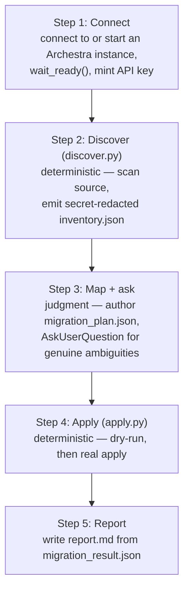
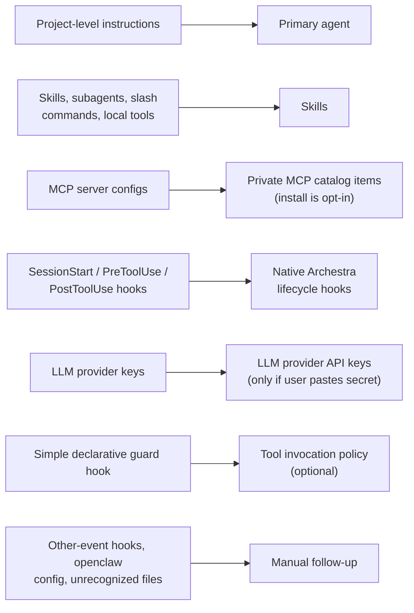

# Migration Kit

`migration-kit/` (`migration-kit/README.md`, `migration-kit/SKILL.md`) turns an existing agentic proof-of-concept — the unsorted configs left behind by tools like Claude Code, OpenClaw, or Hermes: project instruction files, MCP configs, hooks, local scripts, and whatever else accumulated during evaluation — into a running Archestra pilot. It ships as a Claude Code Skill (`migrate-to-archestra`) rather than a standalone CLI, so the migration runs as a guided, agentic conversation instead of a one-shot batch script. For the target-side concepts it maps into, see [Agents, Skills & Sandbox](./07-agents-skills-sandbox.md) and [Security & Guardrails](./06-security-and-guardrails.md).

## Distribution: a zero-dependency stdlib-only installer

Installation is a single piped command:

```bash
curl -fsSL https://raw.githubusercontent.com/archestra-ai/archestra/main/migration-kit/install.py | python3
```

`install.py` requires nothing beyond a stock `python3 >= 3.10` — no `pip install`, no `uv`, no network access beyond the initial fetch — and pulls only what the skill needs (`SKILL.md`, `scripts/`, `references/`, ~90 KB total) into `~/.claude/skills/migrate-to-archestra/`. The README calls this out as deliberate: it "runs on locked-down or air-gapped hosts." Options (`--ref` to pin a git ref instead of `main`, `--dest` to install elsewhere, `--force` to overwrite) support pinning a specific commit and avoiding the shell-pipe pattern entirely for security-conscious installs.

## The spine: three JSON artifacts with a human judgment step in the middle

`migration-kit/SKILL.md` describes the flow as a pipeline with one deliberately non-deterministic stage:

```
discover.py → inventory.json → [you map + ask the user] → migration_plan.json → apply.py → migration_result.json → [you write report.md]
  deterministic                       judgment                                     deterministic
```

The five steps below walk through that pipeline, plus the connect step that precedes it:



**Step 1 — Connect.** The agent (running the skill) either connects to an existing Archestra instance or starts a local Docker one, per `references/install.md`, calls `wait_ready()` as the real readiness gate, and mints an API key.

**Step 2 — Discover (`discover.py`, deterministic).** Scans the source directory and emits a **secret-redacted** `inventory.json` — it never writes credentials to the file. Its frontmatter parser only handles `key: value` scalars, inline `[a, b]` lists, and `- item` block lists; anything it can't confidently interpret (block scalars, nested maps, anchors, comments) is reported into an `unknowns` bucket rather than guessed at, so a human reviews those rather than trusting a silently-wrong parse.

**Step 3 — Map and ask (judgment, not scripted).** The Claude Code agent running the skill reads `inventory.json` against `references/entity-mapping.md` and authors `migration_plan.json` — a list of per-item `decisions` (`action: migrate|skip|manual`, `target_kind`, `scope`, optional `user_answers`). Critically, the skill **never lets the model author raw API payloads directly** — `apply.py` builds and validates those from the plan. The model is scoped to decisions; the deterministic script owns payload construction. `AskUserQuestion` is reserved for genuine ambiguities the SKILL.md enumerates explicitly: default resource scope (personal/team/org) and any per-item exceptions, which concrete team id owns a team-scoped item, whether a subagent becomes a `skill` (the default) or a full `agent`, whether to install an MCP server now versus just registering its catalog entry, which LLM provider keys to migrate (the user must paste each replacement secret directly — the skill never reads one out of the source files), and for each hook, which of `hook` / `tool_policy` / `manual` it maps to.

Before presenting anything for approval, the skill does a **reference-rewrite pass**: it reads each migrating skill/command/subagent/hook body and rewrites paths and shell invocations that assumed the source machine (project-relative paths, `$CLAUDE_PROJECT_DIR`, host-only binaries) so they resolve correctly inside Archestra's sandbox — `apply.py` ships bodies verbatim, so this rewriting has to happen at plan time, not apply time. Anything that can't be safely rewritten is flagged as a manual follow-up item instead of shipped broken.

The skill then shows the user a **preview** (ready-to-create table, needs-your-decision table, manual-follow-up table, sandbox rewrites applied, behavior changes to expect, secrets/safety notes) and requires explicit approval before touching `apply.py` — raw API payloads are withheld unless the user specifically asks for them.

**Step 4 — Apply (`apply.py`, deterministic).** First a dry run (`--dry-run`, fully offline — builds and validates every payload against the API schema, touches no network) so validation errors surface before any real writes; then a real apply. `apply.py` is idempotent (skips entities that already exist), calls `enable-defaults` so the primary agent actually sees its migrated skills, and best-effort-assigns sandbox tools (`run_command`, `upload_file`, `download_file`) to migrated agents — non-blocking, since some Archestra installs don't have the sandbox runtime enabled yet. The script's own exit code is non-zero if any operation failed or was invalid, so CI-style automation around it has a real success/failure signal.

**Step 5 — Report.** The agent writes `report.md` from `migration_result.json` using `references/report-template.md`, framed explicitly as a decision aid ("is this converted pilot ready to try in Archestra") rather than an exhaustive command transcript — surfacing what migrated, what needs manual follow-up, and any secret-redaction warnings from the inventory.

## Entity mapping

| Source artifact | Archestra target | Notes |
|---|---|---|
| Project-level instructions | Primary agent | The core "what is this agent for" mapping. |
| Skills, subagents, slash commands, local tools | Skills | A subagent's isolation/tool-allowlist behavior is *documented* in the migrated skill, not enforced identically — see below. |
| MCP server configs | Private MCP catalog items | Registration is separate from installation (see below). |
| `SessionStart`/`PreToolUse`/`PostToolUse` hooks | Native Archestra lifecycle hooks | Payload is Claude-compatible, so scripts port near-1:1 — see caveats below. |
| LLM provider keys | LLM provider API keys | Only migrated if the user pastes the replacement secret directly; never read out of source files. |
| A simple declarative guard hook | Tool invocation policy (optional) | Only when the guard's target tool exists in Archestra; extracted as `{tool_name, key, operator, value, action?, reason?}`. |
| Hooks for other events, openclaw config, unrecognized files | Reported for manual follow-up | No attempt to force-fit these into an Archestra concept. |

The same mapping, as a diagram:



### MCP install is opt-in, not automatic

Registering an MCP server as a catalog item (`mcp_catalog`) is separate from actually installing it (`mcp_install`), and the skill is instructed to ask the user which one they want per server. The reason is architectural, not just cautious UX: a local stdio MCP server, once installed in Archestra, runs inside Archestra's **Kubernetes-backed runtime** (see the MCP server runtime notes in `platform/CLAUDE.md` and [Agents, Skills & Sandbox](./07-agents-skills-sandbox.md)) — a meaningfully different execution environment and trust boundary than whatever ran it on the source machine, so defaulting to "install everything" would silently change where code executes without the user choosing that.

### Hooks become lifecycle hooks — with real behavior differences, and sometimes a policy instead

Claude Code's `SessionStart`/`PreToolUse`/`PostToolUse` hooks map to Archestra's native lifecycle hooks because the payload shape is Claude-compatible, so most hook scripts port with minimal changes. But the mapping is explicitly **not** 1:1: migrated hooks lose the `matcher` field, run with a sandboxed `cwd`, and have no access to the original command's environment variables or argv. The skill is instructed to surface these differences to the user in both the preview and the final report, rather than silently porting a script that will behave subtly differently once it hits Archestra's sandbox.

For the common case of a hook that's really just a simple guard rail — "block this tool call if condition X" — the skill prefers mapping it to a **tool invocation policy** instead of a native hook, when the guard's target tool actually exists in Archestra. This is a deliberate downgrade-to-the-simpler-primitive choice: a policy is a first-class, declaratively-evaluated Archestra concept (see [Security & Guardrails](./06-security-and-guardrails.md)) rather than an arbitrary script re-execution, so where the semantics fit, the migration produces the more auditable, more native artifact rather than just replaying the old mechanism.

### Secrets: redact, never migrate silently, never invent handling for embedded ones

Three separate secret-handling rules appear across the README and SKILL.md, each addressing a different risk:

1. `discover.py`'s inventory is secret-redacted by construction — credentials are never written to `inventory.json` in the first place.
2. LLM provider keys are the one category that *can* end up in the migrated Archestra instance, but only if the user explicitly pastes the replacement secret during the mapping step (`user_answers.apiKey`) — the skill is instructed to never read a live secret out of the user's source files itself.
3. Secrets embedded inside migrated prose or code (e.g. a hardcoded token inside a skill script) are left intact as part of the migrated artifact — discovery **warns** about them so the user can review before sharing the inventory, but the skill doesn't attempt to auto-redact arbitrary embedded secrets it can't reliably identify inside free-form code.

## Contributor tooling and CI gates

The scripts contributors actually ship (`discover.py`, `apply.py`, and the rest of `scripts/`) are the zero-dependency stdlib-only surface described above. A separate `dev` dependency group in `pyproject.toml` (`pytest`, `pyyaml`, `ty`, `ruff`) exists purely for *developing and testing* those scripts — never required to *run* the skill. `.github/workflows/on-pull-requests.yml`'s `migration-kit-checks` job runs this dev tooling on every PR via `uv run --python 3.10 --frozen --directory migration-kit --group dev pytest -q`, pinned to Python 3.10 (the supported floor) so CI validates against the same interpreter version the zero-dependency guarantee targets. Inside that pytest run, `tests/test_zero_dependency.py` is itself a test: it asserts every shipped script imports only the standard library, turning the "zero-dependency" claim in the README into an enforced CI gate rather than a convention someone could accidentally break with a stray `import requests`. `ty check` (Astral's type checker) is the enforced typing gate — SKILL.md notes it's used over mypy specifically because a few validation helpers need explicit `cast`s that `ty` (a younger, less narrowing-capable checker) requires but mypy would flag as redundant; `ruff check` covers linting.

## Design Decisions & Tradeoffs

- **Zero-dependency, stdlib-only scripts vs. richer tooling.** *Rationale:* the target users are enterprise pilots evaluating Archestra, often on locked-down or air-gapped hosts where `pip install` may not be possible or permitted — a `uv`/PyYAML/etc. dependency chain would exclude exactly the audience most likely to be doing this kind of security-conscious agentic-PoC migration in the first place. *Cost:* the shipped code forgoes real YAML parsing (a hand-rolled subset parser instead), proper HTTP client libraries, and other conveniences a normal Python project would reach for — accepted as the price of the constraint, and enforced permanently via `test_zero_dependency.py` rather than left as an easily-eroded convention.

- **Agentic judgment-call flow vs. a deterministic one-shot script.** *Rationale:* mapping an arbitrary, messy pile of PoC artifacts onto Archestra's entity model (agent vs. skill vs. subagent-as-skill, scope decisions, hook-vs-policy) is genuinely ambiguous in ways a fixed script can't resolve well — the skill's own framing is explicit that "the model owns the judgment calls." *Cost:* the migration is not reproducible or scriptable end-to-end the way a pure CLI tool would be; two runs against the same source could produce different plans depending on how the model reasons about ambiguous cases, which is why the pipeline pins the *deterministic* halves (discovery, payload construction) tightly and confines judgment to the narrow middle step.

- **Opt-in MCP install and paste-your-own-secret key migration, as safety choices rather than convenience defaults.** *Rationale:* auto-installing every discovered MCP server would silently move code execution into Archestra's Kubernetes runtime without the user choosing that trust boundary shift, and auto-migrating a discovered LLM key would mean shipping possibly-scoped-differently credentials into a new system without explicit consent. *Cost:* both choices add required interactive steps the user can't skip past — a fully automated migration (for a user who trusts the source blindly) is not possible by design, only a guided one.

- **Hooks downgraded to tool policies where possible, rather than 1:1-ported as scripts.** *Rationale:* a declarative tool policy is auditable, evaluated by Archestra's own policy engine, and doesn't carry the sandboxed-`cwd`/no-argv/no-matcher behavior gaps that a literally-ported hook script would — so where the semantics genuinely fit (a simple guard against an existing tool), the migration produces the more native, more inspectable artifact. *Cost:* this only works for the narrow "simple guard whose target tool already exists" case; most hooks still port as native lifecycle hooks with real, user-facing behavior differences that the skill must surface rather than silently absorb, and the report step exists specifically to make sure those differences aren't lost between migration and the user actually testing the pilot.
