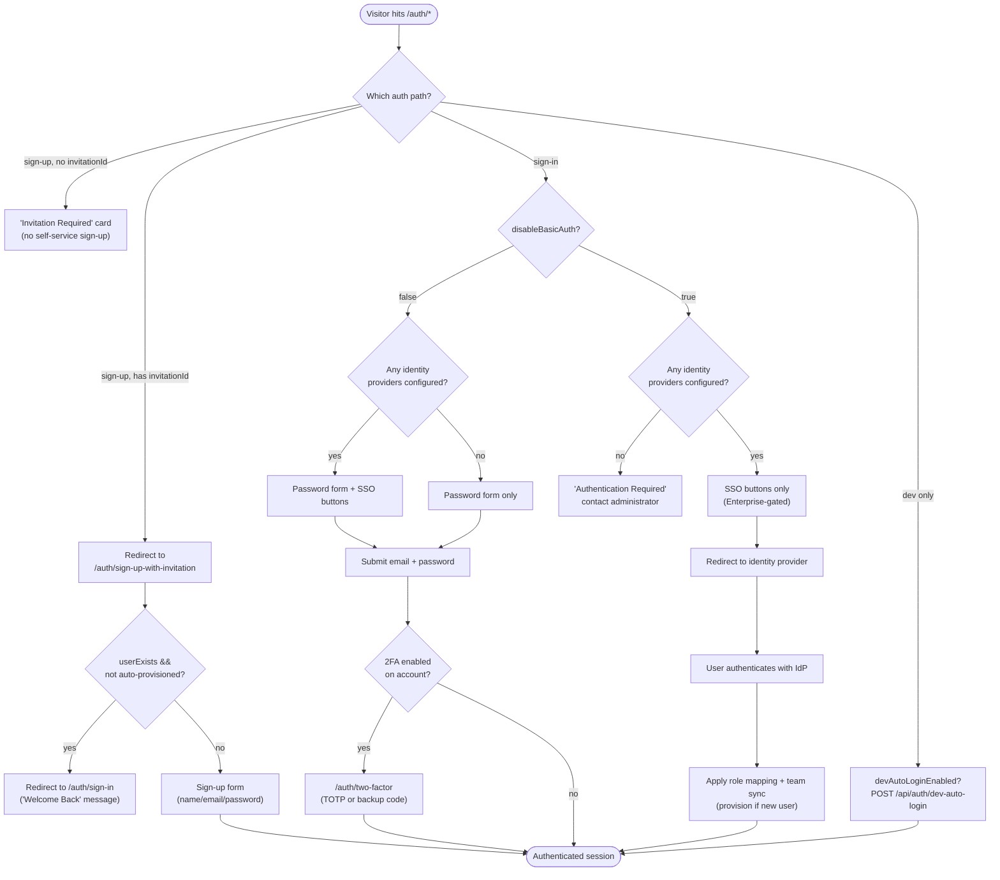
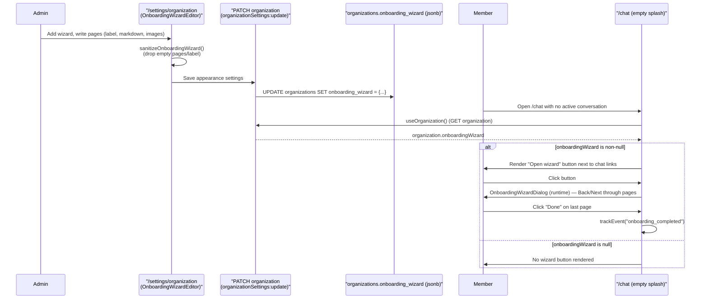
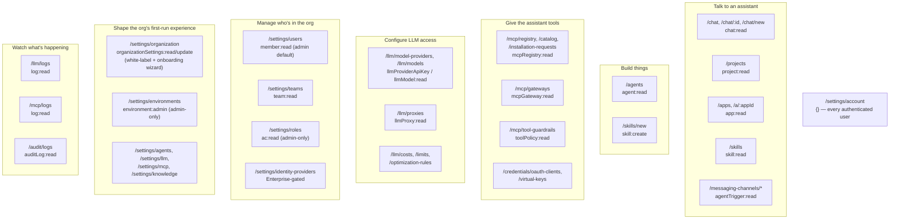

# User Onboarding & Interfaces

Every other document in this set explains how Archestra is built. This one explains what a human actually
sees: the surfaces a person clicks through, how they get an account in the first place, and what changes
between the moment an instance is first booted and the moment a member sends their first chat message.
It is deliberately organized around **user journeys**, not the URL inventory — for the full App Router
route list see [Frontend](./08-frontend.md#app-router-structure); for the RBAC mechanics behind "who can
reach what" see [Backend Architecture](./02-backend.md#routing-permissions--rbac--concrete-example); for
what a member's assigned tools can and cannot do once they're in a chat, see
[Security & Guardrails](./06-security-and-guardrails.md).

## 1. What exists before any human logs in

`platform/backend/src/server.ts` calls `seedRequiredStartingData()` on every boot
(`platform/backend/src/database/seed.ts`). This is not a one-time install step — it runs idempotently on
every startup, which is why most of it reads as "insert if missing." In order:

1. **`seedDefaultUserAndOrg()`** — the actual first-admin bootstrap. It calls
   `UserModel.createOrGetExistingDefaultAdminUser()` (`backend/src/models/user.ts`), which signs up a user
   via Better Auth's `signUpEmail` API using `config.auth.adminDefaultEmail` /
   `config.auth.adminDefaultPassword`, then force-sets that user's role to `admin` and marks it
   `emailVerified: true`. The defaults are `admin@example.com` / `password`
   (`DEFAULT_ADMIN_EMAIL` / `DEFAULT_ADMIN_PASSWORD` in `platform/shared/consts.ts`), overridable via
   `ARCHESTRA_AUTH_ADMIN_EMAIL` / `ARCHESTRA_AUTH_ADMIN_PASSWORD`. In parallel,
   `OrganizationModel.getOrCreateDefaultOrganization()` inserts a single row — id `"default-org"`, name
   `"Default Organization"`, slug `"default"` — if none exists yet. So: **there is no interactive
   first-run wizard that creates the first admin or the first org.** A fresh instance already has exactly
   one admin account and one organization the moment the backend finishes booting; a human's first act is
   signing in with those credentials (or the env-overridden ones), not creating them.
2. Default agents (`AgentModel.getLLMProxyOrCreateDefault()`), the six built-in system agents (policy
   config, dual-LLM main/quarantine, context compaction, chat title generation, app runtime —
   `syncBuiltInAgents()`), and built-in Agent Skills (`syncBuiltInSkills()`) are seeded per organization.
3. The Archestra MCP catalog and its built-in tools are seeded (`seedArchestraCatalogAndTools()`) — but
   per an explicit comment in `seed.ts`, **tools are not automatically assigned to any agent**; an admin
   (or a member with `agent:team-admin`) has to assign them.
4. A Playwright browser-preview MCP catalog entry is seeded org-wide (used by the chat "Browser" button);
   in development (or when `ARCHESTRA_TEST_ENABLE_TEST_MCP_SERVER` is set) a throwaway test MCP server is
   also seeded.
5. Organization and per-team tokens (`seedTeamTokens()`).
6. **`seedChatApiKeysFromEnv()`** — for every provider with an `ARCHESTRA_CHAT_<PROVIDER>_API_KEY` env var
   set, an org-wide LLM provider key is created and its model catalog synced automatically. This is the
   mechanism that lets a `docker run` or Tilt dev environment skip the "Add an LLM Provider Key" UI step
   entirely: if the env var is present, chat already works the moment the container is up.
7. Backfills for pre-existing members who predate a feature: personal chat agent, personal MCP gateway,
   personal LLM proxy per member (`ensureExistingUsersHavePersonalChatAgents/McpGateways/LlmProxies`), and
   demo `DEFAULT_APPS` seeded into any organization that has never had an app
   (`seedDefaultAppsForPristineOrgs()`), authored under the org's earliest-created admin.

**`ARCHESTRA_QUICKSTART=true`** (`config.isQuickstart`, read in `backend/src/config.ts`) does *not* alter
this bootstrap sequence — it is consumed narrowly by the messaging-channel pages
(`frontend/src/app/messaging-channels/{slack,ms-teams,email}/page.tsx`, `use-trigger-statuses.ts`) to treat
webhook connectivity as always-reachable, since a single-container quickstart deployment typically isn't
reachable from the public internet for inbound webhooks. It is not a distinct "first-run" auth mode.

The sign-in page itself surfaces the bootstrap outcome back to the human: `DefaultCredentialsWarning`
(`frontend/src/components/default-credentials-warning.tsx`), driven by `useDefaultCredentialsEnabled()`,
renders an always-visible destructive alert on `/auth/sign-in` showing the literal `admin@example.com` /
`password` pair (with copy buttons) whenever the backend detects default credentials are still active,
linking to the deployment docs' `ARCHESTRA_AUTH_ADMIN_EMAIL` section and to
`/settings/account?highlight=change-password`.

## 2. Getting in: every path to an authenticated session

All auth UI lives under `platform/frontend/src/app/auth/` and is routed through a single dynamic segment,
`auth/[path]/page.tsx`, whose `AUTH_VIEW_PATHS` allowlist is `sign-in`, `sign-out`, `sign-up`, `two-factor`,
`recover-account` (`dynamicParams = false` — anything else 404s; the comment in the file notes
forgot/reset-password, magic-link, and email-OTP flows have no route because the backend has no email
provider). `AuthPageWithInvitationCheck` (`auth/[path]/auth-page-with-invitation-check.tsx`) is the router
in front of that view:

- **Direct sign-up is blocked outright.** If `path` starts with `sign-up` and there's no `invitationId`
  query param, the page renders an "Invitation Required" card ("Direct sign-up is disabled... contact an
  administrator") instead of a form — there is no code path in this component that lets an anonymous
  visitor self-register.
- If `path` starts with `sign-up` **and** an `invitationId` is present, the component redirects to the
  dedicated `/auth/sign-up-with-invitation` page rather than rendering `sign-up` itself.
- `sign-in` renders `AuthViewWithErrorHandling`, which branches on `usePublicConfig().disableBasicAuth`
  (`ARCHESTRA_AUTH_DISABLE_BASIC_AUTH`) and on whether any identity providers are configured
  (`usePublicIdentityProviders()`): password form only, password form + SSO buttons, SSO-only, or (basic
  auth disabled with zero configured providers) an "Authentication Required — contact your administrator"
  dead end.
- `two-factor` and `recover-account` are reachable regardless of session state (`WithAuthCheck`'s
  `isSpecialAuthPage` allowlist) because they're mid-flow: a user isn't "logged in" yet during 2FA
  verification, but *is* logged in when setting 2FA up for the first time (the same route serves both,
  distinguished by the presence of a `totpURI` query param — see `TwoFactorView`).
- `sign-out` renders `SignOutWithIdpLogout`, which fetches the IdP's logout URL *before* clearing the local
  session (so an SSO-authenticated user is also signed out upstream), then POSTs `/api/auth/sign-out` and
  redirects to that IdP URL or back to `/auth/sign-in`.

**SSO** (`docs/pages/platform-sso.md`) is an Enterprise-gated feature (`usePublicEnterpriseCoreActive()`
must be true for the frontend to render `IdentityProviderSelector`, a dynamically-imported `.ee` component
consistent with the licensing convention in [Backend Architecture](./02-backend.md#enterprise-licensing-marking)).
Two additional routes exist beyond ordinary sign-in-page SSO buttons: `/auth/sso/[providerId]` is the
IdP-initiated entry point (a chrome-less redirect-and-spinner page that calls `authClient.signIn.sso()`),
and `/auth/sso/linked-callback` completes a *downstream* IdP link (connecting a second identity provider
to fetch delegated tokens for MCP tool calls, without changing the user's Archestra login) via
`completeLinkedIdentityProviderIntent`.

There is **no self-service password reset** — no email provider exists to send a reset link. After three
failed sign-in attempts, the sign-in form surfaces a hint pointing at the `reset-user-password` CLI
(`backend/src/standalone-scripts/reset-user-password.ts`), an operator script run with shell access to the
deployment (`docs/pages/platform-reset-user-password.md`).

**Dev-auto-login** (already documented in [Frontend](./08-frontend.md#feature-flags-via-apiconfig)) is the
one path that bypasses the sign-in form entirely: when `ARCHESTRA_AUTH_DEV_AUTO_AUTHENTICATE_EMAIL` is set
and the public `devAutoLoginEnabled` flag is true, `WithAuthCheck` (`frontend/src/app/_parts/with-auth-check.tsx`)
POSTs `/api/auth/dev-auto-login` for any unauthenticated visitor instead of redirecting to `/auth/sign-in`,
minting a real cookie-backed session for that seeded user. It is hard-disabled outside development at the
backend config layer regardless of what the env var says.

### Invitation-by-link, concretely

There is exactly one way to onboard a *new* person into an existing organization: an admin (or anyone with
`invitation:create`) generates a link via `InviteByLinkCard`
(`frontend/src/components/invite-by-link-card.tsx`) — email + `RoleSelect` (predefined role or any custom
role) → `useCreateInvitation()` → a link of the shape
`/auth/sign-up-with-invitation?invitationId=<id>&email=<addr>&name=<Derived Name>`. The invitee opens that
link, `useInvitationCheck(invitationId)` resolves whether the email already has an account
(`invitationData.userExists`); if so (and the invitation isn't auto-provisioned — see
`AUTO_PROVISIONED_INVITATION_STATUS`) they're redirected to sign in instead of sign up. Otherwise they fill
in name/email/password and `authClient.signUp.email(...)` is called with the `invitationId` attached, which
both creates the account and accepts the invitation server-side in one call, landing on `/chat`. This whole
flow can be turned off org-wide with `ARCHESTRA_AUTH_DISABLE_INVITATIONS=true` (`disableInvitations` public
flag) for SSO-only, auto-provisioning deployments — see `docs/pages/platform-sso.md`.

## 3. The onboarding wizard system

"Onboarding wizard" is an overloaded term in this codebase — there are five distinct first-run/onboarding
mechanisms, and only one of them is literally called that. Worth being precise about which is which:

| Mechanism | Component | Who sees it | Trigger | Dismissible? |
|---|---|---|---|---|
| Add-a-key step | `NoApiKeySetup` (`components/no-api-key-setup.tsx`) | Any user landing on `/chat` with zero usable LLM keys | `chatApiKeys.length === 0` | No — blocks the composer until resolved |
| Default-model step | `DefaultModelOnboardingStep` (`components/default-model-onboarding.tsx`) | Admin only (`agentSettings:update`), right after the *first* key is added | `firstKeyAdded && canSetDefaultModel && !organization.defaultModelId` | "Skip for now" advances without saving |
| **Onboarding wizard** | `OnboardingWizardButton` / `OnboardingWizardDialog` (`components/chat/onboarding-wizard-*.tsx`) | Anyone, if the admin authored one | A button next to the chat-links row on the empty `/chat` splash — opt-in, not forced | Yes, freely (Back/Next/Done, closeable at any step) |
| First-login survey | `OnboardingSurveyDialog` (`components/onboarding-survey-dialog.tsx`) | Admin only, on a pristine + unlicensed instance | See eligibility rule below | **No** — no close button, Escape/outside-click suppressed |
| Feedback nudge | `FeedbackPopupDialog` (`components/feedback-popup-dialog.tsx`) | Admin only, one session after "activation" | MCP server connected *and* a successful tool call routed | Yes — dismissal is remembered forever |
| Nav red-dots | `OnboardingDot` (`components/onboarding-dot.tsx`) | Any user | Unvisited items in `DOTTED_NAV_ITEMS` (Projects, Apps, Connect, Model Providers, MCP Registry) | Clears on first visit to that nav item |

### The wizard, specifically

An **onboarding wizard** is admin-authored content, not a hardcoded product tour. It lives as a single
JSON value on the organization row (`onboarding_wizard` jsonb column,
`backend/src/database/schemas/organization.ts`) shaped as `{ label: string; pages: Array<{ content:
string; image?: string | null }> }` — one wizard per organization, up to 10 pages, each page a Markdown
blob plus an optional inline PNG/GIF (2MB cap, base64-encoded and stored directly in the JSON, not as a
separate upload).

- **Authoring**: `OnboardingWizardEditor` (`frontend/src/app/settings/organization/_components/onboarding-wizards-editor.tsx`)
  lives inside `/settings/organization` (the same page that owns theme/logo/favicon white-labeling per
  [Frontend](./08-frontend.md#theming-and-white-labeling)), gated behind `organizationSettings:update` —
  admin-only in the predefined-role sense. An admin adds a wizard, gives it a ≤25-character label (shown
  as the button text — e.g. "Setup Microsoft Teams"), adds up to 10 pages, and edits each page's content in
  a Markdown/Preview split editor reusing `OnboardingWizardDialog` in `mode="edit"`. `sanitizeOnboardingWizard()`
  (`onboarding-wizards-editor.utils.ts`) drops empty pages and nulls out the whole wizard if the label or
  every page is empty — so an admin can't accidentally publish a half-filled wizard.
- **Runtime**: `organization.onboardingWizard` is read wherever `useOrganization()` is already fetched. On
  the `/chat` new-chat splash (`frontend/src/app/chat/page.tsx`), if it's non-null, an "Open wizard" (or
  custom-labeled) button renders alongside any configured chat links; clicking it opens
  `OnboardingWizardDialog` in `mode="runtime"` — a paginated Back/Next/Done dialog rendering each page's
  Markdown (via `react-markdown` + `remark-gfm`) side-by-side with its image, if any. Reaching "Done" fires
  a `trackEvent("onboarding_completed", { wizardLabel, pageCount })` analytics event.
- **Not gated to first-run**: unlike the survey or the two mandatory chat-setup steps, the wizard button is
  simply *present* on the empty-chat state for as long as no conversation is open — a returning user can
  reopen it as many times as they like; there is no "seen" tracking for it the way there is for nav dots.

### The other four, briefly

- **`NoApiKeySetup` → `DefaultModelOnboardingStep`** together form the *mandatory* first-run gate on
  `/chat`: `page.tsx` checks `showDefaultModelStep` before `!hasAnyApiKey` specifically so that the moment
  an admin adds their first key, the flow advances straight to the default-model step rather than
  flickering back to the "no keys" screen while the keys query refetches. A non-admin (no
  `agentSettings:update`) who is the first to open `/chat` on a keyless org only ever sees the add-key
  screen, since `showDefaultModelStep` requires the permission.
- **`OnboardingSurveyDialog`**: eligibility (`GET /api/onboarding/survey-eligibility`,
  `backend/src/routes/onboarding/onboarding.routes.ts`) is computed server-side and requires *all* of:
  caller is admin, analytics is enabled (phone-home opt-in), the Enterprise core license is not active, no
  survey has been submitted for the org yet, and the org has zero LLM proxy interactions and zero MCP tool
  calls recorded — i.e., it targets a genuinely untouched, non-Enterprise instance. It is intentionally
  non-dismissible: per its own doc comment, it "reappears next session until submitted once," and
  submission always marks the org done even if the outbound webhook to the Archestra website can't be
  reached (so an airgapped install isn't nagged forever).
- **`FeedbackPopupDialog`**: "activation" (`GET /api/onboarding/feedback-popup-activation`) is defined as
  the *later* of an MCP server having been connected and a successful (`isError: false`) MCP tool call
  having been routed, again gated off analytics-enabled and non-Enterprise. It fires once, on the first
  session that *started after* that activation timestamp — comparing `session.createdAt` against
  `activatedAt` — and once dismissed (via either button or backdrop click) it never shows again, tracked
  via the same `user_onboarding_seen_items` table as the nav dots (`FEEDBACK_POPUP_SEEN_KEY =
  "feedback:popup"`).
- **`OnboardingDot`**: a small red dot on five specific sidebar nav items (`DOTTED_NAV_ITEMS` in
  `frontend/src/lib/onboarding/nav-onboarding.ts`), backed by `user_onboarding_seen_items` per user, cleared
  the moment the user's pathname matches that item's `urlPrefixes`.

## 4. The interface map: what a user is trying to do

Rather than a URL list (already covered in [Frontend](./08-frontend.md#app-router-structure)), here's the
same surface grouped by task, each route's gating permission from
`requiredPagePermissionsMap` (`platform/shared/access-control.ts`), and whether the predefined `admin` /
`member` roles reach it by default (custom roles can be shaped to grant any subset — see
[Backend Architecture](./02-backend.md#routing-permissions--rbac--concrete-example)):

A few gating specifics worth calling out because they diverge from a simple admin/member split:

- **`/settings/account` requires no extra permission** (`{}` in the map) — every authenticated user reaches
  it, since it's where any user manages their own password, 2FA, and API tokens.
- **`/settings/environments` is `environment:admin`**, not `:read` — the only settings tab gated on the
  `admin` action rather than `read`, since environments scope agent/MCP sandbox network policy.
- **`/settings/secrets` additionally requires the org to be running Vault** (`useSecretsType().type ===
  "Vault"`) on top of the `secret:read` permission — a permission grant alone doesn't surface the tab on a
  non-Vault deployment, per `settings-tabs.ts`.
- **`/settings/identity-providers` is always shown when the permission is present**, even when the
  Enterprise license is inactive; the destination page dims itself rather than the nav hiding the tab.
- The **MCP server installation-request workflow** (`/mcp/registry/installation-requests`) is the one place
  a member without `mcpRegistry:create` still gets to *ask* for a new MCP server — they request it from the
  catalog, and an admin approves/declines with optional notes, rather than the member being flatly blocked.

## 5. Day-one walkthroughs

### Admin, setting up a fresh instance

1. Sign in at `/auth/sign-in` with the seeded `admin@example.com` / `password` (or the
   `ARCHESTRA_AUTH_ADMIN_EMAIL` / `_PASSWORD` override) — `DefaultCredentialsWarning` immediately flags
   that these are default credentials.
2. Land on `/chat`. With zero LLM keys configured, `NoApiKeySetup` blocks the composer: click "Add API Key"
   → `CreateLlmProviderApiKeyDialog`.
3. Immediately following the first key, `DefaultModelOnboardingStep` appears (admin-only): pick a default
   model, or "Skip for now." This sets `organization.defaultModelId` — the fallback every built-in
   background subagent (title generation, context compaction, dual-LLM) resolves to.
4. The chat composer opens. Go to `/mcp/registry` (or the catalog at `/mcp/registry/catalog`) to install an
   MCP server; newly installed tools are **not** auto-assigned to any agent, so visit `/agents` (or the
   assignment UI surfaced from the registry) to attach tools to an agent.
5. Optionally author white-labeling and an onboarding wizard at `/settings/organization` — logo, theme,
   app name, chat links, and the multi-page Markdown wizard members will see on their own first `/chat`
   visit.
6. Invite teammates: from wherever `InviteByLinkCard` is surfaced (organization/members settings), enter an
   email, pick a role (predefined `member`/`admin` or any custom role from `/settings/roles`), and copy the
   generated `/auth/sign-up-with-invitation?...` link out-of-band (there's no built-in email delivery — the
   admin has to send the link themselves).
7. If the org is on the pristine, unlicensed path, the non-dismissible `OnboardingSurveyDialog` appears on
   this or a later session until answered; once an MCP server is connected and a tool call succeeds, the
   dismissible `FeedbackPopupDialog` appears on the *next* session.

### Member, joining via invitation

1. Receive the invitation link (`/auth/sign-up-with-invitation?invitationId=...&email=...&name=...`) out of
   band from an admin.
2. `useInvitationCheck` confirms the invitation and pre-fills name/email; the member sets a password and
   submits — `authClient.signUp.email()` creates the account and accepts the invitation in one call,
   redirecting straight to `/chat`.
3. On `/chat`, if the org already has usable LLM keys (the common case for an established org), the member
   skips both mandatory setup steps entirely and lands on the empty-chat splash.
4. If the admin authored an onboarding wizard, an "Open wizard" button sits next to any chat links on that
   splash — entirely opt-in, no forced walkthrough.
5. The member picks (or is defaulted into) an agent and starts chatting; whatever MCP tools were assigned
   to that agent are available through the standard tool-call loop described in
   [Frontend](./08-frontend.md#chat-and-streaming-ui). Red nav dots (`OnboardingDot`) nudge them toward
   Projects, Apps, Connect, Model Providers, and MCP Registry the first time each becomes relevant, clearing
   as each is visited.
6. If the member instead lacks even `agent:read`, they hit an "Access restricted" empty state on `/chat`
   naming the exact missing permission (`agent:read`) rather than a generic 403 — the one place in this
   flow where a permission gap is surfaced by name in the product UI itself.

## Design Decisions & Tradeoffs

**Invitation-gated sign-up, no self-service registration.**
*Rationale*: `AuthPageWithInvitationCheck` hard-blocks `/auth/sign-up` without an `invitationId` — there is
no code path for an anonymous visitor to create an organization or account on their own. Combined with the
seed-time single default org/admin, this makes every Archestra instance a closed system by default: the
population of users is exactly whoever an admin explicitly invited (or whoever SSO auto-provisions, if
configured and not disabled via `ARCHESTRA_AUTH_DISABLE_INVITATIONS`).
*Cost*: there's no product-led growth path (no "sign up and try it" funnel) — every new user requires an
existing admin's action, and invitation delivery is entirely out-of-band (copy a link, send it yourself);
the platform doesn't send invitation emails itself.

**Onboarding wizards are admin-authored content, not hardcoded product-tour code.**
*Rationale*: storing `{ label, pages }` as jsonb on the organization row and rendering it through a generic
Markdown+image dialog means every deployment can ship a completely different first-run walkthrough (or
none) without a frontend code change or redeploy — the same lever white-labeling already uses for
logo/theme/app name. It composes naturally with white-labeling: both live on the same organization row and
the same settings page.
*Cost*: there is no structural validation of wizard *content* the way there is for, say, an agent's tool
assignments — an admin can write a wizard that references stale UI, dead links, or outdated screenshots,
and nothing in the system will catch that drift. It's also genuinely optional and easy to miss: unlike the
two mandatory `/chat` setup steps, nothing forces a member to open it even once.

**Dev-auto-login is gated on two independent flags that must both agree, not one.**
*Rationale*: the frontend only attempts it when the *public*, unauthenticated `/api/public-config` reports
`devAutoLoginEnabled`, and the backend independently hard-zeroes `devAutoAuthenticateEmail` whenever
`NODE_ENV` is `production`/`prod` regardless of what the env var says — see
[Frontend](./08-frontend.md#design-decisions--tradeoffs). Two independent kill switches (one env-var-driven
at the backend, one config-flag-driven at the frontend) make it harder for a single misconfiguration to
leave the bypass live in a real deployment.
*Cost*: as documented in `08-frontend.md`, this is still a real authentication bypass mechanism by
construction — the safety property rests entirely on both gates being wired correctly, and there is no
route in the RBAC map that requires *disproving* dev-auto-login is active; it's a config-time invariant,
not a request-time check.

**Settings navigation is permission-gated per-tab rather than a single flat page with everything visible.**
*Rationale*: `useSettingsTabs()` builds its tab list by checking `usePermissionMap(requiredPagePermissionsMap)`
per tab and only including ones the caller can read — so a member never even sees a "Roles" or
"Identity Providers" tab exists, rather than seeing it and hitting a 403 on click. This mirrors the
backend's fail-closed RBAC posture ([Backend Architecture](./02-backend.md#routing-permissions--rbac--concrete-example)):
absence from the map/permission set means invisible, not merely blocked.
*Cost*: the settings surface is scattered across up to fourteen conditionally-rendered tabs with several
one-off exceptions layered on top (Vault-gating on Secrets, license-dimming rather than hiding on Identity
Providers, the `environment:admin` vs. `:read` asymmetry) — a developer adding a new settings tab has to
know which of these patterns applies, and `settings-tabs.ts` is the only place all of that logic is
legible at once.

**The first-login survey is deliberately non-dismissible, while the feedback popup is freely dismissible.**
*Rationale*: the two dialogs sit at opposite ends of the same trust spectrum on purpose. The survey targets
a genuinely untouched instance (zero LLM interactions, zero MCP tool calls) where a repeat prompt costs
nothing in workflow disruption; making it non-dismissible (no close button, no Escape, no outside-click)
guarantees the data point is eventually captured rather than silently skipped. The feedback popup instead
targets an instance that has already proven real usage (`activatedAt` requires both a connected MCP server
and a successful tool call), where interrupting an established workflow with a non-dismissible modal would
be a much worse trade — so it fires once, respects any dismissal path, and never resurfaces.
*Cost*: two different interaction contracts for superficially similar "onboarding dialog" components means
a developer touching either has to re-read which one they're in — the non-dismissible survey pattern
(`onEscapeKeyDown`/`onPointerDownOutside`/`onInteractOutside` all suppressed) is exactly the kind of thing
that's easy to accidentally copy onto a dialog that should be dismissible.
